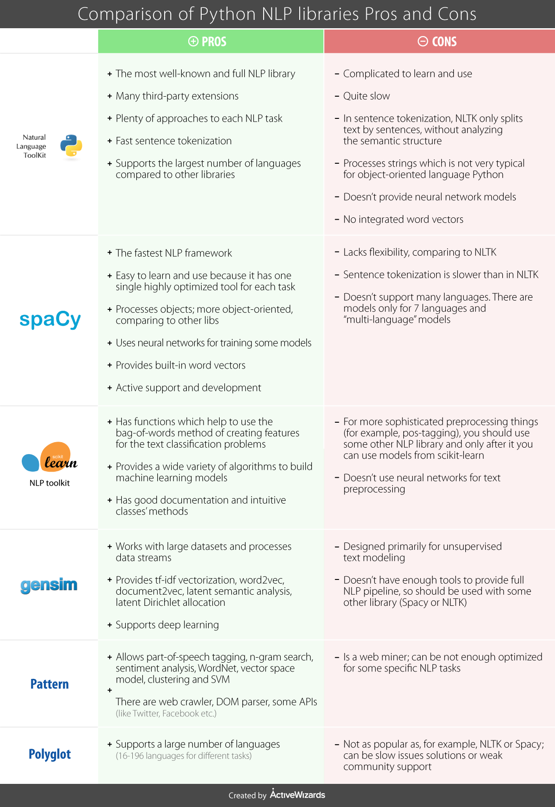

===============
 Text Mining in Python
===============

Libraries and useful links
-------------------------------

   
https://www.kdnuggets.com/2018/07/comparison-top-6-python-nlp-libraries.html   

Basic functions
===============

Here are useful functions for cutting a sentence into words, getting the singular form, getting the root of each word:

.. sourcecode:: python

  import string
  from nltk.tokenize import RegexpTokenizer

  def splitToWords(stringOfWords):   
    tokenizer = RegexpTokenizer("[\w']+")
    words = tokenizer.tokenize(stringOfWords) 
    words = lower_function(words)
    return words

  def lower_function(list_input):
    return [x.lower() for x in list_input]

  def lemmatize_function(list_input):
    wordnet_lemmatizer = WordNetLemmatizer()
    return [wordnet_lemmatizer.lemmatize(i) for i in list_input]

  def stem_function(list_input):
    snowball_stemmer = SnowballStemmer("english") 
    #lancaster_stemmer = LancasterStemmer()
    return [snowball_stemmer.stem(i) for i in list_input]

  def remove_stopWords_function(list_input):
    punctuation = list(string.punctuation)
    stop = stopwords.words('english') + punctuation
    return [term for term in list_input if term not in stop]
    
  #INPUT
  text = "Nonsense?  kiss off, geek. what I said is true.  I'll have your account terminated."
    
  text = splitToWords(text)                 #tokenizes (=splits in words)
  text = remove_stopWords_function(text)    #Removes stopwords ("the",...)    
  text = lemmatize_function(text)           #Lemmatiz = gets singular form of words when applicable   
  text = stem_function(text)                #Stemming = keeps root of words only   
  print(text)   

Output: ['nonsens', 'kiss', 'geek', 'said', 'true', "i'll", 'account', 'termin']  

Another useful text cleaning function can be found here:

.. sourcecode:: python

  def standardize_text(df, text_field):
    df[text_field] = df[text_field].str.replace(r"http\S+", "")
    df[text_field] = df[text_field].str.replace(r"http", "")
    df[text_field] = df[text_field].str.replace(r"@\S+", "")
    df[text_field] = df[text_field].str.replace(r"[^A-Za-z0-9(),!?@\'\`\"\_\n]", " ")
    df[text_field] = df[text_field].str.replace(r"@", "at")
    df[text_field] = df[text_field].str.lower()
    return df

questions = standardize_text(df, "text")

taken from the excellent tutorial on topic classification: https://github.com/hundredblocks/concrete_NLP_tutorial/blob/master/NLP_notebook.ipynb 
Here for the blog: https://blog.insightdatascience.com/how-to-solve-90-of-nlp-problems-a-step-by-step-guide-fda605278e4e?lipi=urn%3Ali%3Apage%3Ad_flagship3_feed%3BqGDpQk2XQQ2DhR08PHkmqg%3D%3D

Other tokenizing, from DataCamp:

.. sourcecode:: python

  # Import necessary modules
  from nltk.tokenize import sent_tokenize
  from nltk.tokenize import word_tokenize

  # Split scene_one into sentences: sentences
  sentences = sent_tokenize(scene_one)

  # Use word_tokenize to tokenize the fourth sentence: tokenized_sent
  tokenized_sent = word_tokenize(sentences[3])

  # Make a set of unique tokens in the entire scene: unique_tokens
  unique_tokens = set(word_tokenize(scene_one))

  # Print the unique tokens result
  print(unique_tokens)

  
Intro to regular expressions (REGEX)
----------------------------------------------------

.. figure:: Images/Regex_table.png
   :scale: 100 %
   :alt: map to buried treasure

   Taken from DataCamp. 

Examples of regex patterns:

pattern1 = r"#\w+" 
This says that we want to catch terms like '#thing'

pattern2 = r"([#|@]\w+)"
This says that we want to catch terms like '#thing' or '@thing'

Let's say we have some german text like this: 

german_text = 'Wann gehen wir zum Pizza? 🍕 Und fährst du mit Über? 🚕'

1. We want to tokenize all words:
all_words = word_tokenize(german_text)
print(all_words)
Output: ['Wann', 'gehen', 'wir', 'zum', 'Pizza', '?', '🍕', 'Und', 'fährst', 'du', 'mit', 'Über', '?', '🚕']

2. We want all words starting by a capital letter (including Ü!!!)
capital_words = r"[A-ZÜ]\w+"
print(regexp_tokenize(german_text,capital_words))
Output: ['Wann', 'Pizza', 'Und', 'Über']

3. We want all symbols! For that we can use the list of them in the pattern:
# Tokenize and print only emoji
emoji = "['\U0001F300-\U0001F5FF'|'\U0001F600-\U0001F64F'|'\U0001F680-\U0001F6FF'|'\u2600-\u26FF\u2700-\u27BF']"
print(regexp_tokenize(german_text,emoji))
Output: ['🍕', '🚕']

So in theory we can capture anything.

   
   

Word2Vec
----------------------------

Word2Vec is a technique to find continuous embeddings for words. It learns from reading massive amounts of text and memorizing which words tend to appear in similar contexts. After being trained on enough data, it generates a 300-dimension vector for each word in a vocabulary, with words of similar meaning being closer to each other.

Word2vec is a model that was pre-trained on a very large corpus, and provides embeddings that map words that are similar close to each other. A quick way to get a sentence embedding for our classifier, is to average word2vec scores of all words in our sentence.
