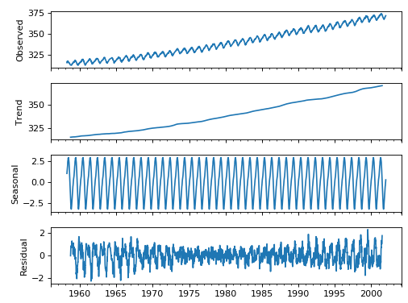

=====================================
 Time Series in Python
=====================================

.. topic:: Introduction

    Blabla
    
General good links for time series:

book: http://www.maths.qmul.ac.uk/~bb/TimeSeries/    

simple intro: https://towardsdatascience.com/the-complete-guide-to-time-series-analysis-and-forecasting-70d476bfe775

Basic TS concepts
=====================================

See https://medium.com/@ATavgen/time-series-modelling-a9bf4f467687

**Stationarity**:

.. figure:: Images/TS_stationary.png
   :scale: 80 %
   :alt: TS_stationary
   
It is stationary when the trend line is 0 and the dispersion is constant in time. For example, white noise is a stationary process.  

The test for the stationarity of a time series is the Augmented Dickey-Fuller test (see below)
   
**Seasonality**:

It is possible to decompose a signal into different pieces: the trend, the seasonality, the noise:

.. figure:: Images/TS_decomposition.png
   :scale: 80 %
   :alt: TS_decomposition
   
(Taken from https://towardsdatascience.com/trend-seasonality-moving-average-auto-regressive-model-my-journey-to-time-series-data-with-edc4c0c8284b )   

**Autocorrelation (ACF)**:

the autocorrelation function tells you the correlation between points separated by various time lags. As an example, here are some possible acf function values for a series with discrete time periods:

The notation is ACF(n=number of time periods between points)=correlation between points separated by n time periods. Ill give examples for the first few values of n.

ACF(0)=1 (all data are perfectly correlated with themselves), ACF(1)=.9 (the correlation between a point and the next point is 0.9), ACF(2)=.4 (the correlation between a point and a point two time steps ahead is 0.4)...etc. 

So, the ACF tells you how correlated points are with each other, based on how many time steps they are separated by. It is how correlated past data points are to future data points, for different values of the time separation. Typically, you'd expect the autocorrelation function to fall towards 0 as points become more separated (i.e. n becomes large in the above notation) because its generally harder to forecast further into the future from a given set of data. This is not a rule, but is typical.

Note on the PARTIAL autocorrelation (PACF): The ACF and its sister function, the partial autocorrelation function (more on this in a bit), are used in the Box-Jenkins/ARIMA modeling approach to determine how past and future data points are related in a time series. The partial autocorrelation function (PACF) can be thought of as the correlation between two points that are separated by some number of periods n, BUT with the effect of the intervening correlations removed. This is important because lets say that in reality, each data point is only directly correlated with the NEXT data point, and none other. However, it will APPEAR as if the current point is correlated with points further into the future, but only due to a "chain reaction" type effect, i.e., T1 is directly correlated with T2 which is directly correlated with T3, so it LOOKs like T1 is directly correlated with T3. The PACF will remove the intervening correlation with T2 so you can better discern patterns. A nice intro to this is here: http://people.duke.edu/~rnau/411arim3.htm.

So PACF corrects the lag-1 problem of the ACF. See also here for python use: https://machinelearningmastery.com/gentle-introduction-autocorrelation-partial-autocorrelation/

Partial autocorrelations measure the linear dependence of one variable after removing the effect of other variable(s) that affect to both variables. For example, the partial autocorrelation of order measures the effect (linear dependence) of yt−2 on yt after removing the effect of yt−1 on both yt and yt−2: see https://stats.stackexchange.com/questions/129052/acf-and-pacf-formula

.. figure:: Images/ACF_vs_PACF.png
   :scale: 80 %
   :alt: ACF_vs_PACF
  
.. figure:: Images/ACF_PCF_example.png
   :scale: 80 %
   :alt: ACF_PCF_example   
  
A beautiful video constructing ACP and PACF: https://www.youtube.com/watch?v=ZjaBn93YPWo

   
Forecast quality metrics
---------------------------------------

Before actually forecasting, let’s understand how to measure the quality of predictions and have a look at the most common and widely used metrics 
   
.. csv-table:: Forecast quality metrics for time series
   :header: "Metric", "Description", "Range", "Tool"
   :widths: 40,50,10,20

   "**R-squared**", "coefficient of determination (in econometrics it can be interpreted as a percentage of variance explained by the model)", "(-inf, 1]", "sklearn.metrics.r2_score"
   "**Mean Absolute Error (MAE)**", "it is an interpretable metric because it has the same unit of measurement as the initial series", "[0, +inf)", "sklearn.metrics.mean_absolute_error"
   "**Median Absolute Error**", "again an interpretable metric, particularly interesting because it is robust to outliers", "[0, +inf)", "sklearn.metrics.median_absolute_error"
   "**Mean Squared Error (MSE)**", "most commonly used, gives higher penalty to big mistakes and vice versa", "[0, +inf)", "sklearn.metrics.mean_squared_error"
   "**Mean Squared Logarithmic Error**", "practically the same as MSE but we initially take logarithm of the series. As a result we give attention to small mistakes. As well usually is used when data has exponential trends", "[0, +inf)", "sklearn.metrics.mean_squared_log_error"
   "**Mean Absolute Percentage Error (MAPE)**", "same as MAE but percentage. Very convenient when you want to explain the quality of the model to your management", "[0, +inf)", "not implemented in sklearn"

Here is how to get all of them:   
   
.. sourcecode:: python       

  from sklearn.metrics import r2_score, median_absolute_error, mean_absolute_error
  from sklearn.metrics import median_absolute_error, mean_squared_error, mean_squared_log_error

  def mean_absolute_percentage_error(y_true, y_pred): 
    return np.mean(np.abs((y_true - y_pred) / y_true)) * 100   
    
.. figure:: Images/MAE.png
   :scale: 80 %
   :alt: MAE
  
.. figure:: Images/RMSE.png
   :scale: 80 %
   :alt: RMSE 
   
The main idea in the debate MAE vs RMSE is that the RMSE should be more useful when large errors are particularly undesirable; it penalizes better large errors. The three tables below show examples where MAE is steady and RMSE increases as the variance associated with the frequency distribution of error magnitudes also increases.
   
.. figure:: Images/MAE_vs_RMSE.png
   :scale: 100 %
   :alt: MAE_vs_RMSE 

Interesting: the sample size influence. Using MAE, we can put a lower and upper bound on RMSE:

- [MAE] ≤ [RMSE]. The RMSE result will always be larger or equal to the MAE. If all of the errors have the same magnitude, then RMSE=MAE.

- [RMSE] ≤ [MAE * sqrt(n)], where n is the number of test samples. The difference between RMSE and MAE is greatest when all of the prediction error comes from a single test sample. The squared error then equals to [MAE^2 * n] for that single test sample and 0 for all other samples. Taking the square root, RMSE then equals to [MAE * sqrt(n)].
    
Focusing on the upper bound, this means that RMSE has a tendency to be increasingly larger than MAE as the test sample size increases. This can problematic when comparing RMSE results calculated on different sized test samples, which is frequently the case in real world modeling.   
    
Links:

- https://medium.com/human-in-a-machine-world/mae-and-rmse-which-metric-is-better-e60ac3bde13d : comparison MAE vs RMSE

- https://machinelearningmastery.com/time-series-forecasting-performance-measures-with-python/ : intro

- http://www.edscave.com/forecasting---time-series-metrics.html : useful for MAPE definition
    
    
    
Augmented Dickey-Fuller test
-------------------------------------

https://machinelearningmastery.com/time-series-data-stationary-python/

This tests whether a time series is non-stationary (H0, Null hypothesis) or stationary (H1, Null hypothesis rejected)   

We interpret this result using the p-value from the test. A p-value below a threshold (such as 5% or 1%) suggests we reject the null hypothesis (stationary), otherwise a p-value above the threshold suggests we fail to reject the null hypothesis (non-stationary).

- p-value > 0.05: Fail to reject the null hypothesis (H0), the data is non-stationary.

- p-value <= 0.05: Reject the null hypothesis (H0), the data is stationary.
 
Statsmodels has the test: from statsmodels.tsa.stattools import adfuller    
    
    

Main forecasting methods
=====================================

https://towardsdatascience.com/trend-seasonality-moving-average-auto-regressive-model-my-journey-to-time-series-data-with-edc4c0c8284b

Standard / Exponentially Moving Average → calculation to analyze data points by creating series of averages of different subsets of the full data set

Auto Regression → is a representation of a type of random process; as such, it is used to describe certain time-varying processes in nature, economics, etc

Linear/Polynomial Regression → regression analysis in which the relationship between the independent variable x and the dependent variable is modeled as an nth degree polynomial (or 1 degree for linear)

ARMA → model that provide a parsimonious description of a (weakly) stationary stochastic process in terms of two polynomials, one for the autoregression and the second for the moving average.

ARIMA (Autoregressive integrated moving average) → is a generalization of an autoregressive moving average (ARMA) model. Both of these models are fitted to time series data either to better understand the data or to predict future points in the series (forecasting)

Seasonal ARIMA → seasonal AR and MA terms predict xt using data values and errors at times with lags that are multiples of S (the span of the seasonality)

ARIMAX → An ARIMA model with covariate on the right hand side

Regression with seasonality: prophet (https://facebook.github.io/prophet/docs/quick_start.html)

Recurrent Neural Network (LSTM) → a class of artificial neural network where connections between nodes form a directed graph along a sequence in which allows it to exhibit dynamic temporal behavior for a time sequence. 

Autoencoders (based on LSTM). See the part on Deep Learning

    
Basic Pandas Time Series
=====================================

    
TS reading from CSV file
----------------------------------

Here is the reading of a time series form a CSV file. It is important to read it specifying the index_col, i.e. the column selected to be the index of the dataframe.
Here are 3 examples, only the third one is really usable as a time series!

.. sourcecode:: python

  df1 = pd.read_csv(filename)
  df2 = pd.read_csv(filename, parse_dates=['Date'])
  df3 = pd.read_csv(filename, index_col='Date', parse_dates=True)

  
Here is how to build a single time series (a Pandas series) using a list of dates as time index, and specifying the format:

.. sourcecode:: python

  # Prepare a format string: time_format
  time_format = '%Y-%m-%d %H:%M'

  # Convert date_list into a datetime object: my_datetimes
  my_datetimes = pd.to_datetime(date_list, format=time_format)  

  # Construct a pandas Series using temperature_list and my_datetimes: time_series
  time_series = pd.Series(temperature_list, index=my_datetimes)

Filtering times and time ranges
-------------------------------------------

.. sourcecode:: python

  # Extract the hour from 9pm to 10pm on '2010-10-11': ts1
  ts1 = ts0.loc['2010-10-11 21:00:00']

  # Extract '2010-07-04' from ts0: ts2
  ts2 = ts0.loc['July 4th, 2010']

  # Extract data from '2010-12-15' to '2010-12-31': ts3
  ts3 = ts0.loc['12/15/2010':'12/31/2010']

Reindexing
------------------

Create a new time series ts3 by reindexing ts2 with the index of ts1.

.. sourcecode:: python

  # Reindex without fill method: ts3
  ts3 = ts2.reindex(ts1.index)

  # Reindex with fill method, using forward fill: ts4
  ts4 = ts2.reindex(ts1.index,method='ffill')

Resampling
-------------------
  
Here: downsampling:  
  
.. sourcecode:: python  
  
  #Resampling for each day frequency  
  sales_byDay  = sales.resample('D')
  
  #Resampling for 2 weeks frequency  
  sales_byDay  = sales.resample('2W')  
  
  
Here: upsampling (so a smaller frequency than available in the original sales dataframe):
  
.. sourcecode:: python  
  
  #Resampling for each 4H frequency:
  sales_byDay  = sales.resample('4H').ffill() #ffill() method fills indexes forward in time, until it finds another time already present in the original dataframe.
  
  
Exercise: we have a dataframe with temperature of one year, each day, each hour. We want the maximum daily temperature in August:
  
.. sourcecode:: python    
  
  # Extract temperature data for August: august
  august = df.loc['2010-08','Temperature']  

  # Downsample to obtain only the daily highest temperatures in August: august_highs
  august_highs = august.resample('D').max()

  
Rolling mean (moving average)  
-----------------------------------------

See https://towardsdatascience.com/the-complete-guide-to-time-series-analysis-and-forecasting-70d476bfe775

Using the same dataframe as above (df['Temperature']), we can compute the daily moving average, or rolling mean:

.. sourcecode:: python

  # Extract data from 2010-Aug-01 to 2010-Aug-15: unsmoothed
  unsmoothed = df['Temperature']['2010-Aug-01':'2010-Aug-15']

  # Apply a rolling mean with a 24 hour window: smoothed
  smoothed = unsmoothed.rolling(window=24).mean()
  
exponential smoothing, Double exponential smoothing
------------------------------------------------------------------------ 

See https://towardsdatascience.com/the-complete-guide-to-time-series-analysis-and-forecasting-70d476bfe775
  
Interpolation
-------------------

Working with a dataframe "population" with 10-years steps, we can linearly interpolate each year between the steps using:

.. sourcecode:: python

  population.resample('A').first().interpolate('linear')
  
  
df.str method: how does it work?
----------------------------------------------

.. sourcecode:: python

  # Strip extra whitespace from the column names: df.columns
  df.columns = df.columns.str.strip()

  # Extract data for which the destination airport is Dallas: dallas
  dallas = df['Destination Airport'].str.contains('DAL')
  
  
Time series decomposition
============================================================

A time series with some seasonality could be decomposed into its long-term trend, the seasonality and the remaining "noise". 
The STL (Seasonal and Trend decomposition using Loess, Cleveland et al. 1990) basically implements this.

R has a lot of nice features for time series. STL is implemented in R (https://www.r-bloggers.com/seasonal-trend-decomposition-in-r/), python's statsmodel also has a variant (https://www.statsmodels.org/dev/generated/statsmodels.tsa.seasonal.seasonal_decompose.html, http://www.statsmodels.org/stable/release/version0.6.html?highlight=seasonal#seasonal-decomposition). 

Few Links:

https://stackoverflow.com/questions/20672236/time-series-decomposition-function-in-python

https://www.statsmodels.org/dev/generated/statsmodels.tsa.seasonal.seasonal_decompose.html

https://machinelearningmastery.com/decompose-time-series-data-trend-seasonality/

https://forecasters.org/wp-content/uploads/gravity_forms/7-c6dd08fee7f0065037affb5b74fec20a/2017/07/Laptev_Nikolay_ISF2017.pdf

https://www.google.com/search?client=ubuntu&channel=fs&q=Detrending%2C+de-seasoning+%28using+STL%29&ie=utf-8&oe=utf-8

https://www.r-bloggers.com/seasonal-trend-decomposition-in-r/

https://pypi.org/project/stldecompose/ 

Here the decomposition of the CO2 curve:

.. sourcecode:: python

  import statsmodels.api as sm

  dta = sm.datasets.co2.load_pandas().data
  # deal with missing values. see issue
  dta.co2.interpolate(inplace=True)

  res = sm.tsa.seasonal_decompose(dta.co2)
  resplot = res.plot() 

  
  
Tsfresh: extracting features from time series
============================================================

Main links:
Arxiv: https://arxiv.org/abs/1610.07717

  
Seasonal ARIMA: an example
============================================================

Here is an example taken from 

.. raw:: html
   :file: SeasonalARIMA_CO2.html
  