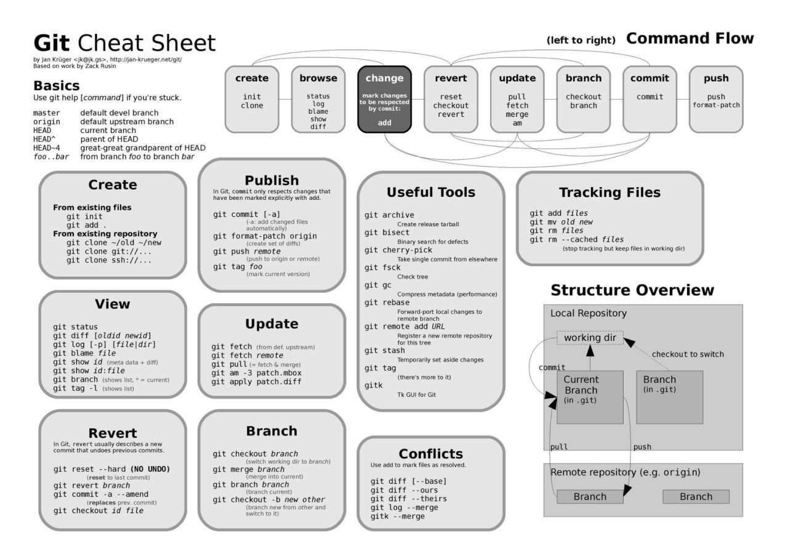

==========================================================================
 Useful Bash commands (or batch)
==========================================================================
      
Find 10 largest files in a directory:
--------------------------------------------------------------------------

du -hsx * | sort -rh | head -10

Where,

- du command -h option : display sizes in human readable format (e.g., 1K, 234M, 2G).

- du command -s option : show only a total for each argument (summary).

- du command -x option : skip directories on different file systems.

- sort command -r option : reverse the result of comparisons.

- sort command -h option : compare human readable numbers. This is GNU sort specific option only.

- head command -10 OR -n 10 option : show the first 10 lines.

This one is also very convenient: a "du" that limits the depth 
du -h --max-depth=1 

Find previous command matching some word in bash
--------------------------------------------------------------------------

history | grep word-i-am-looking-for

Find RAM type in windows:
--------------------------------------------------------------------------

wmic MemoryChip get BankLabel, Capacity, MemoryType, TypeDetail, Speed

Top
--------------------------------------------------------------------------

top -u user: gets the info for the particular user

See https://www.tecmint.com/12-top-command-examples-in-linux/ for useful commands

Finding files and folder in linux
-------------------------------------------------------------------------

Files: whereis

Folder: to find a folder called "media":

find /usr -name "media" 2>/dev/null

https://www.cyberciti.biz/faq/howto-find-a-directory-linux-command/

Symbolic link between folders, files
-------------------------------------------------------------------------

See https://www.freecodecamp.org/news/symlink-tutorial-in-linux-how-to-create-and-remove-a-symbolic-link/ 

.. sourcecode:: python

  #produces a new folder called 'latest' that will be in sync with the 'latest_azure' one
  ln -s latest_azure latest  
  
  # checks where does a symlink points to: here I have a "python" softlink pointing to "python3.6" executable
  ls -l /opt/anaconda/current/bin/python
  lrwxrwxrwx 1 root root 9 Mar 26  2019 /opt/anaconda/current/bin/python -> python3.6

==========================================================================
 Useful GIT commands
==========================================================================

Define name globally
--------------------------------------------------------------------------

git config --global user.name "user name"
git config --global user.email someone@myemail.com

Github: how to create a repo locally and then push it to remote?
--------------------------------------------------------------------------

# Create a new repository on the command line (see e.g. https://madewithml.com/courses/mlops/git/)
 
touch README.md
git init
git add README.md
git commit -m "first commit"
git remote add origin https://github.com/my_repo.git (example)
git push -u origin master

For the specific case of Github repos, where master branch is called main, you have first to rename your master to main:

git branch -M main  # rename branch to main (if needed)

Then only you can push:

git remote add origin https://github.com/my_repo.git (example)
git push -u origin main  # pushing the contents of our main branch to the remote repository
                         # origin is short for the name of the remote repository
 
# Push an existing repository from the command line
 
git remote add origin https://github.com/my_repo.git (example)
git push -u origin master

Note: git push -u <remote> <branch> is to set an upstream branch, i.e. the branch in the remote. If you create a branch locally, it will not exist by default in remote. That's why you need to create the upstream. To do that, for a branch xyz, you would do:

git push -u origin xyz

Bitbucket/Github: how to create ssh-keys and connect to bitbucket server
--------------------------------------------------------------------------

1. Create key: https://confluence.atlassian.com/bitbucketserver0610/creating-ssh-keys-989761219.html?utm_campaign=in-app-help&utm_medium=in-app-help&utm_source=stash or https://docs.microsoft.com/en-us/azure/devops/repos/git/use-ssh-keys-to-authenticate?view=azure-devops (for Azure DevOps)

2. Copy public key to bitbucket: https://confluence.atlassian.com/bitbucketserver0610/ssh-user-keys-for-personal-use-989761224.html

3. git clone your repo. In case we get error bitbucket git "SSL certificate problem: self signed certificate in certificate chain", we need to disable the SSL verification step, either one-time shot: GIT_SSL_NO_VERIFY=true git clone https://username@git.example.com/scm/repository.git (see https://confluence.atlassian.com/bitbucketserverkb/resolving-ssl-self-signed-certificate-errors-806029899.html) or globally: git config --global http.sslVerify false (see https://mattferderer.com/fix-git-self-signed-certificate-in-certificate-chain-on-windows)

Todo commmand:

ssh-keygen -t rsa (or other protocols like dsa, ecdsa, ed25519, or rsa type)

Note: as of Dec 2022, [GitHub recommends](https://docs.github.com/en/authentication/connecting-to-github-with-ssh/generating-a-new-ssh-key-and-adding-it-to-the-ssh-agent?platform=linux) using:

ssh-keygen -t ed25519 -C "your_email@example.com"

You get this:

Generating public/private rsa key pair.
Enter file in which to save the key (/home/ec2-user/.ssh/id_rsa): 
Enter passphrase (empty for no passphrase): 
Enter same passphrase again: 
Your identification has been saved in /home/ec2-user/.ssh/id_rsa.
Your public key has been saved in /home/ec2-user/.ssh/id_rsa.pub.
The key fingerprint is:
SHA256:MjRRqu/J***************************E ec2-user@ip-172-31-33-9.eu-north-1.compute.internal
The key's randomart image is:
+---[RSA 2048]----+
|   .  ...    .   |
   *****
|= +o+o .. . o +  |
|.*o=+o=.     o   |
+----[SHA256]-----+

When then cat /home/ec2-user/.ssh/id_rsa.pub, copy the content and go into Settings in Github and paste that into the section "SSH and GPG keys". Then in your environment, you can then clone any repo using the git@github.com:blabla.git.

Pull requests: how-to
--------------------------------------------------------------------------

How to use git?
Usually safety rules do not allow us to push directly to master, rewrite master history and made changes without Pull Request.
Here are the different steps for a development branch:

1. git checkout master <this selects master branch>
2. git pull <this get newest data from master branch>
3. git checkout –b "branch-name" <this create new branch> (since Git 2.23 we can use "git switch -c" instead of "git checkout -b", with same effect. Checkout seems to be sometimes confusing for users)
4. change code
5. git add file.py <this needed to add changed files> (or git add --all in case we want to include all changes)
6. git commit <after this command usually we shortly write that we changed>
7. git push -u origin "branch-name" <this push our branch "branch-name" to remote and this allows to us create PR>
8. create PR in bitbucket/github <PR = Pull Request>
9. merge PR in bitbucket/github (ideally another team member actually does the merge)

When doing the merge, don't forget to erase the branch (remotely, just by selecting check box in PR merge, and locally by doing git branch -d branch-name)

Repeat these steps
 
Way to learn more about git and how it works: https://learngitbranching.js.org/

How to create a local (empty) branch and upstream it to remote?
--------------------------------------------------------------------------

Link: https://www.atlassian.com/git/tutorials/comparing-workflows/gitflow-workflow

.. sourcecode:: python

  git branch develop
  git push -u origin develop

What to do when your local dev branch is behind remote master?
--------------------------------------------------------------------------

Link: https://stackoverflow.com/questions/34118404/what-i-can-do-to-resolve-1-commit-behind-master

i.e. Local Master branch is behind the remote Master branch

Before preceding, you have to commit or stash all the changes you made on the branch that is behind commits.

First we need to have local master synced with remote master:

.. sourcecode:: python

  # Checkout your local Master branch
  git checkout master

  #Pull from remote Master branch
  git pull origin master

Now your local Master is in sync with the remote master ranch but other local and remote dev branches are not in sync with your local Master branch. To fix that:

.. sourcecode:: python
  
  # Checkout the branch that is behind your local Master branch
  git checkout dev-branch

  # Merge with the local Master branch
  git merge master  // Now your branch is in sync with local Master branch

  # If this branch is on the remote repository, you have to push your changes
  git push origin dev-branch

A branch exists in remote and not in local, how to get on it?
--------------------------------------------------------------------------

In new git (above 1.7) we can directly checkout on it, and git will understand:

.. sourcecode:: python

  $ git branch
  * master
  $ git --version
  git version 1.8.3.1
  $ git checkout feature/dummy-models
  Branch feature/dummy-models set up to track remote branch feature/dummy-models from origin.
  Switched to a new branch 'feature/dummy-models'
  $ git branch
  * feature/dummy-models
    master

My branch "feature" is based on branch "developement" and I wish to bring SPECIFIC new files from "development" into "feature". How?
--------------------------------------------------------------------------

Here it is a useful trick in a scenario when there are several people working on different feature branches, all pushing to development branch at some point. If you want to bring in specific files from the development branch, you can:

.. sourcecode:: python

  $ git branch
  * feature
    development
  $ git fetch
  $ git checkout origin/development -- file.py
  
Now you will have the file of origin/development into your local "feature" branch. Then you can use it (modify if needed), and commit it.  

How to compare 2 branches from the command line?
--------------------------------------------------------------------------

Based on https://devconnected.com/how-to-compare-two-git-branches/

Basically:

.. sourcecode:: python

  $ git diff branch1..branch2

Avoiding git pull
--------------------------------------------------------------------------

Concerning git pull: better to avoid it as it suppresses the history of recent commits: https://coderwall.com/p/jgn6-q/git-pull-is-evil

A better way is to:

- git fetch : it imports 

- git rebase : (git rebase origin/master) . That will find the earliest common commit between master and origin/master, move to a temporary space everything in your local branch that comes after that, fast forward it to the latest commit on origin/master and then apply each of the commits that were put aside on top of it, one by one, stopping if conflicts are found so that you can fix them before going on with the rebase.

About git rebase: https://blog.algolia.com/master-git-rebase/, https://medium.com/datadriveninvestor/git-rebase-vs-merge-cc5199edd77c

Git aliases
--------------------------------------------------------------------------

bash
git ~/.gitconfig

then append the aliases, so that the file looks like this:

.. sourcecode:: python

    [user]
            name = My Name
            
            email = myname@email.com

    [alias]
            g = !git --no-pager log --oneline --abbrev-commit --all --graph --decorate --color
            
            gg = !git --no-pager log --oneline --abbrev-commit --all --graph
            
            co = checkout
            
            br = branch
            
            st = status
        
then we can use the aliases like this:

git g -10    

.. figure:: Images/git_log_alias.PNG
   :scale: 100 %
   :alt: map to buried treasure

The HEAD shows where "we" are, the origin/master is the remote master branch, origin/HEAD probably where is the HEAD at the origin branch, and master the local master branch on which we now sit.

Here are some interesting other aliases: https://dev.to/dephraiim/git-commands-you-probably-didn-t-know-3bcm?utm_source=digest_mailer&utm_medium=email&utm_campaign=digest_email

Other useful commands
--------------------------------------------------------------------------

git reset --hard 9e21211 : this brings you back (or bring the HEAD back) to the commit 9e21211 and changes all files in the directory to the ones of 9e21211 commit.

Without --hard, it would only bring you to the commit but leave the files in the directory unchanged.

.. figure:: Images/git_reset_hard.PNG
   :scale: 100 %
   :alt: map to buried treasure
    
Git push configuration: matching vs simple
--------------------------------------------------------------------------

Default before git 2.0 was matching, from 2.0 will be simple. 

git push - can push all branches or a single one dependent on this configuration:

Configuration 1 – Push all branches

* git config --global push.default matching

It will push all the branches to the remote branch and would merge them. If you don’t want to push all branches, you can push the current branch only.

Configuration 2: Push only the current branch

* git config --global push.default simple

See http://www.fleekitsolutions.com/blogs/git/difference-between-push-default-matching-simple  

Versioning in git: git tag
--------------------------------------------------------------------------

Tag vs branch: https://en.wikibooks.org/wiki/Git/Advanced#:~:text=The%20difference%20between%20tags%20and,and%20usually%20not%20be%20changed.

Atlassian tutorial: https://www.atlassian.com/git/tutorials/inspecting-a-repository/git-tag

What is a detached head?
--------------------------------------------------------------------------

https://www.git-tower.com/learn/git/faq/detached-head-when-checkout-commit/

https://www.cloudbees.com/blog/git-detached-head

Adoption of a git flow
--------------------------------------------------------------------------

The most well-known git flow is GitFlow, by Vincent Driessen (2010): 

- Original post: https://nvie.com/posts/a-successful-git-branching-model/

- Summary picture of GitFlow: https://nvie.com/files/Git-branching-model.pdf

- Same, step by step: http://datasift.github.io/gitflow/IntroducingGitFlow.html

- How to deal with conflicts in GitFlow: https://medium.com/android-news/gitflow-with-github-c675aa4f606a

- Atlassian GitFlow extension: https://www.atlassian.com/git/tutorials/comparing-workflows/gitflow-workflow

After updating my windows password, cannot connect push, authentication error... (stash-bitbucket)
--------------------------------------------------------------------------

You need to update your credentials in Windows:

- Open the search menu in Windows and search for Credential Manager.

- Go to Window Credentials.

- Delete git:https://@stash.something.net.

- Try again (Loging when it prompts for your credentials).
        
Book & Cheatsheets
-------------------------------------------------------------------------- 

Git book: https://git-scm.com/book/en/v2

   
.. figure:: Cheatsheets/Git_CheatSheet.PNG
   :scale: 100 %
   :alt: git_cheatsheet
   
.. figure:: Cheatsheets/Git_CheatSheet2.PNG
   :scale: 100 %
   :alt: git_cheatsheet2

.. figure:: Cheatsheets/Git_CheatSheet3.PNG
   :scale: 100 %
   :alt: git_cheatsheet3

Screen commands
--------------------------------------------------------------------------

https://www.howtoforge.com/linux_screen

https://www.rackaid.com/blog/linux-screen-tutorial-and-how-to/

TMUX commands
---------------------------------------------------------------------------

.. sourcecode:: python

  # Create new session: 
  tmux new -s mysession
  
  # list active sessions
  tmux ls
  
  # attach to existing session
  tmux a -t mysession
  # or
  tmux attach-session -t mysession
  
  # leaving (but not deleting) session
  Ctrl + b d

https://tmuxcheatsheet.com/

==========================================================================
 Useful VIM commands
==========================================================================

https://coderwall.com/p/adv71w/basic-vim-commands-for-getting-started 

Started learning to use Vim .. Some simple commands to get started

Vim has two modes.

1. Insert mode (Where you can just type like normal text editor. Press i for insert mode)

2. Command mode (Where you give commands to the editor to get things done . Press ESC for command mode)

Most of them below are in command mode

- : 340 - go to line 340  (we can also directly open the file at line 340: vi +340 foo.c)

- x - to delete the unwanted character

- u - to undo the last the command and U to undo the whole line

- CTRL-R to redo

- A - to insert text at the end

- a - to insert text at the cursor

- e - move to the end of that word

- b - (back) move to start of word

- 0 - move to the start of the line

- $ - move to the end of the line

- w - move to start of next word

- :wq - to save and exit

- :q! - to trash all changes

- dw - move the cursor to the beginning of the word to delete that word

- 2w - to move the cursor two words forward.

- 3e - to move the cursor to the end of the third word forward.

- d2w - which deletes 2 words .. number can be changed for deleting the number of consecutive words like d3w

- dd to delete the line and 2dd to delete to line .number can be changed for deleting the number of consecutive words

- r - replace current letter by a new letter (re will replace current letter by "e")

- :s/old/new/g - replace word "old" by "new", globally

- yw - copy current word

- p - paste what has been copied (not working for me)

- shift + g: go to bottom of the file

- /stuff - search occurence of word "stuff"

Pasting from system clipboard (vim has its own clipboard): In command mode, write :set paste, then in Insert mode right-mouse button. 

See much more in the link above.

==========================================================================
 Data types
==========================================================================

Definition of float vs double: https://stackoverflow.com/questions/2386772/what-is-the-difference-between-float-and-double 
