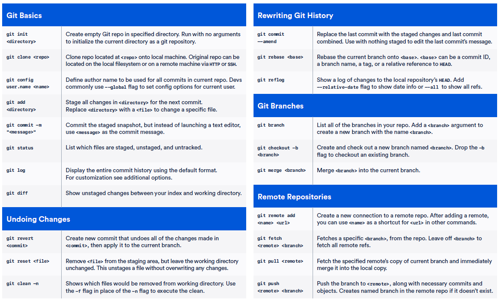

==========================================================================
 Useful Bash commands (or batch)
==========================================================================
      
Find 10 largest files in a directory:
--------------------------------------------------------------------------

du -hsx * | sort -rh | head -10

Where,

- du command -h option : display sizes in human readable format (e.g., 1K, 234M, 2G).

- du command -s option : show only a total for each argument (summary).

- du command -x option : skip directories on different file systems.

- sort command -r option : reverse the result of comparisons.

- sort command -h option : compare human readable numbers. This is GNU sort specific option only.

- head command -10 OR -n 10 option : show the first 10 lines.

This one is also very convenient: a "du" that limits the depth 
du -h --max-depth=1 

Find RAM type in windows:
--------------------------------------------------------------------------

wmic MemoryChip get BankLabel, Capacity, MemoryType, TypeDetail, Speed

Top
--------------------------------------------------------------------------

top -u user: gets the info for the particular user

See https://www.tecmint.com/12-top-command-examples-in-linux/ for useful commands

Finding files and folder in linux
-------------------------------------------------------------------------

Files: whereis

Folder: to find a folder called "media":

find /usr -name "media" 2>/dev/null

https://www.cyberciti.biz/faq/howto-find-a-directory-linux-command/

Symbolic link between folders, files
-------------------------------------------------------------------------

See https://www.freecodecamp.org/news/symlink-tutorial-in-linux-how-to-create-and-remove-a-symbolic-link/ 

.. sourcecode:: python

  #produces a new folder called 'latest' that will be in sync with the 'latest_azure' one
  ln -s latest_azure latest  
  
  # checks where does a symlink points to: here I have a "python" softlink pointing to "python3.6" executable
  ls -l /opt/anaconda/current/bin/python
  lrwxrwxrwx 1 root root 9 Mar 26  2019 /opt/anaconda/current/bin/python -> python3.6

==========================================================================
 Useful GIT commands
==========================================================================

Bitbucket: how to create ssh-keys and connect to bitbucket server
--------------------------------------------------------------------------

1. Create key: https://confluence.atlassian.com/bitbucketserver0610/creating-ssh-keys-989761219.html?utm_campaign=in-app-help&utm_medium=in-app-help&utm_source=stash

2. Copy public key to bitbucket: https://confluence.atlassian.com/bitbucketserver0610/ssh-user-keys-for-personal-use-989761224.html

3. git clone your repo. In case we get error bitbucket git "SSL certificate problem: self signed certificate in certificate chain", we need to disable the SSL verification step, either one-time shot: GIT_SSL_NO_VERIFY=true git clone https://username@git.example.com/scm/repository.git (see https://confluence.atlassian.com/bitbucketserverkb/resolving-ssl-self-signed-certificate-errors-806029899.html) or globally: git config --global http.sslVerify false (see https://mattferderer.com/fix-git-self-signed-certificate-in-certificate-chain-on-windows)

Pull requests: how-to
--------------------------------------------------------------------------

How to use git?
Usually safety rules do not allow us to push directly to master, rewrite master history and made changes without Pull Request.
Here are the different steps for a development branch:

1. git checkout master <this selects master branch>
2. git pull <this get newest data from master branch>
3. git checkout –b "branch-name" <this create new branch>
4. change code
5. git add file.py <this needed to add changed files> (or git add --all in case we want to include all changes)
6. git commit <after this command usually we shortly write that we changed>
7. git push -u origin "branch-name" <this push our branch "branch-name" to remote and this allows to us create PR>
8. create PR in bitbucket/github <PR = Pull Request>
9. merge PR in bitbucket/github (ideally another team member actually does the merge)

When doing the merge, don't forget to erase the branch (remotely, just by selecting check box in PR merge, and locally by doing git branch -d branch-name)

Repeat these steps
 
Way to learn more about git and how it works: https://learngitbranching.js.org/

What to do when your local dev branch is behind remote master?
--------------------------------------------------------------------------

Link: https://stackoverflow.com/questions/34118404/what-i-can-do-to-resolve-1-commit-behind-master

i.e. Local Master branch is behind the remote Master branch

Before preceding, you have to commit or stash all the changes you made on the branch that is behind commits.

First we need to have local master synced with remote master:

.. sourcecode:: python

  # Checkout your local Master branch
  git checkout master

  #Pull from remote Master branch
  git pull origin master

Now your local Master is in sync with the remote master ranch but other local and remote dev branches are not in sync with your local Master branch. To fix that:

.. sourcecode:: python
  
  # Checkout the branch that is behind your local Master branch
  git checkout dev-branch

  # Merge with the local Master branch
  git merge master  // Now your branch is in sync with local Master branch

  # If this branch is on the remote repository, you have to push your changes
  git push origin dev-branch

A branch exists in remote and not in local, how to get on it?
--------------------------------------------------------------------------

In new git (above 1.7) we can directly checkout on it, and git will understand:

.. sourcecode:: python

  $ git branch
  * master
  $ git --version
  git version 1.8.3.1
  $ git checkout feature/dummy-models
  Branch feature/dummy-models set up to track remote branch feature/dummy-models from origin.
  Switched to a new branch 'feature/dummy-models'
  $ git branch
  * feature/dummy-models
    master

Avoiding git pull
--------------------------------------------------------------------------

Concerning git pull: better to avoid it as it suppresses the history of recent commits: https://coderwall.com/p/jgn6-q/git-pull-is-evil

A better way is to:

- git fetch : it imports 

- git rebase : (git rebase origin/master) . That will find the earliest common commit between master and origin/master, move to a temporary space everything in your local branch that comes after that, fast forward it to the latest commit on origin/master and then apply each of the commits that were put aside on top of it, one by one, stopping if conflicts are found so that you can fix them before going on with the rebase.

About git rebase: https://blog.algolia.com/master-git-rebase/, https://medium.com/datadriveninvestor/git-rebase-vs-merge-cc5199edd77c

Git aliases
--------------------------------------------------------------------------

bash
git ~/.gitconfig

then append the aliases, so that the file looks like this:

.. sourcecode:: python

    [user]
            name = My Name
            
            email = myname@email.com

    [alias]
            g = !git --no-pager log --oneline --abbrev-commit --all --graph --decorate --color
            
            gg = !git --no-pager log --oneline --abbrev-commit --all --graph
            
            co = checkout
            
            br = branch
            
            st = status
        
then we can use the aliases like this:

git g -10    

.. figure:: Images/git_log_alias.PNG
   :scale: 100 %
   :alt: map to buried treasure

The HEAD shows where "we" are, the origin/master is the remote master branch, origin/HEAD probably where is the HEAD at the origin branch, and master the local master branch on which we now sit.

Here are some interesting other aliases: https://dev.to/dephraiim/git-commands-you-probably-didn-t-know-3bcm?utm_source=digest_mailer&utm_medium=email&utm_campaign=digest_email

Other useful commands
--------------------------------------------------------------------------

git reset --hard 9e21211 : this brings you back (or bring the HEAD back) to the commit 9e21211 and changes all files in the directory to the ones of 9e21211 commit.

Without --hard, it would only bring you to the commit but leave the files in the directory unchanged.

.. figure:: Images/git_reset_hard.PNG
   :scale: 100 %
   :alt: map to buried treasure
    
Git push configuration: matching vs simple
--------------------------------------------------------------------------

Default before git 2.0 was matching, from 2.0 will be simple. 

git push - can push all branches or a single one dependent on this configuration:

Configuration 1 – Push all branches

* git config --global push.default matching

It will push all the branches to the remote branch and would merge them. If you don’t want to push all branches, you can push the current branch only.

Configuration 2: Push only the current branch

* git config --global push.default simple

See http://www.fleekitsolutions.com/blogs/git/difference-between-push-default-matching-simple  

What is a detached head?
--------------------------------------------------------------------------

https://www.git-tower.com/learn/git/faq/detached-head-when-checkout-commit/

https://www.cloudbees.com/blog/git-detached-head
        
Cheatsheets
-------------------------------------------------------------------------- 

.. figure:: Cheatsheets/Git_CheatSheet.PNG
   :scale: 100 %
   :alt: map to buried treasure
   

.. figure:: Cheatsheets/Git_CheatSheet3.PNG
   :scale: 100 %
   :alt: map to buried treasure

Screen commands
--------------------------------------------------------------------------

https://www.howtoforge.com/linux_screen

https://www.rackaid.com/blog/linux-screen-tutorial-and-how-to/

TMUX commands
---------------------------------------------------------------------------

.. sourcecode:: python

  # Create new session: 
  tmux new -s mysession
  
  # list active sessions
  tmux ls
  
  # attach to existing session
  tmux a -t mysession
  # or
  tmux attach-session -t mysession
  
  # leaving (but not deleting) session
  Ctrl + b d

https://tmuxcheatsheet.com/

==========================================================================
 Useful VIM commands
==========================================================================

https://coderwall.com/p/adv71w/basic-vim-commands-for-getting-started 

Started learning to use Vim .. Some simple commands to get started

Vim has two modes.

1. Insert mode (Where you can just type like normal text editor. Press i for insert mode)

2. Command mode (Where you give commands to the editor to get things done . Press ESC for command mode)

Most of them below are in command mode

- : 340 - go to line 340  (we can also directly open the file at line 340: vi +340 foo.c)

- x - to delete the unwanted character

- u - to undo the last the command and U to undo the whole line

- CTRL-R to redo

- A - to insert text at the end

- a - to insert text at the cursor

- e - move to the end of that word

- :wq - to save and exit

- :q! - to trash all changes

- dw - move the cursor to the beginning of the word to delete that word

- 2w - to move the cursor two words forward.

- 3e - to move the cursor to the end of the third word forward.

- 0 (zero) to move to the start of the line.

- d2w - which deletes 2 words .. number can be changed for deleting the number of consecutive words like d3w

- dd to delete the line and 2dd to delete to line .number can be changed for deleting the number of consecutive words

- r - replace current letter by a new letter (re will replace current letter by "e")

- :s/old/new/g - replace word "old" by "new", globally

- yw - copy current word

- p - paste what has been copied (not working for me)

Pasting from system clipboard (vim has its own clipboard): In command mode, write :set paste, then in Insert mode right-mouse button. 

See much more in the link above.

==========================================================================
 Data types
==========================================================================

Definition of float vs double: https://stackoverflow.com/questions/2386772/what-is-the-difference-between-float-and-double 
