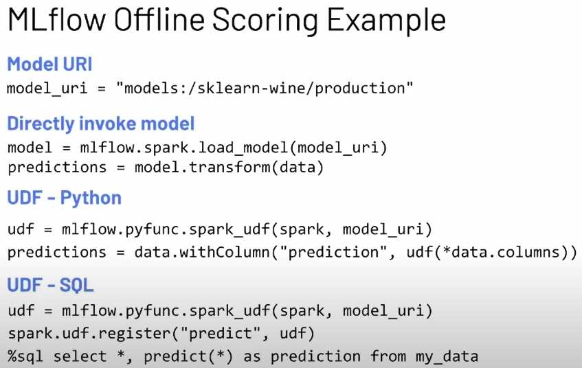
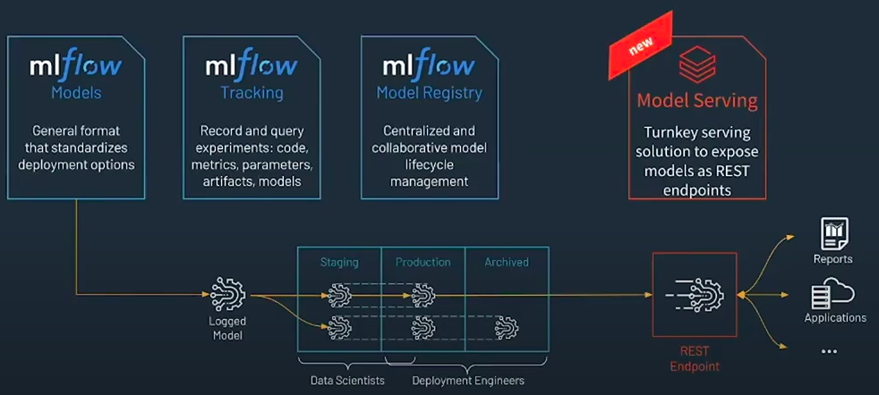
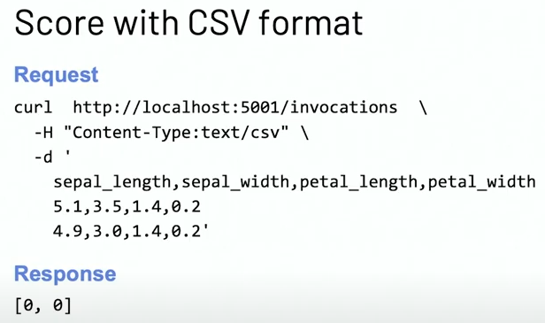
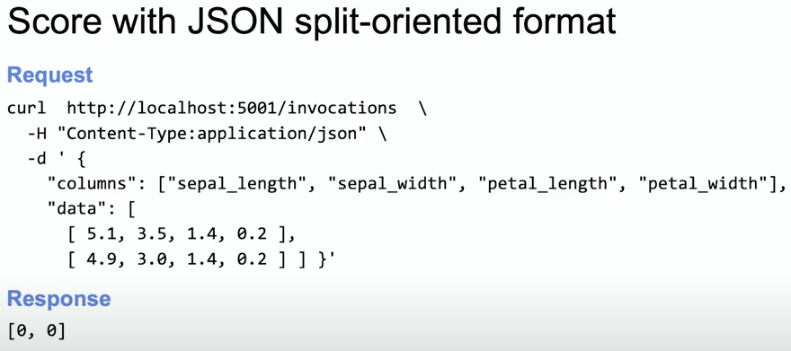
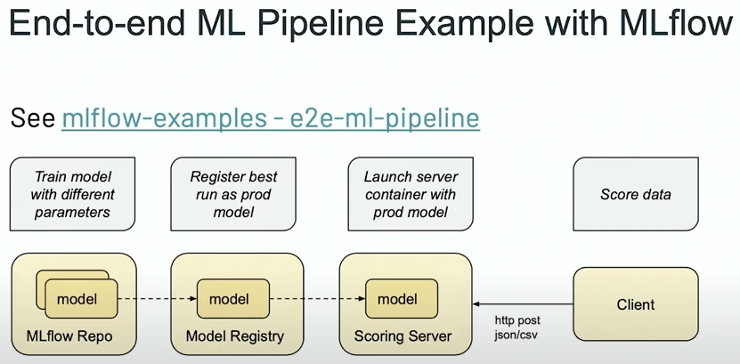
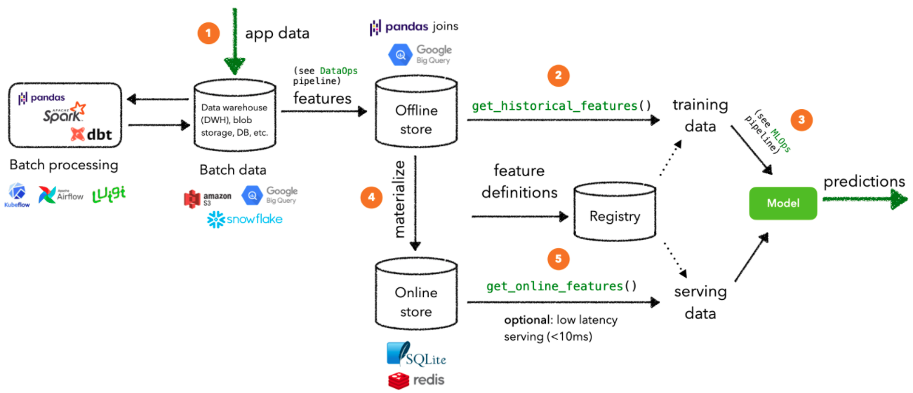
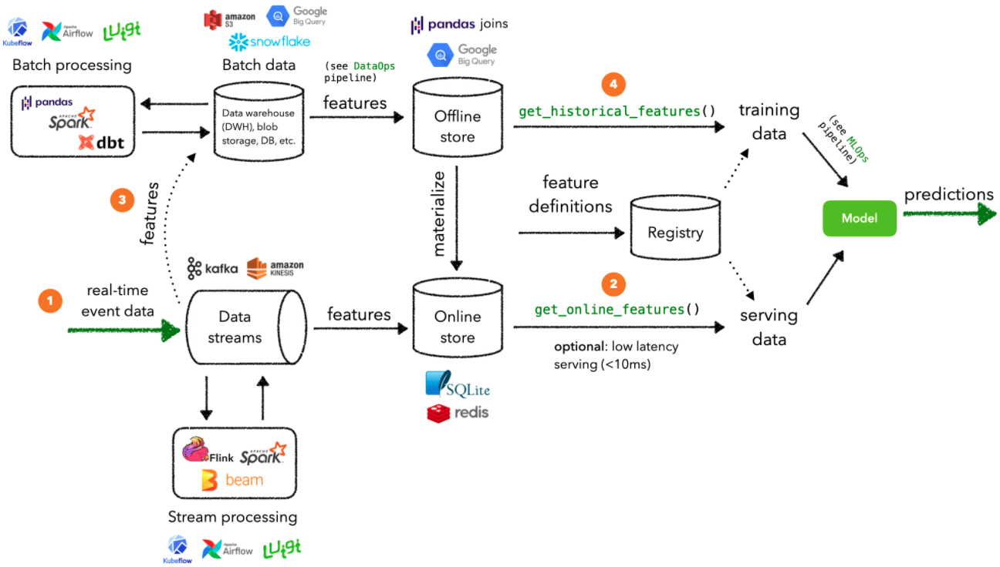
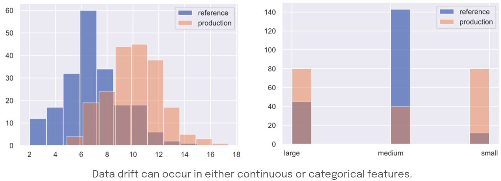

==========================================================================
DevOps
==========================================================================

Airflow
==========================================================================

Links: 

Server installation with database: https://www.statworx.com/de/blog/a-framework-to-automate-your-work-how-to-set-up-airflow/

First dag: https://medium.com/better-programming/how-to-write-your-first-pipeline-in-airflow-a51141c3f4dd

How to unit-test Airflow: https://godatadriven.com/blog/testing-and-debugging-apache-airflow/ 

CRON scheduler translator: https://crontab.guru/#0_08_27_*_*

**A common source of confusion in Airflow regarding dates** is the fact that the run timestamped with a given date only starts when the period that it covers ends! See for example the pictures in https://medium.com/nerd-for-tech/airflow-catchup-backfill-demystified-355def1b6f92 . 

If you run a DAG on a schedule_interval of one day, the run stamped 2020-01-01 will be triggered soon after 2020-01-01T23:59. In other words, the job instance is started once the period it covers has ended. The execution_date available in the context will also be 2020-01-01.

The first DAG Run is created based on the minimum start_date for the tasks in your DAG. Subsequent DAG Runs are created by the scheduler process, based on your DAG’s schedule_interval, sequentially. If your start_date is 2020-01-01 and schedule_interval is @daily, the first run will be created on 2020-01-02 i.e., after your start date has passed.

Re-run DAG

start_date: https://airflow.apache.org/docs/apache-airflow/stable/faq.html#what-s-the-deal-with-start-date

execution_date:

macros for execution_date: https://airflow.apache.org/docs/apache-airflow/stable/macros-ref.html . For example:

{{ ds }} : the execution date as YYYY-MM-DD

{{ next_ds }} : the next execution date as YYYY-MM-DD if {{ ds }} is 2018-01-01 and schedule_interval is @weekly, {{ next_ds }} will be 2018-01-08

Airflow CLI
--------------------------------------------------------------------------

Detection of a specific dag DAG_NAME contained in a file '/folder/dags/any_subfolder/dag_filename':

.. sourcecode:: python

  airflow list_dags -sd /folder/dags/ -r | grep dag_filename
  
  # output such as
  # /any_subfolder/dag_filename.py                                     | 0.018184 |       1 |        1 | ['DAG_NAME']

Docker
==========================================================================

Good links:

The 3 following resources form a series very simple to follow and reproduce, and very useful to grab basic concepts:

- https://mlinproduction.com/docker-for-ml-part-1/ : this basically shows how to run jupyter notebook from a docker image. 

- https://mlinproduction.com/docker-for-ml-part-2/ : this shows how to build a docker image.

- https://mlinproduction.com/docker-for-ml-part-3/ : this shows an example of ML sklearn model packed in a docker image. 

Additional interesting resources:

- https://medium.com/better-programming/how-to-get-docker-to-play-nicely-with-your-python-data-science-packages-81d16f1080d2

- https://medium.com/@itembe2a/docker-nvidia-conda-h204gpu-make-an-ml-docker-image-47451c5ced51 

- https://towardsdatascience.com/docker-for-data-science-9c0ce73e8263

- Intro to docker & kubernetes video: https://www.youtube.com/watch?v=bhBSlnQcq2k&ab_channel=Amigoscode

High-level principle of Docker images:

.. figure:: Images/Docker_principle.png
   :scale: 100 %
   :alt: Docker images principle
   
Activate a conda environment in Docker: https://pythonspeed.com/articles/activate-conda-dockerfile/   

Spark on Docker: https://www.datamechanics.co/blog-post/spark-and-docker-your-spark-development-cycle-just-got-ten-times-faster

Note: bug with Dockerhub, to authenticate (when too many failed login attempts): https://github.com/docker/hub-feedback/issues/1250. In CLI: rm ~/.docker/config.json, and then: docker login

Some basic Docker CLI commands include:

* docker build builds an image from a Dockerfile

* docker images displays all Docker images on the machine

* docker run starts a container and runs commands in it

* docker run options:

-p specify ports in host and Docker container

-it opens an interactive console

-d starts the container in daemon mode (runs in the background)

-e sets environment variables

* docker ps displays all running containers

* docker rmi removes one or more images

* docker rm removes one or more containers

* docker kill kills one or more running containers

* docker tag tags an image with an alias which can be referenced later

* docker login logs in to your Docker registry

Docker-compose
==========================================================================

Links:

- intro: https://www.youtube.com/watch?v=DX1T-PKHKhg&ab_channel=Simplilearn

- install: https://docs.docker.com/compose/install/

- official doc: get started example: https://docs.docker.com/compose/gettingstarted/ 

- docker compose file reference: https://docs.docker.com/compose/compose-file/compose-file-v3/ (useful to match the docker compose file format with the docker engine release number)

Kubernetes
==========================================================================

Good links:

Again, a very interesting series to address the basics concepts:

- https://mlinproduction.com/k8s-pods/ : part 1 of the series, on Kubernetes Pods 

- https://mlinproduction.com/k8s-jobs/ : part 2 of the series, on jobs

- https://mlinproduction.com/k8s-cronjobs/ : part 3 of the series, on CronJobs

- https://mlinproduction.com/k8s-deployments/ : part 4 of the series, on deployments

- https://mlinproduction.com/k8s-services/ : part 5 of the series

- How to start, official site: https://kubernetes.io/docs/home/

- Simple intro: https://dev.to/vascoalramos/learning-kubernetes-concepts-part-1-pb0?utm_source=digest_mailer&utm_medium=email&utm_campaign=digest_email

- 50 days to Kubernetes, Azure (AKS): https://azure.microsoft.com/mediahandler/files/resourcefiles/kubernetes-learning-path/Kubernetes%20Learning%20Path%20version%201.0.pdf

- How to install a kubernetes cluster on Azure (AKS): https://docs.microsoft.com/en-us/azure/aks/tutorial-kubernetes-deploy-cluster This show how to deploy such a cluster and how to access from local environment. 

Intro to docker & kubernetes video: https://www.youtube.com/watch?v=bhBSlnQcq2k&ab_channel=Amigoscode

How to switch between different clusters: https://stackoverflow.com/questions/43643463/how-to-switch-kubectl-clusters-between-gcloud-and-minikube

You first need to get the context, which names the different clusters available:

$ kubectl config get-contexts

Example of output, for a minikube and AKS clusters:

CURRENT   NAME              CLUSTER          AUTHINFO                             NAMESPACE
          aks-cluster-dev   aks-cluster-dev  clusterUser_aks-rg_aks-cluster-dev   
*         minikube          minikube         minikube                             default

Then to switch from the minikube to the AKS one:

kubectl config use-context aks-cluster-dev

And to switch back to the minikube cluster:

kubectl config use-context minikube

Minikube
--------------------------------------------------------------------------

How to install Minikube: https://minikube.sigs.k8s.io/docs/start/

$ curl -LO https://storage.googleapis.com/minikube/releases/latest/minikube_latest_amd64.deb

$ sudo dpkg -i minikube_latest_amd64.deb

* If using VirtualBox, first install it: https://linuxize.com/post/how-to-install-virtualbox-on-ubuntu-20-04/

.. sourcecode:: python

  # Start a cluster using the virtualbox driver: https://minikube.sigs.k8s.io/docs/drivers/virtualbox/
  minikube start --driver=virtualbox
  
  # You can also set these parameters
  minikube start --cpus=4 --memory=8g
  
  # To make virtualbox the default driver:
  minikube config set driver virtualbox
  
  # Access the Kubernetes Dashboard running within the minikube cluster:
  minikube dashboard
  
  # Once started, you can interact with your cluster using kubectl, just like any other Kubernetes cluster. For instance, starting a server:
  kubectl create deployment hello-minikube --image=k8s.gcr.io/echoserver:1.4
  
  # Exposing a service as a NodePort
  kubectl expose deployment hello-minikube --type=NodePort --port=8080
  
  # minikube makes it easy to open this exposed endpoint in your browser:
  minikube service hello-minikube
  
  # Upgrade your cluster:
  minikube start --kubernetes-version=latest
  
  # Stop your local cluster:
  minikube stop
  
  # Delete your local cluster:
  minikube delete
  
  # Exposing a service as a LoadBalancer
  kubectl expose deployment hello-minikube1 --type=LoadBalancer --port=8080
  
  # Then the service can be accessed using:
  minikube service --url hello-minikube1
  # example of output: http://192.168.99.100:12345/ This is the address where the service will be available

The last piece of code expose the service related to the deployment to port 8080. 

To open that in the browser, one needs to open a tunnel in Minikube (see https://minikube.sigs.k8s.io/docs/handbook/accessing/)

$ minikube tunnel

At the end of the experimentation, we need to close the tunnel: 

$ minikube tunnel --cleanup

Minikube Addons

.. sourcecode:: python

  # minikube has a built-in list of applications and services that may be easily deployed, such as Istio or Ingress. To list the available addons for your version of minikube:
  minikube addons list
  
  # To enable an add-on, see:
  minikube addons enable <name>
  
  # To enable an addon at start-up, where –addons option can be specified multiple times:
  minikube start --addons <name1> --addons <name2>
  
  # For addons that expose a browser endpoint, you can quickly open them with:
  minikube addons open <name>
  
  # To disable an addon:
  minikube addons disable <name>
  
  # To clear out minikube's home folder containing configs and other files:
  minikube delete --all --purge

More Minikube links:

* Handbook: https://minikube.sigs.k8s.io/docs/handbook/

How to create a deployment on minikube/kubernetes?

.. sourcecode:: python

  # To see which deployments are already there:
  kubectl get deployments
  
  # To deploy a deployment yaml file:
  kubectl create -f deployment.yaml
  
  # Note that it is also possible to use (https://kubernetes.io/docs/concepts/workloads/controllers/deployment/#creating-a-deployment):
  kubectl apply -f https://k8s.io/examples/controllers/nginx-deployment.yaml
  
  # See the different deployments
  kubectl get deployment
  
  # Describe the deployments (show the yaml files behind them)
  kubectl describe deployments
  
  # Delete a deployment
  kubectl delete deploy mlflow-deployment
  
  # How to scale a deployment to 4 pods (https://cloud.google.com/kubernetes-engine/docs/how-to/scaling-apps#scaling_an_application)
  kubectl scale deployment mlflow-deployment --replicas 4
  
  # How to scale a statefulset (or other controller) to 4 pods
  kubectl scale statefulset mlflow-postgres --replicas 4
  
  # How to autoscale the application (https://cloud.google.com/kubernetes-engine/docs/how-to/scaling-apps#autoscaling-deployments)
  kubectl autoscale deployment my-app --max 6 --min 4 --cpu-percent 50

Seems that *apply* is more declarative, while *create* is imperative (see https://stackoverflow.com/questions/47241626/what-is-the-difference-between-kubectl-apply-and-kubectl-replace), and so *apply* will figure out by itself the best way to deploy (kubectl patch, replace, delete, create, even edit are all imperative)

Create a Stateless (classical app) app deployment: https://cloud.google.com/kubernetes-engine/docs/how-to/stateless-apps#anatomy

- Inspect it: https://cloud.google.com/kubernetes-engine/docs/how-to/stateless-apps#inspect

- Update the deployment: https://cloud.google.com/kubernetes-engine/docs/how-to/stateless-apps#update

- roll back an update to a previous version: https://cloud.google.com/kubernetes-engine/docs/how-to/stateless-apps#rollback

Create a Statefulset (like a database) app: https://cloud.google.com/kubernetes-engine/docs/how-to/stateful-apps#creating_a_statefulset

Configure Ingress 

- for external load-balancing: https://cloud.google.com/kubernetes-engine/docs/how-to/load-balance-ingress

- for internal load-balancing: https://cloud.google.com/kubernetes-engine/docs/how-to/internal-load-balance-ingress

How to merge several yaml manifest files into one: https://stackoverflow.com/questions/59287850/how-to-have-multiple-object-types-in-a-single-openshift-yaml-template

Kubernetes command cheatsheets:

* https://kubernetes.io/docs/reference/kubectl/cheatsheet/

Azure Kubernetes Service
--------------------------------------------------------------------------

Start/stop already created cluster: https://docs.microsoft.com/en-us/azure/aks/start-stop-cluster?tabs=azure-cli

For a given cluster aks-cluster-dev in a resource group aks-rg, stopping/starting it is easy:

$ az aks stop --name aks-cluster-dev --resource-group aks-rg

$ az aks start --name aks-cluster-dev --resource-group aks-rg

Spark on Kubernetes
--------------------------------------------------------------------------

Good links:

- https://levelup.gitconnected.com/spark-on-kubernetes-3d822969f85b

Openshift
==========================================================================

How to create a dummy app? 

1. Create a python repo in bitbucket(or github). It should have a requirements.txt and an app.py file (dummy example)

2. Then in the catalog, search for python, select version, give an app name and select the repo

3. Before going to next, go to advance settings, and fill the configurations

4. Image building. Once the build config is ready, application can be built. To do this navigate to: Your OpenShift project → Builds: Builds → Your application Name → Start Build

5. Deployment. There are basically 3 ways of deploying your app:

- (continuous) deployment: Once an image is built, it is usually automatically pushed into deployment with one running pod.

If one doesn't want to have a continuously running and/or indefinitely restarting application, one can decrease the pods in the deployment to zero:
Openshift → Overview → Application

- job (single run): To run an application once, one should create a job. One should do that using CLI:

.. sourcecode:: python

  oc run single-job --image=docker-registry.default.svc:5000/projectname-spi-syst/application:1.0 --restart=OnFailure --limits="memory=2Gi"

A pod will then be immediately created and run to completion. The pod will restart indefinitely if it fails, meaning that some supervision should take place if the user is not experienced.

--image part can be retrieved with commands oc get imagestream or oc get imagestreamtag or Builds:Images → Docker Repo. It is best to specify the imagestream with the tag (1.0 in this case, ) for specific image because there have been observations of older image versions used when using the tag "latest".

--limits is used in order to extend the amount of memory (and other resources) in the pod 

The pod restarts on failure regardless of which --restart parameter is set (–restart=Never is not proven to work as expected, however).

Latest jobs that ran to completion or currently running jobs can be viewed running oc get pods.

- scheduled job

Scheduling a run is essentiallty the same as creating a job, except that additional schedule parameter in a CRON format should be added, for example:
--schedule="0 0 */1 * *", this cron format should result in a run at 00:00 every day

When the single run command is modified, command for scheduling a job looks something like this:

.. sourcecode:: python

  oc run job-scheduler --image=docker-registry.default.svc:5000/projectname-spi-syst/application:1.0 --schedule="0 3 1,11,21 * *" --restart=OnFailure --limits="memory=2Gi"

This will create a pod with the app that should run once at 03:00 every 1st, 11th and 21st day of the month.

Scheduled jobs can be viewed with oc get cronjobs.

Settings for this cronjob can be edited running oc edit cronjob/job-scheduler

Persistent storage
------------------

Users can create storage volumes where data persists after closing the pods. Volume can be claimed in Storage → Create Storage.

A volume can be mounted to a deployment by modifying deployment config. This can be done from CLI interface running similar command oc set volume dc/application --add --claim-name app-storage --mount-path /opt/app-root/src/mount:

dc/.. indicates chosen deployment which can be found in Overview → Application

--claim-name indicates which volume is mounted (your created volume name)

--mount-path indicates path to your mounted volume within the deployment pods

Other relevant resources can have volumes mounted as well, for example to mount volume to a cronjob change dc/.. to cronjob/.. and etc.

Deletion
----------------------

To find and delete resources that are no longer used is done by similar commands: 

.. sourcecode:: python

  oc delete pod/application-pod

Resource type is indicated before slash

Resource name is indicated after the slash

To delete all resources that belong to an application, this program can be used: 

.. sourcecode:: python

  oc delete all --selector app=application

Additional Openshift doc
-----------------------

General documentation: https://docs.openshift.com/container-platform/4.7/welcome/index.html?ref=learn-cluster-access

Learning: 

- https://learn.openshift.com/

Note: there is some playground for Openshift (60 min trials): 

- version 3.11: https://www.katacoda.com/openshift/courses/playgrounds/openshift311

- version 4.2 : https://www.openshift.com/learn/courses/playground/ 

Also, there is a (non-free, 50$/month) cloud version of Openshift: https://manage.openshift.com/sign_in 

Openshift can be integrated with Azure DevOps (by plugins within Azure DevOps). LOOK INTO THIS!!!

Localhost version of openshift: https://developers.redhat.com/openshift/local-openshift

Open source example of flask using OS3: https://github.com/idealo/flask-openshift-example 

Same, using Minishift: https://medium.com/@nikhilkumar435/deploy-python-flask-application-using-openshift-minishift-af098eb74e26

For Openshift 4.X, to run locally, better to use codeready-containers: https://developers.redhat.com/products/codeready-containers/overview?ref=learn-cluster-access 

Getting started (Medium): https://sindhumurugavel.medium.com/getting-started-with-kubernetes-9fb8995d0726

Get started with CLI: https://docs.openshift.com/enterprise/3.0/cli_reference/get_started_cli.html#basic-setup-and-login

Import images from external registry into openshift image registry: https://dzone.com/articles/pulling-images-from-external-container-registry-to

Example, to import minio image from DockerHub into OS model registry: oc import-image docker.io/minio/minio --confirm

CICD developement
==========================================================================

what is it exactly?

- https://kumul.us/understanding-cicd-continuous-integration-deployment-delivery/

Interesting series of Videos on CI/CD of a ML model (NLP detection of positive/negative comments) using GitLab, Jenkins and Flask (and Docker):

- video 1: installation of Docker, GitLab, Jenkins: https://www.youtube.com/watch?v=SUyHDYb1aBM&ab_channel=ThinkwithRiz
- video 2: model building using Flask: https://www.youtube.com/watch?v=XT2TFQexYrg&ab_channel=ThinkwithRiz
- video 3: deploy NLP Machine Learning Model Flask App to Docker: https://www.youtube.com/watch?v=rb_DkKAZzyA&t=5s&ab_channel=ThinkwithRiz
- video 4: Flask Application End To End CI-CD Pipeline using Jenkins & GitLab: https://www.youtube.com/watch?v=sg1S7A532gM&ab_channel=ThinkwithRiz

GitLab
--------------------------------------------------------------------------

Jenkins
--------------------------------------------------------------------------

Azure DevOps
--------------------------------------------------------------------------

Azure DevOps with azure container registry (for Docker container images): https://docs.microsoft.com/en-us/azure/devops/pipelines/ecosystems/containers/acr-template?view=azure-devops

Examples of deployment of a flask app using Azure DevOps: 

- https://docs.microsoft.com/en-us/azure/devops/pipelines/ecosystems/python-webapp?view=azure-devops

- https://elevate-org.com/2019/10/15/build-devops-ci-cd-pipeline-for-python-flask-with-azure-devops/

Example of full cicd (ok, using dotnet, not python, but useful to see full steps): https://dotnetplaybook.com/build-test-and-deploy-a-rest-api-with-azure-devops/

Doc on docker image building using Azure DevOps (and a Dockerfile): https://docs.microsoft.com/en-us/azure/devops/pipelines/tasks/test/publish-test-results?view=azure-devops&tabs=junit%2Cyaml#docker

Example of Azure pipeline for a TEST-QA-PROD deployment of a python-flask application: https://docs.microsoft.com/en-us/samples/azure-samples/azure-pipelines-variable-templates/azure-pipelines-variable-templates/

jobs, conditions, variables in Azure Pipelines: A recurrent tricky problem: when you define a variable from a job, how to make it available in another job? https://gaunacode.com/passing-variables-between-jobs-for-azure-devops-pipelines (pay attention that jobs run on different agents by default, so the variables are not passed by default). 

Also, if I need to use a variable of a previous job in a condition in a downstream job: https://docs.microsoft.com/en-us/azure/devops/pipelines/process/conditions?view=azure-devops&tabs=yaml#use-the-output-variable-from-a-job-in-a-condition-in-a-subsequent-job

Passing variables between different STAGES: https://docs.microsoft.com/en-us/azure/devops/pipelines/process/expressions?view=azure-devops#stage-to-stage-dependencies

This one is more concrete: https://arunksingh16.medium.com/azure-devops-share-variable-across-stages-9bca85abfe8a (simple working example):

.. sourcecode:: python

  stages:

  - stage: STAGE_X
    jobs:
    - job: STAGE_X_JOB_A
      steps:
      - checkout: none
      - script: |
          echo "This is job STAGE_X_JOB_A. Lets set the value"
          export PARAM_X="TEST"
          echo "##vso[task.setvariable variable=VarKey;isOutput=true]$PARAM_X"
        name: ValidateVar
      - script: |
          echo "Key Value :"
          echo $(ValidateVar.VarKey)
        name: Print_Key_value
    - job: STAGE_X_JOB_B
      dependsOn: STAGE_X_JOB_A
      condition: eq(dependencies.STAGE_X_JOB_A.outputs['ValidateVar.VarKey'], 'TEST')
      steps:
      - checkout: none
      - script: |
          echo "This is job STAGE_X_JOB_B and will run as per the valid condition"
        displayName: Print Details
        
  - stage: STAGE_Y
    dependsOn: STAGE_X
    jobs:
    - job: STAGE_Y_JOB_B
      condition: eq(stageDependencies.STAGE_X.STAGE_X_JOB_A.outputs['ValidateVar.VarKey'], 'TEST') 
      variables:
        varFromStageA: $[ stageDependencies.STAGE_X.STAGE_X_JOB_A.outputs['ValidateVar.VarKey'] ]
      steps:
      - checkout: none
      - script: |
          echo "This Job will print value from Stage STAGE_X"
          echo $(varFromStageA)

Good post on the different variable types in Azure DevOps: https://adamtheautomator.com/azure-devops-variables/#What_are_Azure_DevOps_Pipeline_Variables

Tests
--------------------------------------------------------------------------

- regression testing

- performance testing

- coverage testing: tps://www.guru99.com/test-coverage-in-software-testing.html 

Git Flow
--------------------------------------------------------------------------

Intro here: https://medium.com/@patrickporto/4-branching-workflows-for-git-30d0aaee7bf

Git flow extended demo: https://datasift.github.io/gitflow/IntroducingGitFlow.html

The one of Azure DevOps: https://docs.microsoft.com/en-us/azure/devops/repos/tfvc/effective-tfvc-branching-strategies-for-devops?view=azure-devops

==========================================================================
MLOps - Machine learning life cycle
==========================================================================

Great intro to the core principles of MLOps by Google: https://cloud.google.com/solutions/machine-learning/mlops-continuous-delivery-and-automation-pipelines-in-machine-learning
Therein is discussed the 3 levels of development & deployments, very useful.

Associated video: https://cloud.withgoogle.com/next/sf/sessions?session=AI212#cloud-ai, https://www.youtube.com/watch?v=6gdrwFMaEZ0&feature=emb_logo&ab_channel=GoogleCloudTech

Here are the 3 levels of MLops defined by Google:

* Level 0: the level that most companies try to achieve:

.. figure:: Images/MLops_level0.png
   :scale: 100 %
   :alt: MLOps level 0

* Level 1: 

.. figure:: Images/MLops_level1.png
   :scale: 100 %
   :alt: MLOps level 1

* Level 2: 

.. figure:: Images/MLops_level2.png
   :scale: 100 %
   :alt: MLOps level 2

ML platforms: https://medium.com/better-programming/5-great-mlops-tools-to-launch-your-next-machine-learning-model-3e403d0c97d3

MLFlow
==========================================================================

Advantages:

MLFlow is a Data Science platform built with machine learning model development, versioning and deployment in mind.

Developed by Databricks, open-sourced, and donated to Linux foundation. As such, heavily documented. Became de-facto standard in last 2 years

For development, ability to log parameters (see tracking API)

For deployment, ability to version-control model, and tag model: none-staging-production-archived (see model registry API)

the open source version exists as a server-client application, accessible through:

- a user-friendly (data scientist-friendly) UI

- through python APIs

- through the MLFlow CLI: https://www.mlflow.org/docs/latest/cli.html

See the components of MLFlow here: https://www.mlflow.org/docs/latest/concepts.html#mlflow-components 

Good links:

- Main concepts of MLFlow: https://www.mlflow.org/docs/latest/concepts.html

- https://blog.noodle.ai/introduction-to-mlflow-for-mlops-part-1-anaconda-environment/

- How to track MLFlow using the Databricks MLFlow server (accessed from local environment): https://docs.databricks.com/applications/mlflow/access-hosted-tracking-server.html

- tutorial: https://www.adaltas.com/en/2020/03/23/mlflow-open-source-ml-platform-tutorial

1. MLFLow Tracking: https://www.mlflow.org/docs/latest/tracking.html
--------------------------------------------------------------------------

Log scikit-learn models in MLFlow: https://mlflow.org/docs/latest/python_api/mlflow.sklearn.html#mlflow.sklearn.log_model

Log pyspark models in MLFlow: https://mlflow.org/docs/latest/python_api/mlflow.spark.html#mlflow.spark.log_model

Log tensorflow models in MLFlow: https://www.mlflow.org/docs/latest/python_api/mlflow.tensorflow.html#mlflow.tensorflow.log_model

2. MLFLow Projects: https://www.mlflow.org/docs/latest/projects.html
--------------------------------------------------------------------------

In MLflow projects, we can containarize the MLflow model (training and/or inference) into Docker containers!

Here an example for a containarized training: https://github.com/mlflow/mlflow/tree/master/examples/docker

3. MLFlow Models: https://www.mlflow.org/docs/latest/models.html
--------------------------------------------------------------------------

There are 2 ways to score/serve the MLflow models: offline and online.

For **offline** scoring:

For **online** scoring, also multiple possibilities:   

MLflow also has a CLI that supports the following commands:

* How to [serve](https://www.mlflow.org/docs/latest/cli.html#mlflow-models-serve) MLflow models on the Databricks platform:

* [build_docker](https://www.mlflow.org/docs/latest/cli.html#mlflow-models-build-docker) packages a REST API endpoint serving the model as a docker image.

* [predict](https://www.mlflow.org/docs/latest/cli.html#mlflow-models-predict) uses the model to generate a prediction for a local CSV or JSON file. Note that this method only supports DataFrame input.

For more info, see:

.. sourcecode:: python

  mlflow models --help
  mlflow models serve --help
  mlflow models predict --help
  mlflow models build-docker --help

build-docker:   

Builds a Docker image whose default entrypoint serves the specified MLflow model at port 8080 within the container, using the ‘python_function’ flavor.

For example, the following command builds a docker image named ‘my-image-name’ that serves the model from run ‘some-run-uuid’ at run-relative artifact path ‘my-model’:

.. sourcecode:: python

  mlflow models build-docker -m "runs:/some-run-uuid/my-model" -n "my-image-name"

  # We can then serve the model, exposing it at port 5001 on the host via:
  docker run -p 5001:8080 "my-image-name"

  # NB: by default, the container will start nginx and gunicorn processes. If you don’t need the nginx process to be started (for instance if you deploy your container to Google Cloud Run), you can disable it via the DISABLE_NGINX environment variable:
  docker run -p 5001:8080 -e DISABLE_NGINX=true "my-image-name"

  # See https://www.mlflow.org/docs/latest/python_api/mlflow.pyfunc.html for more information on the ‘python_function’ flavor.

- MLflow documentation for serving as REST endpoint: https://docs.databricks.com/applications/mlflow/model-serving.html

- concrete example using Iris dataset during Data & AI conference: https://www.youtube.com/watch?v=Q8ieZEiDTbE&ab_channel=Databricks

- Serving different flavours in MLflow (using pyfunc and UDFs): https://www.youtube.com/watch?v=A1NERf_8wwA&ab_channel=Databricks

MLflow serve deploys the model as a local REST API server.

How to launch a MLflow webserver using the MLflow CLI:

mlflow models serve --model-uri models:/sklearn-iris/production --port 5001 (example)

Two formats, CSV or JSON (pandas-split or pandas-records format): https://www.mlflow.org/docs/latest/models.html#deploy-mlflow-models

   

Here is the entire procedure:

4. MLFlow Model registry: https://www.mlflow.org/docs/latest/model-registry.html
--------------------------------------------------------------------------------

Model registry example: https://docs.microsoft.com/en-us/azure/databricks/applications/mlflow/model-registry-example 

Model registry accessible from multiple environments: https://docs.microsoft.com/en-us/azure/databricks/applications/machine-learning/manage-model-lifecycle/multiple-workspaces?fbclid=IwAR20hHDxB5JWl5otgceJ8yOv260POXwu-oBBgJaBuVNfiNAmNUOxSisU6Ew

* How to register a model using the model registry UI: https://docs.microsoft.com/en-us/azure/databricks/applications/mlflow/model-registry-example#register-and-manage-the-model-using-the-mlflow-ui

* How to register a model in the model registry in the MLFlow API: https://docs.microsoft.com/en-us/azure/databricks/applications/mlflow/model-registry-example#register-and-manage-the-model-using-the--mlflow-api 

Here is the full chain with Databricks' MLflow and azure ML: https://databricks.com/blog/2020/10/13/using-mlops-with-mlflow-and-azure.html Very good tutorial. 

How to create an open-source MLFlow server on Docker or Kubernetes
--------------------------------------------------------------------------

- Setup MLflow in Production: https://towardsdatascience.com/setup-mlflow-in-production-d72aecde7fef, https://pedro-munoz.tech/how-to-setup-mlflow-in-production/, https://medium.com/datatau/how-to-setup-mlflow-in-production-a6f70511ebdc

- Deploy MLflow with Docker-compose: https://towardsdatascience.com/deploy-mlflow-with-docker-compose-8059f16b6039

- Deploy MLflow on kubernetes (minikube): https://towardsdatascience.com/mlflow-part-2-deploying-a-tracking-server-to-minikube-a2d6671e6455

- Deploy MLflow on kubernetes using Kompose (minikube): https://github.com/Imaginea/mlflow-on-k8s

- MLflow on kubernetes using bodywork: https://www.bodyworkml.com/posts/deploy-mlflow-with-bodywork

Deploy MLflow on Openshift: 

- Getting started (Medium): https://sindhumurugavel.medium.com/getting-started-with-kubernetes-9fb8995d0726

- part 1: https://sindhumurugavel.medium.com/running-your-app-on-kubernetes-part-1-build-an-image-of-mlflow-app-on-openshift-3404f3885f84

- part 2: https://sindhumurugavel.medium.com/running-your-app-on-kubernetes-part-2-deploying-an-image-of-mlflow-on-openshift-c4ab4301d9d2

How to setup MLflow on an Azure VM: https://medium.com/swlh/how-to-setup-mlflow-on-azure-5ba67c178e7d

SonarQube (or SonarCloud, SonarLint): static code analysis
--------------------------------------------------------------------------

How to use SonarQube with Azure DevOps: https://docs.sonarqube.org/latest/analysis/azuredevops-integration/

- SonarQube: on prem version

- SonarCloud: cloud available version

- SonarLint: version available in IDEs, like VSCode. 

How to use the cloud version of SonarQube, SonarCloud, with Azure DevOps: 

- https://azuredevopslabs.com/labs/vstsextend/sonarcloud/

- https://www.codewrecks.com/blog/index.php/2019/01/05/sonar-analysis-of-python-with-azure-devops-pipeline/ : with concrete YAML file example

What does SonarQube/SonarCloud "better" than classical linting tools like flake8 or pylint? 

- https://blog.sonarsource.com/sonarcloud-finds-bugs-in-high-quality-python-projects

- https://community.sonarsource.com/t/is-that-possible-to-use-pylint-with-sonarqube/24874 (also introduces how to mix pylint & Sonar)

Rule explorer: here is the list of 174 rules used in SonarQube/SonarCloud/SonarLint: https://rules.sonarsource.com/python (for Python, but exists also for different languages)

Good links on SQ: https://tomgregory.com/sonarqube-branch-analysis/ and related pages

Kubeflow
==========================================================================

Intro: https://www.kubeflow.org/docs/about/kubeflow/

Use cases: https://www.kubeflow.org/docs/about/use-cases/

On Azure: https://www.kubeflow.org/docs/azure/ and https://www.kubeflow.org/docs/azure/azureendtoend/ 

On Openshift: https://www.kubeflow.org/docs/openshift/ 

On premises: https://www.kubeflow.org/docs/other-guides/kubeflow-on-multinode-cluster/ 

On Minikube: 

- https://www.kubeflow.org/docs/started/workstation/minikube-linux/ (high resources needed)

- https://gist.github.com/John-Lin/c8083b4db75e97cf12943c545301acd8 (lower resources needed)

- https://v0-2.kubeflow.org/docs/started/getting-started-minikube/

==========================================================================
DataOps
==========================================================================

Feature Store
==========================================================================

Why do we need a feature store? (https://www.datarevenue.com/en-blog/feature-store-feast-vs-hopsworks)

If you train models without a feature store, your setup might look something like this: 

.. figure:: Images/no_feature_store.png
   :scale: 100 %
   :alt: Taken from https://www.datarevenue.com/en-blog/feature-store-feast-vs-hopsworks

Every model has to access the data and do some transformation to turn it into features, which the model then uses for training.

There's a lot of duplication in this process - many of the models use many of the same features.

This duplication is one problem a feature store can solve. Every feature can be stored, versioned, and organized in your feature store. 

.. figure:: Images/with_feature_store.png
   :scale: 100 %
   :alt: Taken from https://www.datarevenue.com/en-blog/feature-store-feast-vs-hopsworks

[Reasons of a FS](https://madewithml.com/courses/mlops/feature-store/):

1. **Isolation**: feature development in isolation (for each unique ML application) can lead to duplication of efforts (setting up ingestion pipelines, feature engineering, etc.).

Solution: create a central feature repository where the entire team contributes maintained features that anyone can use for any application.

2. **Skew**: we may have different pipelines for generating features for training and serving which can introduce skew through the subtle differences.

Solution: create features using a **unified pipeline** and store them in a central location that the training and serving pipelines pull from.

3. **Values**: once we set up our data pipelines, we need to ensure that our input feature values are up-to-date so we aren't working with stale data, while maintaining point-in-time correctness so we don't introduce data leaks.

Solution: retrieve input features for the respective outcomes by pulling what's available when a prediction would be made.

When actually constructing our feature store, there are several core components we need to have to address these challenges:

* **data ingestion**: ability to ingest data from various sources (databases, data warehouse, etc.) and keep them updated.

* **feature definitions**: ability to define entities and corresponding features

* **historical features**: ability to retrieve historical features to use for training.

* **online features**: ability to retrieve features from a low latency origin for inference.

FS **Batch processing**: in batch processing, inference requests on specific entity instances can use features that have been materialized from the offline store

1. Application data is stored in a database and/or a data warehouse, etc. And it goes through the DataOps pipeline to validate the data and engineer the features.

2. These features are written to the offline store which can then be used to retrieve historical training data to train a model with.

3. Once we have our training data, we can start the MLOps pipeline to optimize, train and validate a model.

4. We can incrementally materialize features to the online store so that we can retrieve an entity's feature values with low latency. In a production setting, something like Redis or DynamoDB would be used.

5. These online features are passed on to the deployed model to generate predictions that would be used downstream.   

FS **Stream processing**: we require near real-time feature values to deliver up-to-date predictions at low latency. While we'll still utilize an offline store for retrieving historical data, our application's real-time event data will go directly through our data streams to an online store for serving.

1. Real-time event data enters our running data streams (Kafka / Kinesis, etc.) where they can be processed to generate features.

2. These features are written to the online store which can then be used to retrieve online features for serving at low latency. In a production setting, something like Redis or DynamoDB would be used.

3. Streaming features are also written from the data stream to the batch data source (data warehouse, db, etc.) to be processed for generating training data later on.

4. Historical data will be validated and used to generate features for training a model. This cadence for how often this happens depends on whether there are data annotation lags, compute constraints, etc.

Hopsworks 
--------------------------------------------------------------------------

Intro: 

* Jim Dowling Medium blog: https://towardsdatascience.com/mlops-with-a-feature-store-816cfa5966e9 

* Data & AI conference presentation: https://www.youtube.com/watch?v=uDyQqDCVjfA&ab_channel=Databricks

* White paper: https://uploads-ssl.webflow.com/5e6f7cd3ee7f51d539a4da0b/5ef397dce942172c90259858_feature%20management%20platform%20v02.pdf

Documentation:

* How to's: https://docs.hopsworks.ai/latest/

* Official doc: https://hopsworks.readthedocs.io/en/stable/index.html

* Examples: https://github.com/logicalclocks/hops-examples

* Nice intro from Made with ML: https://madewithml.com/courses/mlops/feature-store/

FEAST
---------------------------------------------------------------------------

FEAST is an open source feature store. 

FEAST is heavily linked with Kubeflow:

* FEAST introduction: https://cloud.google.com/blog/products/ai-machine-learning/introducing-feast-an-open-source-feature-store-for-machine-learning

Comparison FEAST vs Hopsworks: https://www.datarevenue.com/en-blog/feature-store-feast-vs-hopsworks

Getting started with FEAST: https://www.kubeflow.org/docs/components/feature-store/getting-started/

==========================================================================
Monitoring of ML models
==========================================================================

Great hands-on blog: https://www-jeremyjordan-me.cdn.ampproject.org/c/s/www.jeremyjordan.me/ml-monitoring/amp/

madewithml: https://madewithml.com/courses/mlops/monitoring/

What exactly can we monitor: 

- The system health (underlying platform health)

- the model performance. 

Problem of delayed outcome: it is sometimes difficult to have the real model performance (absence of feedback on model output) on fresh data. We can use a subset of the dataset being served, with an annotation pipeline, to be able to produce some performance metric. 

"If we wait to catch the model decay based on the performance, it may have already caused significant damage to downstream business pipelines that are dependent on it. We need to employ more fine-grained monitoring to identify the sources of model drift prior to actual performance degradation."

Different types of drift:

.. figure:: Images/drift_MLOps.png
   :scale: 100 %
   :alt: Different types of drifts

   Copied from https://madewithml.com/courses/mlops/monitoring/
   
**Data drift**: also known as feature drift or covariate shift, occurs when the distribution of the production data is different from the training data. 

   Copied from https://madewithml.com/courses/mlops/monitoring/

**Target drift**: shift in the outcomes/labels. This can be a shift in the distributions but also the removal or addition of new classes with categorical tasks. Though retraining can mitigate the performance decay caused target drift, it can often be avoided with proper inter-pipeline communication about new classes, schema changes, etc.

**Concept drift**: Besides the input and output/label data drifting, we can have the actual relationship between them drift as well. This concept drift renders our model ineffective because the patterns it learned to map between the original inputs and outputs are no longer relevant. Such drift can be gradual, abrupt, or even periodic.

Scikit-multiflow provides a toolkit for concept drift detection techniques directly on streaming data. The package offers windowed, moving average functionality (including dynamic preprocessing) and even methods around concepts like gradual concept drift.

How to measure the drifts?

1. Comparing the expectations (in the sense of Great Expectations) on reference data and production data

2. For univariate case:

- Kolmogorov-Smirnov (KS) test. For example, a Kolmogorov-Smirnov (KS) test, which determines the maximum distance between two distribution's cumulative density functions.

- Chi-squared test: similarly for categorical data (input features, targets, etc.) we can apply the Pearson's chi-squared test to determine if a frequency of events (1D) is consistent with a reference distribution.

3. Multivariate case: measuring drift is fairly straightforward for univariate data but difficult for multivariate data. In https://madewithml.com/courses/mlops/monitoring/, it is recommended to reduce data dimensionality (PCA and alike) and then measure. The different dimensionality reduction techniques applied on multivariate data yield either 1D or multidimensional data and so different statistical tests are used to calculate drift: 

- Maximum Mean Discrepancy (MMD): a kernel-based approach that determines the distance between two distributions by computing the distance between the mean embeddings of the features from both distributions.

- Kolmogorov-Smirnov (KS) Test + Bonferroni Correction: determines the maximum distance between two distribution's cumulative density functions. We can apply this on each dimension of the multidimensional data and then use the Bonferroni correction (conservative) or the False discovery rate (FDR) correction to mitigate issues stemming from multiple comparisons.

