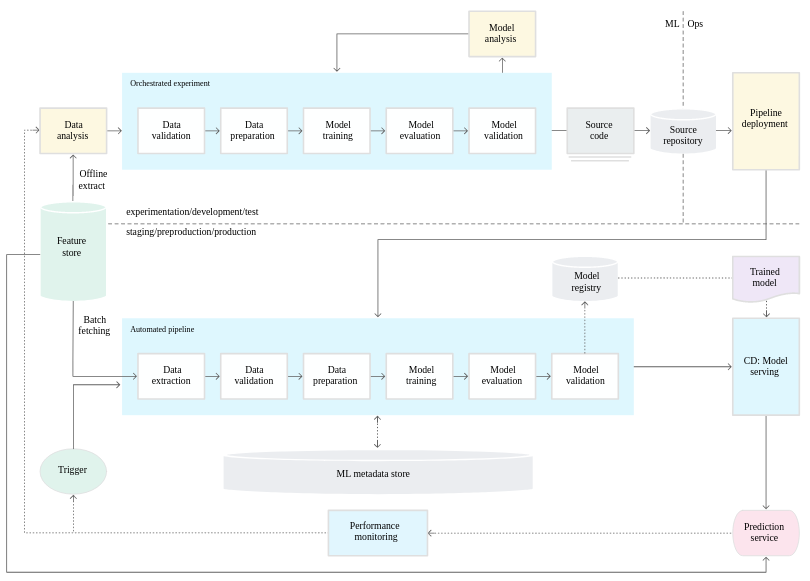

==========================================================================
 DevOps
==========================================================================

Airflow
==========================================================================

Links: 

Server installation with database: https://www.statworx.com/de/blog/a-framework-to-automate-your-work-how-to-set-up-airflow/
First dag: https://medium.com/better-programming/how-to-write-your-first-pipeline-in-airflow-a51141c3f4dd
How to unit-test Airflow: https://godatadriven.com/blog/testing-and-debugging-apache-airflow/ 

Docker
==========================================================================

Good links:

The 3 following resources form a series very simple to follow and reproduce, and very useful to grab basic concepts:

- https://mlinproduction.com/docker-for-ml-part-1/ : this basically shows how to run jupyter notebook from a docker image. 

- https://mlinproduction.com/docker-for-ml-part-2/ : this shows how to build a docker image.

- https://mlinproduction.com/docker-for-ml-part-3/ : this shows an example of ML sklearn model packed in a docker image. 

Additional interesting resources:

- https://medium.com/better-programming/how-to-get-docker-to-play-nicely-with-your-python-data-science-packages-81d16f1080d2

- https://medium.com/@itembe2a/docker-nvidia-conda-h204gpu-make-an-ml-docker-image-47451c5ced51 

- https://towardsdatascience.com/docker-for-data-science-9c0ce73e8263

- Intro to docker & kubernetes video: https://www.youtube.com/watch?v=bhBSlnQcq2k&ab_channel=Amigoscode

High-level principle of Docker images:

.. figure:: Images/Docker_principle.png
   :scale: 100 %
   :alt: Docker images principle
   
Activate a conda environment in Docker: https://pythonspeed.com/articles/activate-conda-dockerfile/   

Spark on Docker: https://www.datamechanics.co/blog-post/spark-and-docker-your-spark-development-cycle-just-got-ten-times-faster

Note: bug with Dockerhub, to authenticate (when too many failed login attempts): https://github.com/docker/hub-feedback/issues/1250. In CLI: rm ~/.docker/config.json, and then: docker login

Kubernetes
==========================================================================

Good links:

Again, a very interesting series to address the basics concepts:

- https://mlinproduction.com/k8s-pods/ : part 1 of the series, on Kubernetes Pods 

- https://mlinproduction.com/k8s-jobs/ : part 2 of the series, on jobs

- https://mlinproduction.com/k8s-cronjobs/ : part 3 of the series, on CronJobs

- https://mlinproduction.com/k8s-deployments/ : part 4 of the series, on deployments

- https://mlinproduction.com/k8s-services/ : part 5 of the series

- How to start, official site: https://kubernetes.io/docs/home/

- 50 days to Kubernetes, Azure (AKS): https://azure.microsoft.com/mediahandler/files/resourcefiles/kubernetes-learning-path/Kubernetes%20Learning%20Path%20version%201.0.pdf

- How to install a kubernetes cluster on Azure (AKS): https://docs.microsoft.com/en-us/azure/aks/tutorial-kubernetes-deploy-cluster This show how to deploy such a cluster and how to access from local environment. 

Intro to docker & kubernetes video: https://www.youtube.com/watch?v=bhBSlnQcq2k&ab_channel=Amigoscode

Minikube
--------------------------------------------------------------------------

How to install Minikube: https://minikube.sigs.k8s.io/docs/start/

$ curl -LO https://storage.googleapis.com/minikube/releases/latest/minikube_latest_amd64.deb

$ sudo dpkg -i minikube_latest_amd64.deb

* If using VirtualBox, first install it: https://linuxize.com/post/how-to-install-virtualbox-on-ubuntu-20-04/

.. sourcecode:: python

  # Start a cluster using the virtualbox driver: https://minikube.sigs.k8s.io/docs/drivers/virtualbox/
  minikube start --driver=virtualbox
  
  # You can also set these parameters
  minikube start --cpus=4 --memory=8g
  
  # To make virtualbox the default driver:
  minikube config set driver virtualbox
  
  # Access the Kubernetes Dashboard running within the minikube cluster:
  minikube dashboard
  
  # Once started, you can interact with your cluster using kubectl, just like any other Kubernetes cluster. For instance, starting a server:
  kubectl create deployment hello-minikube --image=k8s.gcr.io/echoserver:1.4
  
  # Exposing a service as a NodePort
  kubectl expose deployment hello-minikube --type=NodePort --port=8080
  
  # minikube makes it easy to open this exposed endpoint in your browser:
  minikube service hello-minikube
  
  # Upgrade your cluster:
  minikube start --kubernetes-version=latest
  
  # Stop your local cluster:
  minikube stop
  
  # Delete your local cluster:
  minikube delete
  
  # How to deploy an application to minikube using kubectl, using an image, and expose it:
  kubectl create deployment hello-minikube1 --image=k8s.gcr.io/echoserver:1.4
  kubectl expose deployment hello-minikube1 --type=LoadBalancer --port=8080

Minikube Addons

.. sourcecode:: python

  # minikube has a built-in list of applications and services that may be easily deployed, such as Istio or Ingress. To list the available addons for your version of minikube:
  minikube addons list
  
  # To enable an add-on, see:
  minikube addons enable <name>
  
  # To enable an addon at start-up, where –addons option can be specified multiple times:
  minikube start --addons <name1> --addons <name2>
  
  # For addons that expose a browser endpoint, you can quickly open them with:
  minikube addons open <name>
  
  # To disable an addon:
  minikube addons disable <name>

More Minikube links:

* Handbook: https://minikube.sigs.k8s.io/docs/handbook/

How to create a deployment on minikube/kubernetes?

.. sourcecode:: python

  # To see which deployments are already there:
  kubectl get deployments
  
  # To deploy a deployment yaml file:
  kubectl create -f deployment.yaml
  
  # Note that it is also possible to use (https://kubernetes.io/docs/concepts/workloads/controllers/deployment/#creating-a-deployment):
  kubectl apply -f https://k8s.io/examples/controllers/nginx-deployment.yaml

Seems that *apply* is more declarative, while *create* is imperative (see https://stackoverflow.com/questions/47241626/what-is-the-difference-between-kubectl-apply-and-kubectl-replace), and so *apply* will figure out by itself the best way to deploy (kubectl patch, replace, delete, create, even edit are all imperative)

Kubernetes command cheatsheets:

* https://kubernetes.io/docs/reference/kubectl/cheatsheet/

Spark on Kubernetes
--------------------------------------------------------------------------

Good links:

- https://levelup.gitconnected.com/spark-on-kubernetes-3d822969f85b

Openshift
==========================================================================

How to create a dummy app? 

1. Create a python repo in bitbucket(or github). It should have a requirements.txt and an app.py file (dummy example)

2. Then in the catalog, search for python, select version, give an app name and select the repo

3. Before going to next, go to advance settings, and fill the configurations

4. Image building. Once the build config is ready, application can be built. To do this navigate to: Your OpenShift project → Builds: Builds → Your application Name → Start Build

5. Deployment. There are basically 3 ways of deploying your app:

- (continuous) deployment: Once an image is built, it is usually automatically pushed into deployment with one running pod.

If one doesn't want to have a continuously running and/or indefinitely restarting application, one can decrease the pods in the deployment to zero:
Openshift → Overview → Application

- job (single run): To run an application once, one should create a job. One should do that using CLI:

.. sourcecode:: python

  oc run single-job --image=docker-registry.default.svc:5000/projectname-spi-syst/application:1.0 --restart=OnFailure --limits="memory=2Gi"

A pod will then be immediately created and run to completion. The pod will restart indefinitely if it fails, meaning that some supervision should take place if the user is not experienced.

--image part can be retrieved with commands oc get imagestream or oc get imagestreamtag or Builds:Images → Docker Repo. It is best to specify the imagestream with the tag (1.0 in this case, ) for specific image because there have been observations of older image versions used when using the tag "latest".

--limits is used in order to extend the amount of memory (and other resources) in the pod 

The pod restarts on failure regardless of which --restart parameter is set (–restart=Never is not proven to work as expected, however).

Latest jobs that ran to completion or currently running jobs can be viewed running oc get pods.

- scheduled job

Scheduling a run is essentiallty the same as creating a job, except that additional schedule parameter in a CRON format should be added, for example:
--schedule="0 0 */1 * *", this cron format should result in a run at 00:00 every day

When the single run command is modified, command for scheduling a job looks something like this:

.. sourcecode:: python

  oc run job-scheduler --image=docker-registry.default.svc:5000/projectname-spi-syst/application:1.0 --schedule="0 3 1,11,21 * *" --restart=OnFailure --limits="memory=2Gi"

This will create a pod with the app that should run once at 03:00 every 1st, 11th and 21st day of the month.

Scheduled jobs can be viewed with oc get cronjobs.

Settings for this cronjob can be edited running oc edit cronjob/job-scheduler

Persistent storage
------------------

Users can create storage volumes where data persists after closing the pods. Volume can be claimed in Storage → Create Storage.

A volume can be mounted to a deployment by modifying deployment config. This can be done from CLI interface running similar command oc set volume dc/application --add --claim-name app-storage --mount-path /opt/app-root/src/mount:

dc/.. indicates chosen deployment which can be found in Overview → Application

--claim-name indicates which volume is mounted (your created volume name)

--mount-path indicates path to your mounted volume within the deployment pods

Other relevant resources can have volumes mounted as well, for example to mount volume to a cronjob change dc/.. to cronjob/.. and etc.

Deletion
----------------------

To find and delete resources that are no longer used is done by similar commands: 

.. sourcecode:: python

  oc delete pod/application-pod

Resource type is indicated before slash

Resource name is indicated after the slash

To delete all resources that belong to an application, this program can be used: 

.. sourcecode:: python

  oc delete all --selector app=application

Additional Openshift doc
-----------------------

Learning: 

- https://learn.openshift.com/

Note: there is some playground for Openshift (60 min trials): 

- version 3.11: https://www.katacoda.com/openshift/courses/playgrounds/openshift311

- version 4.2 : https://www.openshift.com/learn/courses/playground/ 

Also, there is a (non-free, 50$/month) cloud version of Openshift: https://manage.openshift.com/sign_in 

Openshift can be integrated with Azure DevOps (by plugins within Azure DevOps)

Localhost version of openshift: https://developers.redhat.com/openshift/local-openshift

Open source example of flask using OS3: https://github.com/idealo/flask-openshift-example 

Same, using Minishift: https://medium.com/@nikhilkumar435/deploy-python-flask-application-using-openshift-minishift-af098eb74e26

CICD developement
==========================================================================

what is it exactly?

- https://kumul.us/understanding-cicd-continuous-integration-deployment-delivery/

Interesting series of Videos on CI/CD of a ML model (NLP detection of positive/negative comments) using GitLab, Jenkins and Flask (and Docker):

- video 1: installation of Docker, GitLab, Jenkins: https://www.youtube.com/watch?v=SUyHDYb1aBM&ab_channel=ThinkwithRiz
- video 2: model building using Flask: https://www.youtube.com/watch?v=XT2TFQexYrg&ab_channel=ThinkwithRiz
- video 3: deploy NLP Machine Learning Model Flask App to Docker: https://www.youtube.com/watch?v=rb_DkKAZzyA&t=5s&ab_channel=ThinkwithRiz
- video 4: Flask Application End To End CI-CD Pipeline using Jenkins & GitLab: https://www.youtube.com/watch?v=sg1S7A532gM&ab_channel=ThinkwithRiz

GitLab
--------------------------------------------------------------------------

Jenkins
--------------------------------------------------------------------------

Azure DevOps
--------------------------------------------------------------------------

Azure DevOps with azure container registry (for Docker container images): https://docs.microsoft.com/en-us/azure/devops/pipelines/ecosystems/containers/acr-template?view=azure-devops

Examples of deployment of a flask app using Azure DevOps: 

- https://docs.microsoft.com/en-us/azure/devops/pipelines/ecosystems/python-webapp?view=azure-devops

- https://elevate-org.com/2019/10/15/build-devops-ci-cd-pipeline-for-python-flask-with-azure-devops/

Example of full cicd (ok, using dotnet, not python, but useful to see full steps): https://dotnetplaybook.com/build-test-and-deploy-a-rest-api-with-azure-devops/

Doc on docker image building using Azure DevOps (and a Dockerfile): https://docs.microsoft.com/en-us/azure/devops/pipelines/tasks/test/publish-test-results?view=azure-devops&tabs=junit%2Cyaml#docker

Tests
--------------------------------------------------------------------------

- regression testing

- performance testing

- coverage testing: tps://www.guru99.com/test-coverage-in-software-testing.html 

Git Flow
--------------------------------------------------------------------------

Intro here: https://medium.com/@patrickporto/4-branching-workflows-for-git-30d0aaee7bf

Git flow extended demo: https://datasift.github.io/gitflow/IntroducingGitFlow.html

The one of Azure DevOps: https://docs.microsoft.com/en-us/azure/devops/repos/tfvc/effective-tfvc-branching-strategies-for-devops?view=azure-devops

==========================================================================
MLOps - Machine learning life cycle
==========================================================================

Great intro to the core principles of MLOps by Google: https://cloud.google.com/solutions/machine-learning/mlops-continuous-delivery-and-automation-pipelines-in-machine-learning
Therein is discussed the 3 levels of development & deployments, very useful.

Associated video: https://cloud.withgoogle.com/next/sf/sessions?session=AI212#cloud-ai, https://www.youtube.com/watch?v=6gdrwFMaEZ0&feature=emb_logo&ab_channel=GoogleCloudTech

Here are the 3 levels of MLops defined by Google:

* Level 0: the level that most companies try to achieve:

.. figure:: Images/MLops_level0.png
   :scale: 100 %
   :alt: MLOps level 0

* Level 1: 

* Level 2: 

ML platforms: https://medium.com/better-programming/5-great-mlops-tools-to-launch-your-next-machine-learning-model-3e403d0c97d3

MLFlow
==========================================================================

Advantages:

MLFlow is a Data Science platform built with machine learning model development, versioning and deployment in mind.

Developed by Databricks, open-sourced, and donated to Linux foundation. As such, heavily documented. Became de-facto standard in last 2 years

For development, ability to log parameters (see tracking API)

For deployment, ability to version-control model, and tag model: none-staging-production-archived (see model registry API)

the open source version exists as a server-client application, accessible through:

- a user-friendly (data scientist-friendly) UI

- through python APIs

- through the MLFlow CLI: https://www.mlflow.org/docs/latest/cli.html

See the components of MLFlow here: https://www.mlflow.org/docs/latest/concepts.html#mlflow-components 

Good links:

- Main concepts of MLFlow: https://www.mlflow.org/docs/latest/concepts.html

- https://blog.noodle.ai/introduction-to-mlflow-for-mlops-part-1-anaconda-environment/

- How to track MLFlow using the Databricks MLFlow server (accessed from local environment): https://docs.databricks.com/applications/mlflow/access-hosted-tracking-server.html

- tutorial: https://www.adaltas.com/en/2020/03/23/mlflow-open-source-ml-platform-tutorial

MLFLow Tracking: https://www.mlflow.org/docs/latest/tracking.html
--------------------------------------------------------------------------

Log scikit-learn models in MLFlow: https://mlflow.org/docs/latest/python_api/mlflow.sklearn.html#mlflow.sklearn.log_model

Log pyspark models in MLFlow: https://mlflow.org/docs/latest/python_api/mlflow.spark.html#mlflow.spark.log_model

Log tensorflow models in MLFlow: https://www.mlflow.org/docs/latest/python_api/mlflow.tensorflow.html#mlflow.tensorflow.log_model

MLFLow Projects: https://www.mlflow.org/docs/latest/projects.html
--------------------------------------------------------------------------

MLFlow Models: https://www.mlflow.org/docs/latest/models.html
--------------------------------------------------------------------------

MLFlow Model registry: https://www.mlflow.org/docs/latest/model-registry.html
--------------------------------------------------------------------------

Model registry example: https://docs.microsoft.com/en-us/azure/databricks/applications/mlflow/model-registry-example 

* How to register a model using the model registry UI: https://docs.microsoft.com/en-us/azure/databricks/applications/mlflow/model-registry-example#register-and-manage-the-model-using-the-mlflow-ui

* How to register a model in the model registry in the MLFlow API: https://docs.microsoft.com/en-us/azure/databricks/applications/mlflow/model-registry-example#register-and-manage-the-model-using-the--mlflow-api 

Here is the full chain with Databricks' MLflow and azure ML: https://databricks.com/blog/2020/10/13/using-mlops-with-mlflow-and-azure.html Very good tutorial. 

MLFlow server
--------------------------------------------------------------------------

- Setup MLflow in Production: https://towardsdatascience.com/setup-mlflow-in-production-d72aecde7fef, https://pedro-munoz.tech/how-to-setup-mlflow-in-production/, https://medium.com/datatau/how-to-setup-mlflow-in-production-a6f70511ebdc

- Deploy MLflow with Docker-compose: https://towardsdatascience.com/deploy-mlflow-with-docker-compose-8059f16b6039

- Deploy MLflow on kubernetes (minikube): https://towardsdatascience.com/mlflow-part-2-deploying-a-tracking-server-to-minikube-a2d6671e6455

SonarQube (or SonarCloud, SonarLint): static code analysis
--------------------------------------------------------------------------

How to use SonarQube with Azure DevOps: https://docs.sonarqube.org/latest/analysis/azuredevops-integration/

- SonarQube: on prem version

- SonarCloud: cloud available version

- SonarLint: version available in IDEs, like VSCode. 

How to use the cloud version of SonarQube, SonarCloud, with Azure DevOps: 

- https://azuredevopslabs.com/labs/vstsextend/sonarcloud/

- https://www.codewrecks.com/blog/index.php/2019/01/05/sonar-analysis-of-python-with-azure-devops-pipeline/ : with concrete YAML file example

What does SonarQube/SonarCloud "better" than classical linting tools like flake8 or pylint? 

- https://blog.sonarsource.com/sonarcloud-finds-bugs-in-high-quality-python-projects

- https://community.sonarsource.com/t/is-that-possible-to-use-pylint-with-sonarqube/24874 (also introduces how to mix pylint & Sonar)

Rule explorer: here is the list of 174 rules used in SonarQube/SonarCloud/SonarLint: https://rules.sonarsource.com/python (for Python, but exists also for different languages)

Kubeflow
==========================================================================

Intro: https://www.kubeflow.org/docs/about/kubeflow/

Use cases: https://www.kubeflow.org/docs/about/use-cases/

On Azure: https://www.kubeflow.org/docs/azure/ and https://www.kubeflow.org/docs/azure/azureendtoend/ 

On Openshift: https://www.kubeflow.org/docs/openshift/ 

On premises: https://www.kubeflow.org/docs/other-guides/kubeflow-on-multinode-cluster/ 

On Minikube: https://www.kubeflow.org/docs/started/workstation/minikube-linux/

==========================================================================
DataOps
==========================================================================

Feature Store
==========================================================================

Why do we need a feature store? (https://www.datarevenue.com/en-blog/feature-store-feast-vs-hopsworks)

If you train models without a feature store, your setup might look something like this: 

.. figure:: Images/no_feature_store.png
   :scale: 100 %
   :alt: Taken from https://www.datarevenue.com/en-blog/feature-store-feast-vs-hopsworks

Every model has to access the data and do some transformation to turn it into features, which the model then uses for training.

There’s a lot of duplication in this process – many of the models use many of the same features.

This duplication is one problem a feature store can solve. Every feature can be stored, versioned, and organized in your feature store. 

.. figure:: Images/with_feature_store.png
   :scale: 100 %
   :alt: Taken from https://www.datarevenue.com/en-blog/feature-store-feast-vs-hopsworks

Hopsworks 
--------------------------------------------------------------------------
Intro: 

* Jim Dowling Medium blog: https://towardsdatascience.com/mlops-with-a-feature-store-816cfa5966e9 

* Data & AI conference presentation: https://www.youtube.com/watch?v=uDyQqDCVjfA&ab_channel=Databricks

* White paper: https://uploads-ssl.webflow.com/5e6f7cd3ee7f51d539a4da0b/5ef397dce942172c90259858_feature%20management%20platform%20v02.pdf

Documentation:

* How to's: https://docs.hopsworks.ai/latest/

* Official doc: https://hopsworks.readthedocs.io/en/stable/index.html

* Examples: https://github.com/logicalclocks/hops-examples

FEAST
---------------------------------------------------------------------------

FEAST is an open source feature store. 

FEAST is heavily linked with Kubeflow:

* FEAST introduction: https://cloud.google.com/blog/products/ai-machine-learning/introducing-feast-an-open-source-feature-store-for-machine-learning

Comparison FEAST vs Hopsworks: https://www.datarevenue.com/en-blog/feature-store-feast-vs-hopsworks

Getting started with FEAST: https://www.kubeflow.org/docs/components/feature-store/getting-started/

