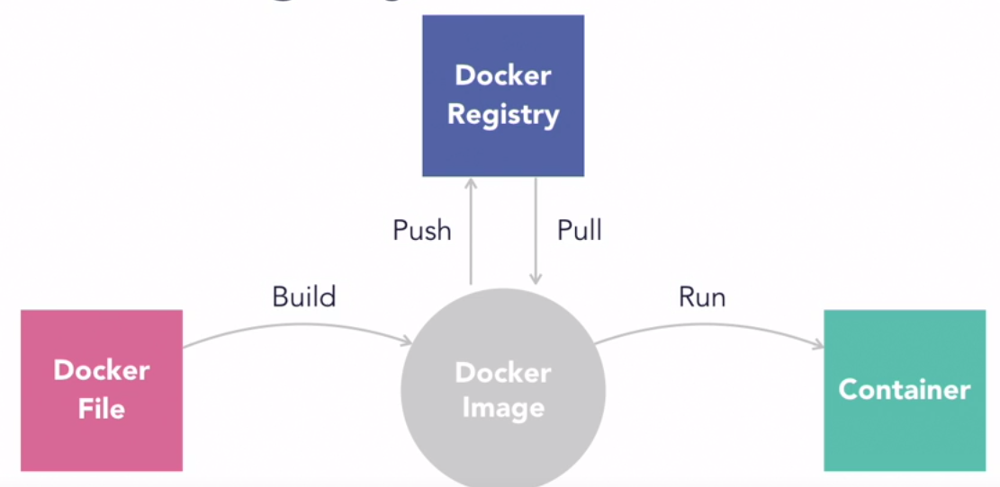

==========================================================================
Docker and Kubernetes - short tutorial
==========================================================================

Docker
--------------------------------------------------------------------------

Good links:

The 3 following resources form a series very simple to follow and reproduce, and very useful to grab basic concepts:

- https://mlinproduction.com/docker-for-ml-part-1/ : this basically shows how to run jupyter notebook from a docker image. 

- https://mlinproduction.com/docker-for-ml-part-2/ : this shows how to build a docker image.

- https://mlinproduction.com/docker-for-ml-part-3/ : this shows an example of ML sklearn model packed in a docker image. 

Additional interesting resources:

- https://medium.com/better-programming/how-to-get-docker-to-play-nicely-with-your-python-data-science-packages-81d16f1080d2 

- https://medium.com/@itembe2a/docker-nvidia-conda-h204gpu-make-an-ml-docker-image-47451c5ced51 

- https://towardsdatascience.com/docker-for-data-science-9c0ce73e8263

- Docker for python: how does it compare to other python environment managment tools: https://www.pluralsight.com/tech-blog/managing-python-environments/

High-level principle of Docker images:

Kubernetes
--------------------------------------------------------------------------

Good links:

Again, a very interesting series to address the basics concepts:

- https://mlinproduction.com/k8s-pods/ : part 1 of the series, on Kubernetes Pods 

- https://mlinproduction.com/k8s-jobs/ : part 2 of the series, on jobs

- https://mlinproduction.com/k8s-cronjobs/ : part 3 of the series, on CronJobs

- https://mlinproduction.com/k8s-deployments/ : part 4 of the series, on deployments

- https://mlinproduction.com/k8s-services/ : part 5 of the series

Local version of Kubernetes using microk8s: https://kubernetes.io/blog/2019/11/26/running-kubernetes-locally-on-linux-with-microk8s/

Spark on Kubernetes links: 

- from the official spark doc: https://spark.apache.org/docs/latest/running-on-kubernetes.html

DEVOPS
--------------------------------------------------------------------------

CICD developement: what is it exactly?

- https://kumul.us/understanding-cicd-continuous-integration-deployment-delivery/
