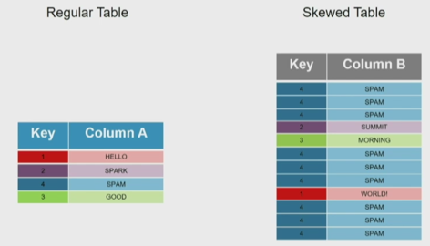

===============
 Pyspark
===============

Basic Pyspark documentation
======================================================

.. topic:: Introduction

    The objective here is to have everything useful for the projects, not to make a complete documentation of the whole package. Here I will try to document both version 1.6 and >2.0. A special emphase will be done on machine learning module ml (mllib is outdated).
    We will not review the full Pyspark documentation. For that, look at http://spark.apache.org/docs/1.6.0/programming-guide.html for version 1.6, http://spark.apache.org/docs/2.1.0/programming-guide.html for version 2.1.
 
General Spark resources:

- nice intro to Spark concept: https://towardsdatascience.com/explaining-technical-stuff-in-a-non-techincal-way-apache-spark-274d6c9f70e9

- https://sparkbyexamples.com/

- https://data-flair.training/blogs/dag-in-apache-spark/ (internal of Spark)

Installation of Spark (3.0.1) on Ubuntu machine
------------------------------------------------------

See https://phoenixnap.com/kb/install-spark-on-ubuntu Includes the launch of master&slave workers. 

Certifications
------------------------------------------------------

Databricks: https://medium.com/@sriramn84_34423/crack-databricks-certified-associate-developer-for-apache-spark-3-0-cf4cb89df61d

Spark-submit tasks
------------------------------------------------------

How to navigate between versions using spark-submit:

To check the spark version that currently uses spark-submit:

spark-submit --version

In bash, if we need spark-submit for spark 2.X, we can use:

export SPARK_MAJOR_VERSION=2 

export SPARK_MAJOR_VERSION=2
export PYSPARK_PYTHON=/var/opt/teradata/anaconda2/bin/python 

# Launch:
spark-submit --name CashflowModel --executor-memory 60G --master yarn --driver-memory 2G --executor-cores 30 Pipeline_cashflow_standalone.py &>> run_log.txt

See here for configuration parameters: https://spark.apache.org/docs/2.2.0/configuration.html 

Killing YARN applications:
------------------------------------------------------

yarn application -kill application_NNN

Simple HDFS commands
------------------------------------------------------

.. sourcecode:: python

  # explore one file
  hdfs dfs -cat /user/hadoop/file4

  # Remove directory: 
  hdfs dfs -rm -R /path/to/HDFS/file
  
  # copyFromLocal
  hdfs dfs -copyFromLocal <localsrc> URI

  # copyToLocal
  hdfs dfs -copyToLocal [-ignorecrc] [-crc] URI <localdst>
  # example: copy hdfs file part-00000 to current local directory
  hdfs dfs -copyToLocal /user/bc4350/model/metadata/part-00000 .
  
  # copy from hdfs to hdfs
  hdfs dfs -cp /user/hadoop/file1 /user/hadoop/file2 
  
  # how big is my hdfs folder?
  hdfs dfs -du -h -s /user/bc4350

And much more here: 

- https://hadoop.apache.org/docs/r1.2.1/file_system_shell.pdf 

- https://www.dezyre.com/hadoop-tutorial/hadoop-hdfs-commands

Importing Pyspark modules
------------------------------------------------------  

There are many different ones. among the most commonly used:

.. sourcecode:: python

   from pyspark.sql.functions import *
	
Creation of Pyspark objects
------------------------------------------------------  

First we need to create a Spark context (version 1.6):

.. sourcecode:: python

  from pyspark import SparkContext, SparkConf
  appName = "Your App Name"
  master = "local"
  conf = SparkConf().setAppName(appName).setMaster(master)  
  sc = SparkContext(conf=conf)
  
  #or if you just don't care (by default, the master will be local)
  sc = SparkContext()
  
  #For closing it (don't forget, if you want to create a new one later)
  sc.close()
  
Using version 2.X, we can use SparkSession:

.. sourcecode:: python
 
  from pyspark import SparkSession
  spark = SparkSession \
    .builder \
    .appName("Protob Conversion to Parquet") \
    .config("spark.some.config.option", "some-value") \
    .getOrCreate()
    
    
To change the spark configuration (for example to tune the numbers of workers available), we can define it 

.. sourcecode:: python

  #from pyspark import SparkSession,SQLContext #if not present in the notebook (in the "pyspark3Jupyter" command)
  spark.stop() #If some default spark running
  spark = SparkSession \
    .builder \
    .appName("3839_spark") \
    .config("spark.executor.cores", "3") \
    .config("spark.executor.memory","15g") \
    .config("spark.dynamicAllocation.maxExecutors","20") \
    .config("spark.dynamicAllocation.cachedExecutorIdleTimeout","30m") \
    .config("spark.sql.parquet.writeLegacyFormat","true") \
    .enableHiveSupport() \
    .getOrCreate()  
  sqlCtx = SQLContext(sc)

It can also be used that way:

.. sourcecode:: python

  from pyspark.conf import SparkContext, SparkConf
  from pyspark.sql import SparkSession
  conf = spark.sparkContext._conf.setAll([('spark.executor.memory', '4g'), ('spark.app.name', 'Spark Updated Conf'), ('spark.executor.cores', '4'), ('spark.cores.max', '4'), ('spark.driver.memory','4g')])
  spark = SparkSession.builder.config(conf=conf).getOrCreate()

   
In order to check which are the configuration parameters of the notebook:

.. sourcecode:: python

  spark.sparkContext.getConf().getAll()
  #or, when using sc:
  sc._conf.getAll()
  
If the Spark context is created to read SQL data (i.e. if we have sqlCtx), then we can simply use:

.. sourcecode:: python

   sql = """
   select * from risk_work.PBAFF_TestTrans
   """
   # Create a cashed version of data
   Data = sqlCtx.sql(sql)
   Data = Data.cache() #this is to cache the object, makes it faster to reload/reuse it later

Here a comparison of 2 ways of opening a table:
   
.. sourcecode:: python
   
  spark = SparkSession(sc)
  sqlCtx = SQLContext(sc)
  table1 = spark.sql('''select * from 3839_project_pbaff.trx_201805_mcc_pcat_gir_tra''')
  table2 = spark.table('3839_project_pbaff.trx_201805_mcc_pcat_gir_tra')   
  
RDDs
------------------------------------------------------  

RDDs are the main data structure type in Pyspark until version 2.X. When possible, let's work with the Dataframe approach rather than RDDs (they will become more and more deprecated, and are planed to disappear in 3.X) 

sc.parallelize allows to convert python list to RDDs

.. sourcecode:: python

  rdd = sc.parallelize(range(1,10))
  
Here is the DataCamp Cheatsheet for RDDs:
  
.. figure:: Cheatsheets/PySpark_Cheat_Sheet_Python.png
   :scale: 100 %
   :alt: map to buried treasure

   This Cheatsheet is taken from DataCamp.

Dataframes
------------------------------------------------------  

Starting from Pyspark 1.5, Dataframes are built ontop of RDDs and allow to deal easier with data, in a more Pandas-like way. Since version 2.0, they become the main data type.

Here is the DataCamp Cheatsheet for RDDs:
  

   This Cheatsheet is taken from DataCamp.

From Pandas to Pyspark dataframe:

.. sourcecode:: python

  #Loading a Pandas dataframe:
  df_pd = pd.read_csv("/home/BC4350/Desktop/Iris.csv")
  #Conversion to a Pyspark dataframe:
  df_sp = sqlContext.createDataFrame(df_pd) #or sc.createDataFrame(df_pd)
  #If needs to go back to Pandas:
  df_pd = df_sp.toPandas()
  
From RDD to dataframe:

.. sourcecode:: python
  
  df = rdd.toDF()
  
  
Creating a df from scatch: sometimes you have to specify the datatype:

.. sourcecode:: python

  from pyspark.sql.types import FloatType

  df = spark.createDataFrame([1.0, 2.0, 3.0], FloatType())

  df.show()

  +-----+
  |value|
  +-----+
  |  1.0|
  |  2.0|
  |  3.0|
  +-----+  
  
Partitions in pyspark
------------------------------------------------------  

How many partitions should we have? Rule of thumb is to have 128Mb per partition.

The default number of partitions in Spark is 200. For big dataframes, this low number of partitions leads to high shuffle block size (i.e. when shuffling, high block size to be shuffled). 2 Things to keep in mind against this: 

- increase the number of partitions (therefore reducing the number of partion size)

- Get rid of skew in the data

It is important not to have too big partitions, since the job might fail due to the 2Gb limit (no Spark shuffle block can be greater than 2Gb)

Rule of thumb: if number of partitions lower than 2000 but close to it, better to bump it above 2000, safer. 

You can check the number of partitions:

.. sourcecode:: python

  df.rdd.partitions.size
  #or 
  df.rdd.getNumPartitions()

  #To change the number of partitions:
  df2 = df.repartition(15)

  #re-check the number of partitions:
  df2.rdd.partitions.size
  #or 
  df2.rdd.getNumPartitions()
  
Beware of data shuffle when repartitioning as this is expensive. Take a look at coalesce if needed. "coalesce" just decreases the size of partitions (while "partition" allows to increase), but "coalesce" does not shuffle the data.  

Note: it is possible to change the default number of partitions: https://stackoverflow.com/questions/46510881/how-to-set-spark-sql-shuffle-partitions-when-using-the-lastest-spark-version : spark.conf.set("spark.sql.shuffle.partitions", 1000)
   
It is also possible to partition dataframe when loading them: https://deepsense.ai/optimize-spark-with-distribute-by-and-cluster-by/

A nice function to read the number of partitions as well as the size of each partitions:

.. sourcecode:: python

  def check_partition(df):

    print("Num partition: {0}".format(df.rdd.getNumPartitions()))
     
    def count_partition(index, iterator):
        yield (index, len(list(iterator)))
         
    data = (df.rdd.mapPartitionsWithIndex(count_partition, True).collect())
     
    for index, count in data:
        print("partition {0:2d}: {1} bytes".format(index, count))
        
  df = spark.table('database.table')        
  check_partition(df) 
  
Example of output:

.. sourcecode:: python

  Num partition: 29
  partition  0: 93780 bytes
  partition  1: 93363 bytes
  partition  2: 93153 bytes
  
  
Concerning partition skewness problem
------------------------------------------------------  

Great link on avoiding data skewness: https://medium.com/simpl-under-the-hood/spark-protip-joining-on-skewed-dataframes-7bfa610be704

Very good presentations takling skewness:

- https://www.youtube.com/watch?v=6zg7NTw-kTQ&list=PLuitsavBRqtNM0XACsWSAHRzwdLIaHmq-&index=4&t=1391s

- https://www.youtube.com/watch?v=daXEp4HmS-E&list=PLuitsavBRqtNM0XACsWSAHRzwdLIaHmq-&index=6&t=912s
  
Ideally we would like to have partitions like this:  
  
.. figure:: Images/Distribution_system_good.png
   :scale: 60 %
   :alt: Memory management in yarn and spark
   
But sometimes things like this can happen:   
   
.. figure:: Images/Distribution_system_bad.png
   :scale: 60 %
   :alt: Memory management in yarn and spark 
   
Let's say we have 2 tables skewed:

If we want to do a join, 

   
Solution using a broadcast join:

.. sourcecode:: python

  from pyspark.sql.functions import broadcast
  result = broadcast(A).join(B,["join_col"],"left")
   
Solution using a SALT key (applied for a groupby operation, but would be similar for a join):

.. figure:: Images/Data_skew_solution_using_salt.png
   :scale: 60 %
   :alt: Data_skew_solution_using_salt    
   

Spark executor/cores and memory management: Resources allocation in Spark
------------------------------------------------------

https://spoddutur.github.io/spark-notes/distribution_of_executors_cores_and_memory_for_spark_application.html  

Here a good intro:

https://blog.cloudera.com/blog/2015/03/how-to-tune-your-apache-spark-jobs-part-2/

The two main resources that Spark (and YARN) think about are CPU and memory. Disk and network I/O, of course, play a part in Spark performance as well, but neither Spark nor YARN currently do anything to actively manage them.

Every Spark executor in an application has the same fixed number of cores and same fixed heap size. The number of cores can be specified with the --executor-cores flag when invoking spark-submit, spark-shell, and pyspark from the command line, or by setting the spark.executor.cores property in the spark-defaults.conf file or on a SparkConf object. Similarly, the heap size can be controlled with the --executor-memory flag or the spark.executor.memory property. The cores property controls the number of concurrent tasks an executor can run. --executor-cores 5 means that each executor can run a maximum of five tasks at the same time. The memory property impacts the amount of data Spark can cache, as well as the maximum sizes of the shuffle data structures used for grouping, aggregations, and joins.

The --num-executors command-line flag or spark.executor.instances configuration property control the number of executors requested. Starting in CDH 5.4/Spark 1.3, you will be able to avoid setting this property by turning on dynamic allocation with the spark.dynamicAllocation.enabled property. Dynamic allocation enables a Spark application to request executors when there is a backlog of pending tasks and free up executors when idle.

It’s also important to think about how the resources requested by Spark will fit into what YARN has available. The relevant YARN properties are:

- yarn.nodemanager.resource.memory-mb controls the maximum sum of memory used by the containers on each node.

- yarn.nodemanager.resource.cpu-vcores controls the maximum sum of cores used by the containers on each node.

Asking for five executor cores will result in a request to YARN for five virtual cores. The memory requested from YARN is a little more complex for a couple reasons:

- --executor-memory/spark.executor.memory controls the executor heap size, but JVMs can also use some memory off heap, for example for interned Strings and direct byte buffers. The value of the spark.yarn.executor.memoryOverhead property is added to the executor memory to determine the full memory request to YARN for each executor. It defaults to max(384, .07 * spark.executor.memory).

- YARN may round the requested memory up a little. YARN’s yarn.scheduler.minimum-allocation-mb and yarn.scheduler.increment-allocation-mb properties control the minimum and increment request values respectively.

The following (not to scale with defaults) shows the hierarchy of memory properties in Spark and YARN:

.. figure:: Images/Memory_spark_yarn.png
   :scale: 100 %
   :alt: Memory management in yarn and spark
   
And if that weren’t enough to think about, a few final concerns when sizing Spark executors:

- The application master (AM), which is a non-executor container with the special capability of requesting containers from YARN, takes up resources of its own that must be budgeted in. In yarn-client mode, it defaults to a 1024MB and one vcore. In yarn-cluster mode, the application master runs the driver, so it’s often useful to bolster its resources with the --driver-memory and --driver-cores properties.

- Running executors with too much memory often results in excessive garbage collection delays. 64GB is a rough guess at a good upper limit for a single executor.

- the HDFS client has trouble with tons of concurrent threads. A rough guess is that at most five tasks per executor can achieve full write throughput, so it’s good to keep the number of cores per executor below that number.

- Running tiny executors (with a single core and just enough memory needed to run a single task, for example) throws away the benefits that come from running multiple tasks in a single JVM. For example, broadcast variables need to be replicated once on each executor, so many small executors will result in many more copies of the data.
   
EXAMPLE: Let's say we have a cluster with the following physical specifications:

- 6 physical nodes

- each node has 16 cores

- each node has 64Gb of memory

What are the spark parameters, to use as much resources as possible from the cluster?

Note that each of the node runs NodeManagers. The NodeManager capacities, yarn.nodemanager.resource.memory-mb and yarn.nodemanager.resource.cpu-vcores, should probably be set to 63 * 1024 = 64512 (megabytes) and 15 cores respectively. We avoid allocating 100% of the resources to YARN containers because the node needs some resources to run the OS and Hadoop daemons.

The likely first impulse would be to use --num-executors 6 --executor-cores 15 --executor-memory 63G. However, this is the wrong approach because:

- 63GB + the executor memory overhead won’t fit within the 63GB capacity of the NodeManagers.

- The application master will take up a core on one of the nodes, meaning that there won’t be room for a 15-core executor on that node.

- 15 cores per executor can lead to bad HDFS I/O throughput.

A better option would be to use --num-executors 17 --executor-cores 5 --executor-memory 19G. Why?

- This config results in three executors on all nodes except for the one with the AM, which will have two executors.

- --executor-memory was derived as (63/3 executors per node) = 21. The memory overhead should take 7% (or in more recent cases 10%) of the allocated memory: 21 * 0.07 = 1.47 Gb. So the total memory allocated should be no large than 21 – 1.47 ~ 19.
   
Spark UI
------------------------------------------------------

See an exercise from Databricks: https://www.databricks.training/spark-ui-simulator/exploring-the-spark-ui/v002/
   
Basic commands
------------------------------------------------------

.. sourcecode:: python
  
  #Counting how many rows in dataframe:
  df.count() 
  
  #Displaying first 20 rows:
  df.show(20) 
  
  #Count how many distinct values for a column:
  df.select("column").distinct().count()
  
  #Count how many Null in a column:
  df.filter(df.columName.isNull()).count()
  
  #Convert the type of a column to float. In fact you can add a new column, columnFloat:
  df = df.withColumn("columnFloat", df["column"].cast("float"))
  #Or simply replace the old column by the new one:
  df = df.withColumn("column", df["column"].cast("float"))
  
  #Sorting:
  df = spark.createDataFrame([(1, 4), (2, 8), (2, 6)], ["A", "B"]) # some data
  df.sort(col("B").desc()).show() # sorting along B column in desc order
  df.sort(col("A").desc(), col("B").asc()).show() # sorting along A column in asc order, and then along B column in desc order 
  df.sort(col("B").desc_nulls_last()).show() # sorting along B column in desc order, keeping potential NULL at the end (by default they would stay on top)  
  
  #Moving to a Pandas dataframe:
  df_pd = df.toPandas()
  
  #Add a new column (dayofmonth) to a dataframe:
  df = df.withColumn('dayofmonth',df.bgdt[7:2].cast(DoubleType())/31.)
  
  #Add a new column with a constant value:
  from pyspark.sql.functions import lit
  df = df.withColumn('NewColumn', lit(constant))
  
  #Changing the type of a column:
  df = df.withColumn("pjkd", df["pjkd"].cast("int"))
  
  #Renaming a column:
  df = df.withColumnRenamed('value', 'value2')
  
  #Trimming of whitespace in strings
  df = df.withColumn('columnName', trim(df.columnName))
  
  #Filtering (with where clause):
  df_filtered = df.select('init','initFeatures').where(df['init']=='0006')
  
  #Modify only SOME values of a column: we can use a when clause for that:
  df = df.withColumn('column', when(df['otherColumn']==something, constant).otherwise(df['column']))
  
  #Vertical concatenation of 2 dataframes
  df_result = df_1.unionAll(df_2)  
  
  #Find common columns in 2 different dataframes:
  list(set(df1.columns).intersection(set(df2.columns)))
  
  #Add a column of monotonically increasing ID:
  df = df.withColumn("id", monotonically_increasing_id())
  
  #Add a column made of a uniform random number
  df = df.withColumn('random_number', rand() )
  
  # using selectExpr to define a column (alternative to withColumn)
  df = spark.createDataFrame([(1, 4), (2, 8), (2, 6)], ["A", "B"]) 
  df.selectExpr("A", "B", "A+B > 7 as high").show(5)
  
Type definition for several variables at once ("recasting"):

.. sourcecode:: python

  # recast variable
  df.select(df[c],df[c].cast('int'))
  dtype_dict = {'Player' : StringType, 'Pos' : StringType, 'Tm' : StringType, 'Age' : IntegerType, 'G' : IntegerType, 'GS' : IntegerType, 'yr' : IntegerType}

  df2 = df.fillna('0')

  for c in df2.schema.names[6:]:
    dtype = DoubleType if c not in dtype_dict.keys() else dtype_dict[c]
  df2 = df2.withColumn(c,df2[c].cast(dtype()))
  
Dropping duplicate rows:

.. sourcecode:: python

  df = spark.createDataFrame([(1, 4, 3), (2, 8, 1), (2, 8, 1), (2, 8, 3), (3, 2, 1)], ["A", "B", "C"])  
  
  df.dropDuplicates() # drops all identical rows
  
  df.dropDuplicates(['A','B']) # drops all identical rows for columns A and B  
  
Reading/writing data  
------------------------------------------------------

Examples of reading:

Here reading a csv file in DataBricks: 

.. sourcecode:: python

  crimeDF = (spark.read
    .option("delimiter", "\t")
    .option("header", True)
    .option("timestampFormat", "mm/dd/yyyy hh:mm:ss a")
    .option("inferSchema", True)
    .csv("/mnt/training/Chicago-Crimes-2018.csv")
  )
  
  # here to remove any space in column headers, and lowercase them
  cols = crimeDF.columns
  titleCols = [''.join(j for j in i.title() if not j.isspace()) for i in cols]
  camelCols = [column[0].lower()+column[1:] for column in titleCols]

  crimeRenamedColsDF = crimeDF.toDF(*camelCols)
  
  # Note: we can read txt files with csv option:
  df    = (spark.read
           .option("delimiter",":")   
           .option("header", "true")   
           .option("inferSchema", "true")            
           .csv("/mnt/training/dataframes/people-with-dups.txt"))
  
  # writing to parquet
  targetPath = f"{workingDir}/crime.parquet"
  crimeRenamedColsDF.write.mode("overwrite").parquet(targetPath)
  
  # or for partition control
  crimeRenamedColsDF.repartition(1).write.mode("overwrite").parquet(targetPath)
  
  
  
User-Defined Schemas
------------------------------------------------------

Spark infers schemas from the data, as detailed in the example above. Challenges with inferred schemas include:

- Schema inference means Spark scans all of your data, creating an extra job, which can affect performance

- Consider providing alternative data types (for example, change a Long to a Integer)

- Consider throwing out certain fields in the data, to read only the data of interest

To define schemas, build a StructType composed of StructFields.

A primitive type contains the data itself.  The most common primitive types include:

| Numeric | General | Time |
|-----|-----|
| `FloatType` | `StringType` | `TimestampType` | 
| `IntegerType` | `BooleanType` | `DateType` | 
| `DoubleType` | `NullType` | |
| `LongType` | | |
| `ShortType` |  | |

Non-primitive types are sometimes called reference variables or composite types.  Technically, non-primitive types contain references to memory locations and not the data itself.  Non-primitive types are the composite of a number of primitive types such as an Array of the primitive type `Integer`.

The two most common composite types are `ArrayType` and `MapType`. These types allow for a given field to contain an arbitrary number of elements in either an Array/List or Map/Dictionary form.

Taken from databricks online lectures.

.. sourcecode:: python

  from pyspark.sql.types import StructType, StructField, IntegerType, StringType

  zipsSchema2 = StructType([
    StructField("city", StringType(), True), 
    StructField("pop", IntegerType(), True) 
  ])
  
  # or for composite type example:
  from pyspark.sql.types import StructType, StructField, IntegerType, StringType, ArrayType, FloatType
  
  schema = StructType([
    StructField("city", StringType(), True), 
    StructField("loc", 
      ArrayType(FloatType(), True), True),
    StructField("pop", IntegerType(), True)
  ])  
  
  # and the actual reading is like this:
  df = (spark.read
    .schema(schema)
    .json("/mnt/training/UbiqLog4UCI/14_F/log*")
  )  
  
Other example, taken from Databricks lectures too:

.. sourcecode:: python

  # 1. Read a csv file from the following path, inferring the schema:
  productsCsvPath = "/mnt/training/ecommerce/products/products.csv"
  productsDF = (spark.read
               .option("header","true")
               .option("inferSchema","true")
               .csv(productsCsvPath))  
  productsDF.printSchema()
  
  root
   |-- item_id: string (nullable = true)
   |-- name: string (nullable = true)
   |-- price: double (nullable = true)  
   
   # 2. again read, but now use a defined schema, using StructType:
  from pyspark.sql.types import StructType, StructField, StringType, DoubleType
  
  userDefinedSchema = StructType([
    StructField("item_id", StringType(), True),
    StructField("name", StringType(), True),
    StructField("price", DoubleType(), True)
  ])
  
  productsDF2 = (spark.read
                .option("header","true")
                .schema(userDefinedSchema)
                .csv(productsCsvPath))
  
  # 3. again read, using a DDL string for the schema:
  DDLSchema = "item_id string, name string, price double"
  # or DDLSchema = "`item_id` STRING,`name` STRING,`price` DOUBLE"
  
  productsDF3 = (spark.read
                .option("header","true")
                .schema(DDLSchema)
                .csv(productsCsvPath))

Note that the third way is allowed from Spark 3.0. 
  
Random sampling, stratified sampling
------------------------------------

The trick is to sort using a random number and the take the N first rows. 

.. sourcecode:: python
 
  df_sampled = df.orderBy(rand()).limit(5000)  
  
In Hive the equivalent is 

select * from my_table order by rand() limit 10000;  
  
BUT! If your input table has an distribution key, the order by rand might not work as expected, in that case you need to use something like this:

select * from my_table distribute by rand() sort by rand() limit 10000;

To do this in Spark, we could use a temp table, like this. Let's say we have a dataframe containing many time series, one for each customer (millions of customers). And we want a sample of 100K customers and their time series.

.. sourcecode:: python

  customer_list = time_series.select('primaryaccountholder').distinct()

  customer_list.createOrReplaceTempView('customer_list_temp')

  customer_list_sample = spark.sql('select * from customer_list_temp distribute by rand() sort by rand() limit 100000')

  customer_list_sample.count()

By this we extracted the list of 100K customers. Then we can extract the associated data (time series) selecting for only these customers (using a join).

What about stratified sampling in Spark? sampleBy does stratified sampling without replacement: http://spark.apache.org/docs/3.0.0/api/python/pyspark.sql.html?highlight=window#pyspark.sql.DataFrameStatFunctions.sampleBy 

.. sourcecode:: python

# first let's produce a long vector with 3 distinct values (0,1,2)
dataset = spark.range(0, 100).select((col("id") % 3).alias("key"))

+---+
|key|
+---+
|  0|
|  1|
|  2|
|  0|
|  1|
+---+

# then let's sample that without replacement, and without stratifying, using only the values "0" and "1":
sampled = dataset.sampleBy("key", fractions={0: 1., 1: 1.}, seed=0)

# when we count the number of values, we have obviously ~1/3 of each value:
sampled.groupBy("key").count().orderBy("key").show()

+---+-----+
|key|count|
+---+-----+
|  0|   34|
|  1|   33|
+---+-----+

# now we use the stratifying option, 50% on the value "1":
sampled = dataset.sampleBy("key", fractions={1: 0.5}, seed=0)
sampled.groupBy("key").count().orderBy("key").show()

+---+-----+
|key|count|
+---+-----+
|  1|   14|
+---+-----+

Aggregating in Pyspark
------------------------------------

The main aggregation functions:

.. sourcecode:: python

  approxCountDistinct, avg, count, countDistinct, first, last, max, mean, min, sum, sumDistinct

.. sourcecode:: python

  #Grouping and aggregating:
  df.groupBy("id","name","account_number").agg({"amount": "sum", "id": "count"})
  #Other example with aggregation on distinct id:
  df.groupBy('txft').agg(countDistinct('id')).orderBy('count(id)',ascending=0).show(100,False)
  
  #Here for one column only:
  df.groupBy('id').count().orderBy('count',ascending=0).show(100,False)
  
  #Example: we have a given dataframe like
  df = spark.createDataFrame([(1, 4), (2, 5), (2, 8), (3, 6), (3, 2)], ["A", "B"])
  df.show()
  
  +---+---+
  |  A|  B|
  +---+---+
  |  1|  4|
  |  2|  5|
  |  2|  8|
  |  3|  6|
  |  3|  2|
  +---+---+
  
  #Then we can build the aggregates for each values of A using:
  from pyspark.sql import functions as F
  df.groupBy("A").agg(F.avg("B"), F.min("B"), F.max("B")).show()
  
  +---+------+------+------+
  |  A|avg(B)|min(B)|max(B)|
  +---+------+------+------+
  |  1|   4.0|     4|     4|
  |  3|   4.0|     2|     6|
  |  2|   6.5|     5|     8|
  +---+------+------+------+
  
  #We can also build aggregates using aliases:  
  df.groupBy("A").agg(
    F.first("B").alias("my first"),
    F.last("B").alias("my last"),
    F.sum("B").alias("my everything")
  ).show()

  +---+--------+-------+-------------+
  |  A|my first|my last|my everything|
  +---+--------+-------+-------------+
  |  1|       4|      4|            4|
  |  3|       6|      2|            8|
  |  2|       8|      5|           13|
  +---+--------+-------+-------------+
  
  
Group data and give how many counts per group (similar to .value_counts() in pandas):

.. sourcecode:: python

  df.groupBy('colum').count().orderBy('count',ascending=0).show() # will show biggest groups first
  
  +---+------+
  |  A| count|
  +---+------+
  | AB|   250|
  | CD|    32|
  |EFG|     8|
  +---+------+  
  
  
Group by data and count (distinct) number of elements for one column:

.. sourcecode:: python

  # simple count
  df.groupBy('columnToGroupOn').agg(count('columnToCount').alias('count')).orderBy('count',ascending=0).show() 

  # distinct count
  df.groupBy('columnToGroupOn').agg(countDistinct('columnToCount').alias('count')).orderBy('count',ascending=0).show()  

Joins
---------------------------

https://docs.databricks.com/spark/latest/faq/join-two-dataframes-duplicated-column.html 

Here is a simple example of inner join where we keep all left columns and SOME of the right columns:

.. sourcecode:: python

  from pyspark.sql.functions import *

  df1 = df.alias('df1')
  df2 = df.alias('df2')
  df1.join(df2, df1.id == df2.id).select('df1.*') 
  
  #we can also select everything but one column from right:
  df1 = df.alias('df1')
  df2 = df.alias('df2')  
  df1.join(df2, df1.id == df2.id).drop(df2.bankid)
  
Join on multiple conditions:

.. sourcecode:: python

  join = txn.join(external, on=[txn.colA == external.colC, txn.colB == external.colD], how='left')   
  
  #or simply:
  
  join = txn.join(external, [txn.colA == external.colC, txn.colB == external.colD], 'left')   

  
  
Window functions
---------------------------

The main window functions:

.. sourcecode:: python

  cumeDist, denseRank, lag, lead, ntile, percentRank, rank, rowNumber

.. sourcecode:: python

  #Let's say we have the same dataframe as in the aggregation section:
  df = spark.createDataFrame([(1, 4), (2, 5), (2, 8), (3, 6), (3, 2)], ["A", "B"])

  #We can build a window function that computes a diff line by line – ordered or not – given a specific key
  
  from pyspark.sql.window import Window
  window_over_A = Window.partitionBy("A").orderBy("B")
  df.withColumn("diff", F.lead("B").over(window_over_A) - df.B).show()

  +---+---+----+
  |  A|  B|diff|
  +---+---+----+
  |  1|  4|null|
  |  3|  2|   4|
  |  3|  6|null|
  |  2|  5|   3|
  |  2|  8|null|
  +---+---+----+
  
Example: a ranking on a window, and selection of first rank:

.. sourcecode:: python

  window = Window.partitionBy('mtts','pcatkey1','pcatkey2').orderBy(F.desc('pcat_opts'))
  trx_2018=trx_2018.withColumn("rank_pcatids", F.rank().over(window))
  trx_2018=trx_2018.filter("rank_pcatids==1")  
  
  
Another thing: when we want to count the number of rows PER GROUP:

.. sourcecode:: python

  #some data:
  data = [
    ('a', 5),
    ('a', 8),
    ('a', 7),
    ('b', 1),
  ]
  df = spark.createDataFrame(data, ["x", "y"])  
  df.show()
  
  +---+---+
  |  x|  y|
  +---+---+
  |  a|  5|
  |  a|  8|
  |  a|  7|
  |  b|  1|
  +---+---+  
  
  w = Window.partitionBy('x')
  df.select('x', 'y', count('x').over(w).alias('count')).sort('x', 'y').show()
  
  +---+---+-----+
  |  x|  y|count|
  +---+---+-----+
  |  a|  5|    3|
  |  a|  7|    3|
  |  a|  8|    3|
  |  b|  1|    1|
  +---+---+-----+  
  
  #We can get exactly the same using pure SQL:
  df.registerTempTable('table')
  spark.sql(
    'SELECT x, y, COUNT(x) OVER (PARTITION BY x) AS n FROM table ORDER BY x, y'
  ).show()
  
  #Slightly different: we want to have the new column included into the dataframe. Very similar.
  #the advantage of this is when there are many columns, not practical with select.   
  w = Window.partitionBy('x')
  df = df.withColumn("count", count('x').over(w)) #not necessary to sort in fact
  #if we want to sort:
  df = df.withColumn("count", count('x').over(w)).sort('x', 'y')

  
See also a comparison of cumulative sum made on groups in pandas and in pyspark (see the pandas section).  

Generate a column with dates between 2 dates
-----------------------------------------------------------

I could not find a native way, so I generated it from Pandas and converted to Spark:

.. sourcecode:: python

  # Create a Pandas dataframe with the column "time" containing the dates between start_date and end_date
  time = pd.date_range(start_date, end_date, freq='D')
  df = pd.DataFrame(columns=['time'])
  df['time'] = time 
  df['time'] = pd.to_datetime(df['time'])

  # Converting to Pyspark
  df_sp = spark.createDataFrame(dff)
  df_sp = df_sp.withColumn('transactiondate',psf.to_date(df_sp.time))
  df_sp.show(5)
  
  +-------------------+---------------+
  |               time|transactiondate|
  +-------------------+---------------+
  |2017-01-01 00:00:00|     2017-01-01|
  |2017-01-02 00:00:00|     2017-01-02|
  |2017-01-03 00:00:00|     2017-01-03|
  |2017-01-04 00:00:00|     2017-01-04|
  |2017-01-05 00:00:00|     2017-01-05|
  +-------------------+---------------+
  
Generate an array of dates between 2 dates
------------------------------------------------------------  
  
Inspired by some of the answers here: https://stackoverflow.com/questions/43141671/sparksql-on-pyspark-how-to-generate-time-series  
  
.. sourcecode:: python
  
  from pyspark.sql.functions import sequence, to_date, explode, col
  spark.sql("SELECT sequence(to_date('2018-01-01'), to_date('2018-03-01'), interval 1 month) as date")  
  
  +------------------------------------------+
  |                  date                    |
  +------------------------------------------+
  | ["2018-01-01","2018-02-01","2018-03-01"] |
  +------------------------------------------+  
  
  #or in case of start_date, end_date already defined:
  spark.sql("SELECT sequence(to_date('{0}'), to_date('{1}'), interval 1 month) as transactiondate".format(start_date, end_date))
    
You can use the explode function to "pivot" this array into rows:

.. sourcecode:: python

  spark.sql("SELECT sequence(to_date('2018-01-01'), to_date('2018-03-01'), interval 1 month) as date").withColumn("date", explode(col("date"))
  
  +------------+
  |    date    |
  +------------+
  | 2018-01-01 |
  | 2018-02-01 |
  | 2018-03-01 |
  +------------+  

Fill forward or backward in spark
-----------------------------------------------------

Taken from https://johnpaton.net/posts/forward-fill-spark/ . This is also based on window functions.

Forward fill: filling null values with the last known non-null value, leaving only leading nulls unchanged. 

Note: in Pandas this is easy. We just do a groupby without aggregation, and to each group apply the .fillna method, specifying specifying method='ffill', also known as method='pad':

.. sourcecode:: python

  df_filled = df.groupby('location')\
              .apply(lambda group: group.fillna(method='ffill'))
              
In Pyspark we need a window function as well as the 'last' function of pyspark.sql. 'last' returns the last value in the window (implying that the window must have a meaningful ordering).  It takes an optional argument ignorenulls which, when set to True, causes last to return the last non-null value in the window, if such a value exists.          

The strategy to forward fill in Spark is as follows. First we define a window, which is ordered in time, and which includes all the rows from the beginning of time up until the current row. We achieve this here simply by selecting the rows in the window as being the rowsBetween -sys.maxint (the largest negative value possible), and 0 (the current row). Specifying too large of a value for the rows doesn't cause any errors, so we can just use a very large number to be sure our window reaches until the very beginning of the dataframe. If you need to optimize memory usage, you can make your job much more efficient by finding the maximal number of consecutive nulls in your dataframe and only taking a large enough window to include all of those plus one non-null value. 

We act with last over the window we have defined, specifying ignorenulls=True. If the current row is non-null, then the output will just be the value of current row. However, if the current row is null, then the function will return the most recent (last) non-null value in the window.

Let's say we have some array:

.. sourcecode:: python

  values = [
    (1, "2015-12-01", None),
    (1, "2015-12-02", 25),
    (1, "2015-12-03", 30),
    (1, "2015-12-04", 55),
    (1, "2015-12-05", None),
    (1, "2015-12-06", None),
    (2, "2015-12-07", None),
    (2, "2015-12-08", None),
    (2, "2015-12-09", 49),
    (2, "2015-12-10", None),
  ] 

  df = spark.createDataFrame(values, ['customer', 'date', 'value'])
  df.show()
  
  +--------+----------+-----+
  |customer|      date|value|
  +--------+----------+-----+
  |       1|2015-12-01| null|
  |       1|2015-12-02|   25|
  |       1|2015-12-03|   30|
  |       1|2015-12-04|   55|
  |       1|2015-12-05| null|
  |       1|2015-12-06| null|
  |       2|2015-12-07| null|
  |       2|2015-12-08| null|
  |       2|2015-12-09|   49|
  |       2|2015-12-10| null|
  +--------+----------+-----+  
  
  from pyspark.sql import Window
  from pyspark.sql.functions import last
  import sys

  window = Window.partitionBy('customer')\
               .orderBy('date')\
               .rowsBetween(-sys.maxsize, 0)

  spark_df_filled = df.withColumn('value_ffill', last(df['value'], ignorenulls=True).over(window) )
  spark_df_filled = spark_df_filled.orderBy('customer','date')
  spark_df_filled.show()   
  
  +--------+----------+-----+-----------+
  |customer|      date|value|value_ffill|
  +--------+----------+-----+-----------+
  |       1|2015-12-01| null|       null|
  |       1|2015-12-02|   25|         25|
  |       1|2015-12-03|   30|         30|
  |       1|2015-12-04|   55|         55|
  |       1|2015-12-05| null|         55|
  |       1|2015-12-06| null|         55|
  |       2|2015-12-07| null|       null|
  |       2|2015-12-08| null|       null|
  |       2|2015-12-09|   49|         49|
  |       2|2015-12-10| null|         49|
  +--------+----------+-----+-----------+  

Arrays: Create time series format from row time series (ArrayType format)
--------------------------------------------------------------------------------------

List of general array operations in Spark: https://mungingdata.com/apache-spark/arraytype-columns/

.. sourcecode:: python

  #https://stackoverflow.com/questions/38080748/convert-pyspark-string-to-date-format
  df = sqlContext.createDataFrame([("1991-11-15",'a',23),
                                 ("1991-11-16",'a',24),
                                 ("1991-11-17",'a',32),
                                 ("1991-11-25",'b',13),
                                 ("1991-11-26",'b',14)], schema=['date', 'customer', 'balance_day'])

  df.show()
  
  +----------+--------+-----------+
  |      date|customer|balance_day|
  +----------+--------+-----------+
  |1991-11-15|       a|         23|
  |1991-11-16|       a|         24|
  |1991-11-17|       a|         32|
  |1991-11-25|       b|         13|
  |1991-11-26|       b|         14|
  +----------+--------+-----------+  

  df = df.groupby("customer").agg(psf.collect_list('date').alias('time_series_dates'),
                                psf.collect_list('balance_day').alias('time_series_values'),
                                psf.collect_list(psf.struct('date','balance_day')).alias('time_series_tuples'))

  df.show(20,False)
  
  +--------+------------------------------------+------------------+---------------------------------------------------+
  |customer|time_series_dates                   |time_series_values|time_series_tuples                                 |
  +--------+------------------------------------+------------------+---------------------------------------------------+
  |b       |[1991-11-25, 1991-11-26]            |[13, 14]          |[[1991-11-25,13], [1991-11-26,14]]                 |
  |a       |[1991-11-15, 1991-11-16, 1991-11-17]|[23, 24, 32]      |[[1991-11-15,23], [1991-11-16,24], [1991-11-17,32]]|
  +--------+------------------------------------+------------------+---------------------------------------------------+  
  
  
Revert from time series (list) format to traditional (exploded) format
----------------------------------------------------------------------------------------------------

Taken from https://stackoverflow.com/questions/41027315/pyspark-split-multiple-array-columns-into-rows

Let's say we have 2 customers 1 and 2

.. sourcecode:: python

  from pyspark.sql import Row
  df = sqlContext.createDataFrame([Row(customer=1, time=[1,2,3],value=[7,8,9]), Row(customer=2, time=[4,5,6],value=[10,11,12])])
  df.show()  
  
  +--------+---------+------------+
  |customer|     time|       value|
  +--------+---------+------------+
  |       1|[1, 2, 3]|   [7, 8, 9]|
  |       2|[4, 5, 6]|[10, 11, 12]|
  +--------+---------+------------+ 
  
  df_exploded = (df.rdd
                 .flatMap(lambda row: [(row.key, b, c) for b, c in zip(row.time, row.value)])
                 .toDF(['key', 'time', 'value']))

  +--------+--------+---------+
  |customer|time_row|value_row|
  +--------+--------+---------+
  |       1|       1|        7|
  |       1|       2|        8|
  |       1|       3|        9|
  |       2|       4|       10|
  |       2|       5|       11|
  |       2|       6|       12| 
  +--------+--------+---------+
  
Based on this, here is a function that does the same:

.. sourcecode:: python

  def explode_time_series(df, key, time, value):
    '''
    This function explodes the time series format to classical format
    
    Input  : - df          : the dataframe containin the time series
             - key         : the name of the key column (ex: "customer")
             - time        : the name of the time column
             - value       : the name of the value column
    
    Output : - df_exploded : the same dataframe as input but with exploded time and value
    
    example: a simple dataframe with time series:
    
    from pyspark.sql import Row
    df = sqlContext.createDataFrame([Row(customer=1, time=[1,2,3],value=[7,8,9]), Row(customer=2, time=[4,5,6],value=[10,11,12])])
    df.show()      
    
    +--------+---------+------------+
    |customer|     time|       value|
    +--------+---------+------------+
    |       1|[1, 2, 3]|   [7, 8, 9]|
    |       2|[4, 5, 6]|[10, 11, 12]|
    +--------+---------+------------+
    
    will become:
    
    df_exploded = explode_time_series(df,'customer','time','value')
    df_exploded.show()    
    
    +--------+--------+---------+
    |customer|time_row|value_row|
    +--------+--------+---------+
    |       1|       1|        7|
    |       1|       2|        8|
    |       1|       3|        9|
    |       2|       4|       10|
    |       2|       5|       11|
    |       2|       6|       12|
    +--------+--------+---------+
    '''
    
    df_exploded = (df.rdd
                   .flatMap(lambda row: [(row[key], b, c) for b, c in zip(row[time], row[value])])
                   .toDF([key, time, value]))
    
    return df_exploded

  df_exploded = explode_time_series(df,'customer','time','value')
  df_exploded.show()
  
Converting dates in Pyspark
---------------------------------

.. sourcecode:: python

  #Converting date from yyyy mm dd to year, month, day
  from pyspark.sql.functions import year, month, dayofmonth
  d = [{'date': '20170412'}]
  dp_data = pd.DataFrame(d)

  df_date = sqlContext.createDataFrame(dp_data)
  df_date.show()
  
  +--------+
  |    date|
  +--------+
  |20170412|
  +--------+  

  df_date = df_date.select(from_unixtime(unix_timestamp('date', 'yyyyMMdd')).alias('date')) #date should first be converted to unixtime
  df_date.select("date",year("date").alias('year'), month("date").alias('month'), dayofmonth("date").alias('day')).show()

  +-------------------+----+-----+---+
  |               date|year|month|day|
  +-------------------+----+-----+---+
  |2017-04-12 00:00:00|2017|    4| 12|
  +-------------------+----+-----+---+  

Create column by casting a date, using to_date:
  
.. sourcecode:: python  
  
  txn = transactions.withColumn('date',to_date(transactions.transactiondate))
  
Convert a column to date time:

.. sourcecode:: python

  df = df.withColumn('date', col('date_string').cast(DateType()))

Get the minimum date and maximum date of a column:

.. sourcecode:: python

  from pyspark.sql.functions import min, max

  df = spark.createDataFrame([
    "2017-01-01", "2018-02-08", "2019-01-03"], "string"
  ).selectExpr("CAST(value AS date) AS date")

  min_date, max_date = df.select(min("date"), max("date")).first()
  min_date, max_date    
  
Select rows (filter) between 2 dates (or datetime):

.. sourcecode:: python

  txn = txn.filter(col("date").between('2017-01-01','2018-12-31')) #for dates only  
  
  txn = txn.filter(col("date").between(pd.to_datetime('2017-04-13'),pd.to_datetime('2017-04-14')) #for dates only; works also with pandas dates   
  
  txn = txn.filter(col("datetime").between('2017-04-13 12:00:00','2017-04-14 00:00:00')) #for datetime
  
Create a df with a date range:

.. sourcecode:: python

  date_range = pd.DataFrame()
  date_range['date'] = pd.date_range(start='2017-01-01', end='2018-09-01')
  date_range_sp = sqlContext.createDataFrame(date_range)
  date_range_sp = date_range_sp.withColumn('date',to_date('date', "yyyy-MM-dd"))
  date_range_sp.show()
  
Casting to timestamp from string with format 2015-01-01 23:59:59:

.. sourcecode:: python

  df.select( df.start_time.cast("timestamp").alias("start_time") )  
  
.. sourcecode:: python  

  # datetime function
  current_date, current_timestamp, trunc, date_format
  datediff, date_add, date_sub, add_months, last_day, next_day, months_between
  year, month, dayofmonth, hour, minute, second
  unix_timestamp, from_unixtime, to_date, quarter, day, dayofyear, weekofyear, from_utc_timestamp, to_utc_timestamp  

  
NaN/Null/None handling
----------------------------

.. sourcecode:: python

  #dropping NaN in whole dataframe:
  df.na.drop()
  
  #dropping NaN in one column (it will remove all rows of the df where that column contains a NaN):
  #df.select("column").na.drop()  this does not work!
  df = df.where(df["column"].isNull()) #or df = df.where(df.column.isNull())
  
  #Filling with NaN or with whatever value, let's say 50:
  df.na.fill(50)
  
  #Count how many NaN/Null/None in a column:
  df.filter(df.columnName.isNull()).count()  
  
Saving a table in Hadoop
-----------------------------

.. sourcecode:: python

  #mode: one of append, overwrite, error, ignore (default: error)
  #partitionBy: names of partitioning columns
  p2.saveAsTable('risk_work.TULE_savetest',partitionBy='KNID',mode='overwrite')

PySpark does not save the table in an ORC format - therefore, we cannot query the saved tables via Ambari or SQL Developer. So if you want to be able to use these programs to investigate your created tables, you should save the tables like this: 

.. sourcecode:: python
  
  #Classical saving
  df.saveAsTable('risk_temp.table_name, mode='overwrite')
  #Specifying the format
  df.write.format("ORC").saveAsTable('risk_temp.table_name, mode='overwrite')
  
   
Filtering data in Pyspark
-----------------------------

.. sourcecode:: python

  #example 1:
  p2 = p1.filter(p1.BLPS >0)
  
  #example 2:
  p3 = p2.filter(trim(p2.KNID) == '0011106277').cache()
  
  # we can also use the "between" function:
  df = df.filter(col("age").between(20,30))
  
Here is a comparison of the filtering of a dataframe done in Pandas and the same operation done in Pyspark (taken from https://lab.getbase.com/pandarize-spark-dataframes/):

.. sourcecode:: python

  #Pandas:
  sliced = data[data.workclass.isin([' Local-gov', ' State-gov']) \
                 & (data.education_num > 1)][['age', 'workclass']]

  sliced.head(1)

     age   workclass
  0   39   State-gov
  
  #Pyspark:
  slicedSpark = dataSpark[dataSpark.workclass.inSet([' Local-gov', ' State-gov']) 
                           & (dataSpark.education_num > 1)][['age', 'workclass']]

  slicedSpark.take(1)

  [Row(age=48.0, workclass=u' State-gov')]

There is one important difference. In Pandas, boolean slicing expects just a boolean series, which means you can apply filter from another DataFrame if they match in length. In Pyspark you can only filter data based on columns from DataFrame you want to filter.
  
 

Opening tables from Data Warehouse
-------------------------------------------------------

(strongly outdated)

.. sourcecode:: python

  import sys
  TOOLS_PATH = '/home/BC3589/Git/tools'
  if TOOLS_PATH not in sys.path:
    sys.path.append(TOOLS_PATH)
	
  from connection.SQLConnector import SQLConnector

  # testing connection to Exploration Warehouse
  etpew_connector = SQLConnector('ETPEW')
  sql = "select top 1 * from [ETZ3EW].[dbo].[ZW_KUNDE_MST_HV];"
  df = etpew_connector.query_to_pandas(sql)
  print('Loaded from [ETZ3EW].[dbo].[ZW_KUNDE_MST_HV]')
  print(df.iloc[0])
        
  # testing connection to MCS
  mcs_connector = SQLConnector('MCS')
  sql = "SELECT top 1 * FROM sys.databases"
  df = mcs_connector.query_to_pandas(sql)
  print('Loaded from sys.databases')
  print(df.iloc[0])
 
.. _udf_subsection:
User-defined functions (UDF)
----------------------------------

Here is a very good and simple introduction: https://changhsinlee.com/pyspark-udf/

Simple example:

.. sourcecode:: python

  from pyspark.sql.types import StringType
  from pyspark.sql.functions import udf

  maturity_udf = udf(lambda age: "adult" if age >=18 else "child", StringType())

  df = sqlContext.createDataFrame([{'name': 'Alice', 'age': 1}])
  df.withColumn("maturity", maturity_udf(df.age)) 

Here is an example of removal of whitespaces in a string column of a dataframe:

.. sourcecode:: python

  from pyspark.sql.types import StringType
  
  spaceDeleteUDF = udf(lambda s: s.replace(" ", ""), StringType())
  
  df = sqlContext.createDataFrame([("aaa 111",), ("bbb 222",), ("ccc 333",)], ["names"])

  df.withColumn("names", spaceDeleteUDF("names")).show()
 
  +------+
  | names|
  +------+
  |aaa111|
  |bbb222|
  |ccc333|
  +------+
  
Here is a great example of a UDF with MULTIPLE COLUMNS AS INPUT: 

(Taken from https://stackoverflow.com/questions/47824841/pyspark-passing-multiple-dataframe-fields-to-udf?rq=1)

.. sourcecode:: python

  import math

  def distance(origin, destination):
    lat1, lon1 = origin
    lat2, lon2 = destination
    radius = 6371 # km
    dlat = math.radians(lat2-lat1)
    dlon = math.radians(lon2-lon1)
    a = math.sin(dlat/2) * math.sin(dlat/2) + math.cos(math.radians(lat1)) \
    * math.cos(math.radians(lat2)) * math.sin(dlon/2) * math.sin(dlon/2)
    c = 2 * math.atan2(math.sqrt(a), math.sqrt(1-a))
    d = radius * c
    return d

  df = spark.createDataFrame([([101, 121], [-121, -212])], ["origin", "destination"])
  filter_udf = psf.udf(distance, pst.DoubleType())
  df = df.withColumn("distance", filter_udf(df.origin, df.destination))
  df.show()  
  
  +----------+------------+------------------+
  |    origin| destination|          distance|
  +----------+------------+------------------+
  |[101, 121]|[-121, -212]|15447.812243421227|
  +----------+------------+------------------+
  
  
Here is an example of a UDF with MULTIPLE COLUMNS AS OUTPUT:

(Taken from https://stackoverflow.com/questions/47669895/how-to-add-multiple-columns-using-udf?rq=1)

.. sourcecode:: python

  import pyspark.sql.types as pst
  from pyspark.sql import Row
  
  df = spark.createDataFrame([("Alive", 4)], ["Name", "Number"])
    
  def example(n):
      return Row('Signal_type', 'array')(n + 2, [n-2,n+2])
  
  
  schema = pst.StructType([
      pst.StructField("Signal_type", pst.IntegerType(), False),
      pst.StructField("array", pst.ArrayType(pst.IntegerType()), False)])
  
  example_udf = F.udf(example, schema)
  
  newDF = df.withColumn("Output", example_udf(df["Number"]))
  newDF = newDF.select("Name", "Number", "Output.*")
  
  newDF.show(truncate=False)  
  
  +-----+------+-----------+------+
  |Name |Number|signal_type|array |
  +-----+------+-----------+------+
  |Alive|4     |6          |[2, 6]|
  +-----+------+-----------+------+  
  
Note: if you want to create a UDF that can be used also with the SQL api (in Databricks), use spark.udf.register: 

.. sourcecode:: python

  from pyspark.sql.types import FloatType
  plusOneUDF = spark.udf.register("plusOneUDF", lambda x: x + 1, FloatType())
  
  # example:
  from pyspark.sql.types import IntegerType
  manualAddPythonUDF = spark.udf.register("manualAddSQLUDF", manual_add, IntegerType())
  
  integerDF = (spark.createDataFrame([
    (1, 2),
    (3, 4),
    (5, 6)
  ], ["col1", "col2"]))
  
  integerDF.show()  
  
  +----+----+
  |col1|col2|
  +----+----+
  |   1|   2|
  |   3|   4|
  |   5|   6|
  +----+----+  
  
  integerAddDF = integerDF.select("*", manualAddPythonUDF("col1", "col2").alias("sum"))
  integerAddDF.show()  
  
  |col1|col2|sum|
  +----+----+---+
  |   1|   2|  3|
  |   3|   4|  7|
  |   5|   6| 11|
  +----+----+---+
 
Pandas UDF
-----------------------

UDF's are slow... But there are now pandas_udf pyspark function, that is said to work faster, and convert a simple pandas function to pyspark:
https://databricks.com/blog/2017/10/30/introducing-vectorized-udfs-for-pyspark.html  

Some example on arrays: https://stackoverflow.com/questions/54432794/pandas-udf-that-operates-on-arrays

Great and deep intro: https://florianwilhelm.info/2019/04/more_efficient_udfs_with_pyspark/ (good explanation of the 3 output modes of the pandas UDF)

.. sourcecode:: python

  from pyspark.sql.functions import pandas_udf,PandasUDFType
  from pyspark.sql.types import *
  
  df = spark.createDataFrame([([1.4343,2.3434,3.4545],'val1'),([4.5656,5.1215,6.5656],'val2')],['col1','col2'])
  df.show()
  
  from pyspark.sql.functions import pandas_udf,PandasUDFType
  from pyspark.sql.types import *
  import pandas as pd
    
  @pandas_udf(ArrayType(FloatType()),PandasUDFType.SCALAR)
  def round_func(v):
      return v.apply(lambda x:np.around(x,decimals=2))  
  
  df.withColumn('col3',round_func(df.col1)).show()
  
  +--------------------+----+------------------+
  |                col1|col2|              col3|
  +--------------------+----+------------------+
  |[1.4343, 2.3434, ...|val1|[1.43, 2.34, 3.45]|
  |[4.5656, 5.1215, ...|val2|[4.57, 5.12, 6.57]|
  +--------------------+----+------------------+  
  
Links on Pandas_UDF:

- https://spark.apache.org/docs/latest/sql-pyspark-pandas-with-arrow.html#pandas-udfs-aka-vectorized-udfs 

- https://medium.com/analytics-ai-swedbank/predicting-customer-finances-using-deep-learning-168b47e54d54 

- Spark 3: New Pandas_UDF: https://databricks.com/blog/2020/05/20/new-pandas-udfs-and-python-type-hints-in-the-upcoming-release-of-apache-spark-3-0.html

ETL in Spark 
========================================

Taken from Databricks Academy lectures.

Normalizing data
----------------------------------------

.. sourcecode:: python

  # let's create some dummy data
  
  integerDF = spark.range(1000, 10000)
  integerDF.show(3)
  
  +----+
  |  id|
  +----+
  |1000|
  |1001|
  |1002|
  +----+
    
  # here we normalize the data manually:
  from pyspark.sql.functions import col, max, min
  
  colMin = integerDF.select(min("id")).first()[0]
  colMax = integerDF.select(max("id")).first()[0]
  
  normalizedIntegerDF = (integerDF
    .withColumn("normalizedValue", (col("id") - colMin) / (colMax - colMin) )
  )
  normalizedIntegerDF.show(3)  
    
  +----+--------------------+
  |  id|     normalizedValue|
  +----+--------------------+
  |1000|                 0.0|
  |1001|1.111234581620180...|
  |1002|2.222469163240360...|
  +----+--------------------+
  
Imputing Null or Missing Data
----------------------------------------

Null values refer to unknown or missing data as well as irrelevant responses. Strategies for dealing with this scenario include:

- Dropping these records: Works when you do not need to use the information for downstream workloads

- Adding a placeholder (e.g. -1): Allows you to see missing data later on without violating a schema

- Basic imputing: Allows you to have a "best guess" of what the data could have been, often by using the mean of non-missing data

- Advanced imputing: Determines the "best guess" of what data should be using more advanced strategies such as clustering machine learning algorithms or oversampling techniques

.. sourcecode:: python

  # let's create some data
  corruptDF = spark.createDataFrame([
    (11, 66, 5),
    (12, 68, None),
    (1, None, 6),
    (2, 72, 7)], 
    ["hour", "temperature", "wind"]
  )
  
  corruptDF.show()
  
  +----+-----------+----+
  |hour|temperature|wind|
  +----+-----------+----+
  |  11|         66|   5|
  |  12|         68|null|
  |   1|       null|   6|
  |   2|         72|   7|
  +----+-----------+----+
  
  corruptDroppedDF = corruptDF.dropna("any")
  corruptDroppedDF = corruptDF.na.drop("any") # also works
  
  corruptDroppedDF.show()  
  
  +----+-----------+----+
  |hour|temperature|wind|
  +----+-----------+----+
  |  11|         66|   5|
  |   2|         72|   7|
  +----+-----------+----+
  
  # Impute values with the mean.
  corruptImputedDF = corruptDF.na.fill({"temperature": 68, "wind": 6})
  corruptImputedDF.show()  
  
  +----+-----------+----+
  |hour|temperature|wind|
  +----+-----------+----+
  |  11|         66|   5|
  |  12|         68|   6|
  |   1|         68|   6|
  |   2|         72|   7|
  +----+-----------+----+  
  
Deduplicating Data
----------------------------------------

Duplicate data comes in many forms. The simple case involves records that are complete duplicates of another record. The more complex cases involve duplicates that are not complete matches, such as matches on one or two columns or "fuzzy" matches that account for formatting differences or other non-exact matches.

.. sourcecode:: python

  # some data with duplicates
  duplicateDF = spark.createDataFrame([
    (15342, "Conor", "red"),
    (15342, "conor", "red"),
    (12512, "Dorothy", "blue"),
    (5234, "Doug", "aqua")], 
    ["id", "name", "favorite_color"]
  )
  duplicateDF.show()
  
  +-----+-------+--------------+
  |   id|   name|favorite_color|
  +-----+-------+--------------+
  |15342|  Conor|           red|
  |15342|  conor|           red|
  |12512|Dorothy|          blue|
  | 5234|   Doug|          aqua|
  +-----+-------+--------------+
  
  # Drop duplicates on id and favorite_color:
  duplicateDedupedDF = duplicateDF.dropDuplicates(["id", "favorite_color"])
  duplicateDedupedDF.show()    
    
  +-----+-------+--------------+
  |   id|   name|favorite_color|
  +-----+-------+--------------+
  | 5234|   Doug|          aqua|
  |12512|Dorothy|          blue|
  |15342|  Conor|           red|
  +-----+-------+--------------+  

Other Helpful Data Manipulation Functions:

- explode()	Returns a new row for each element in the given array or map

- pivot()	Pivots a column of the current DataFrame and perform the specified aggregation

- cube()	Create a multi-dimensional cube for the current DataFrame using the specified columns, so we can run aggregation on them

- rollup()	Create a multi-dimensional rollup for the current DataFrame using the specified columns, so we can run aggregation on them

Machine Learning using the MLlib package
========================================

There are 2 main packages for Machine Learning in Pyspark. MLlib, which is based on RDDs, and ML, which is based on Dataframes. The distinction is very important! After version 2.0, RDDs are deprecated (removed in Spark 3.0) in profit of Pyspark dataframes, which are much more Pandas-friendly. 

The Random Forest
----------------------------------------

The MLlib's version of Random Forest is described in details here: https://spark.apache.org/docs/1.6.1/mllib-ensembles.html .
Here is a very simple working code:

.. sourcecode:: python

  from pyspark.mllib.regression import LabeledPoint
  from pyspark.mllib.tree import RandomForest
  from pyspark.sql.functions import *

  # Building of some data for supervised ML: first column is label, second is feature
  data = [
    LabeledPoint(0.0, [0.0, 0.0]),
    LabeledPoint(0.0, [1.0, 1.0]),
    LabeledPoint(1.0, [2.0, 2.0]),
    LabeledPoint(1.0, [3.0, 2.0])]

  # Creating RDD from data
  trainingData=sc.parallelize(data)
  trainingData.collect()
  print trainingData.toDF().show()

  +---------+-----+
  | features|label|
  +---------+-----+
  |[0.0,0.0]|  0.0|
  |[1.0,1.0]|  0.0|
  |[2.0,2.0]|  1.0|
  |[3.0,2.0]|  1.0|
  +---------+-----+

  # Model creation
  model = RandomForest.trainClassifier(trainingData, 2, {}, 3, seed=42)
  print model.numTrees()
  print model.totalNumNodes()
  print(model.toDebugString())

  # Predicting a new sample
  rdd = sc.parallelize([[3.0,2.0]])
  model.predict(rdd).collect()

Here is another working example, on the IRIS dataset:

.. sourcecode:: python

  from pyspark.mllib.regression import LabeledPoint
  from pyspark.mllib.tree import RandomForest
  from sklearn.datasets import load_iris
  from sklearn.metrics import accuracy_score
  from sklearn import metrics
  import numpy as np

  def Convert_to_LabelPoint_format(X,y):
    '''
    This function is intended for the preparation of Supervised ML input data, using the MLlib package of Pyspark.
    Input:
    - X: a numpy array containing the features (as many columns as features)
    - y: a numpy array containing the labels (1 column)
    Output:
    - data: a python list containing the data in LabeledPoint format
    '''
    data = []
    for i in range(0,len(y)):
        X_list =  list(X[i,:])
        data.append(LabeledPoint(y[i],X_list))
    return data

  #USING IRIS DATASET:
  iris = load_iris()
  idx = list(range(len(iris.target)))
  np.random.shuffle(idx)              #We shuffle it (important if we want to split in train and test sets)
  X = iris.data[idx]
  y = iris.target[idx]

  data = Convert_to_LabelPoint_format(X,y)

  # Creating RDD from data
  data_rdd=sc.parallelize(data)
  data_rdd.collect()
  print data_rdd.toDF().show(5)
  
  +-----------------+-----+
  |         features|label|
  +-----------------+-----+
  |[5.1,3.4,1.5,0.2]|  0.0|
  |[6.7,3.0,5.2,2.3]|  2.0|
  |[5.0,3.6,1.4,0.2]|  0.0|
  |[6.8,3.2,5.9,2.3]|  2.0|
  |[6.1,2.9,4.7,1.4]|  1.0|
  +-----------------+-----+  

  #Splitting the data in training and testing set
  (trainingData, testData) = data_rdd.randomSplit([0.7, 0.3])

  # Model creation
  model = RandomForest.trainClassifier(trainingData, numClasses=3, categoricalFeaturesInfo={},
                                     numTrees=10, featureSubsetStrategy="auto",
                                     impurity='gini', maxDepth=4, maxBins=32)
  print model.numTrees()
  print model.totalNumNodes()
  print(model.toDebugString())
  print

  # Predicting for test data
  y_pred = model.predict(testData.map(lambda x: x.features)).collect()

  #ACCURACY
  testData_pd = testData.toDF().toPandas()
  y_test = testData_pd['label']
  accuracy    = accuracy_score(y_test,y_pred)
  print("Accuracy = ", accuracy) 
  
('Accuracy = ', 0.9772)

Kernel Density Estimation (here 1-D only)
-------------------------------------------------
 
Here we still use the old mllib package. Look for the same using the ml one.

.. sourcecode:: python

  from pyspark.mllib.stat import KernelDensity
  from pyspark.mllib.random import RandomRDDs
  %matplotlib inline

  # Create the estimator
  kd = KernelDensity()
  # Choose the range to evaluate density on
  ran=np.arange(-100,100,0.1);
  # Set kernel bandwidth
  kd.setBandwidth(3.0)
 
  #Here with a random normal sample
  u = RandomRDDs.normalRDD(sc, 10000, 10)
  kd.setSample(u)
  #plot of the histogram
  num_bins = 50
  n, bins, patches = plt.hist(u.collect(), num_bins, normed=1)
  #plot of the kde
  densities = kd.estimate(ran)
  plt.plot(ran,densities)
  
  #Here with a true variable: the age (takes some time to compile)
  sql = """
  select * from risk_temp.TULE_TP5
  """
  p1 = sqlContext.sql(sql)
  p2 = p1.filter(p1.statusondate == '2014-01-01').cache()
  p_age = p2.map(lambda y: y['ac_age_cust_01'])
  kd.setSample(p_age)
  # Choose the range to evaluate density on
  ran=np.arange(0,100,0.1);  #We evaluate the KDE in the age range [0,100]
  densities = kd.estimate(ran)
  plt.plot(ran,densities);
 
 

  
Machine Learning using the ML package
========================================

For the machine-learning package, look at:

* Version 1.6: https://spark.apache.org/docs/1.6.0/ml-guide.html  
* Version 2.1: https://spark.apache.org/docs/2.1.0/ml-guide.html 

Convert a string column to indexed labels
-------------------------------------------------

.. sourcecode:: python

  from pyspark.ml.feature import StringIndexer

  df = sqlContext.createDataFrame(
    [(0, "a"), (1, "b"), (2, "c"), (3, "a"), (4, "a"), (5, "c")],
    ["id", "category"])
  df.show()
  
  +---+--------+
  | id|category|
  +---+--------+
  |  0|       a|
  |  1|       b|
  |  2|       c|
  |  3|       a|
  |  4|       a|
  |  5|       c| 
  +---+--------+  
  
  indexer = StringIndexer(inputCol="category", outputCol="categoryIndex")
  indexed = indexer.fit(df).transform(df) 
  indexed.show()
  
  +---+--------+-------------+
  | id|category|categoryIndex|
  +---+--------+-------------+
  |  0|       a|          0.0|
  |  1|       b|          2.0|
  |  2|       c|          1.0|
  |  3|       a|          0.0|
  |  4|       a|          0.0|
  |  5|       c|          1.0|
  +---+--------+-------------+  
  
Assembling multiple columns in one "features" columns using VectorAssembler
---------------------------------------------------------------------------------------------

VectorAssembler is a transformer that combines a given list of columns into a single vector column. It is useful for supervised ML tools like Random Forest. 

.. sourcecode:: python

  from pyspark.ml.linalg import Vectors
  from pyspark.ml.feature import VectorAssembler

  dataset = sqlContext.createDataFrame(
    [(0, 18, 1.0, Vectors.dense([0.0, 10.0, 0.5]), 1.0)],
    ["id", "hour", "mobile", "userFeatures", "clicked"])
  dataset.show()
  
  +---+----+------+--------------+-------+
  | id|hour|mobile|  userFeatures|clicked|
  +---+----+------+--------------+-------+
  |  0|  18|   1.0|[0.0,10.0,0.5]|    1.0|
  +---+----+------+--------------+-------+

  assembler = VectorAssembler(
    inputCols=["hour", "mobile", "userFeatures"],
    outputCol="features")
  output = assembler.transform(dataset)
  output.show()
  
  +---+----+------+--------------+-------+-----------------------+
  | id|hour|mobile|  userFeatures|clicked|               features|
  +---+----+------+--------------+-------+-----------------------+
  |  0|  18|   1.0|[0.0,10.0,0.5]|    1.0|[18.0,1.0,0.0,10.0,0.5]|
  +---+----+------+--------------+-------+-----------------------+
  
  
One-Hot encoding
-----------------------------

One-hot encoding (https://en.wikipedia.org/wiki/One-hot) maps a column of label indices to a column of binary vectors, with at most a single one-value. See also https://spark.apache.org/docs/2.1.0/ml-features.html#onehotencoder
In this example, we have a dataframe with 5 different values (a-f) and we one-hot encode that column. It is a two-steps task: first need to string-index it, then encode it. 

.. sourcecode:: python

  from pyspark.ml.feature import OneHotEncoder, StringIndexer

  df = spark.createDataFrame([
    (0, "a"),
    (1, "b"),
    (2, "c"),
    (3, "a"),
    (4, "a"),
    (5, "c"),
    (6, "b"),        
    (7, "d"),         
    (8, "d"),  
    (9, "e"),          
    (10, "e"),           
    (11, "f"),            
  ], ["id", "category"])

  stringIndexer = StringIndexer(inputCol="category", outputCol="categoryIndex")
  model = stringIndexer.fit(df)
  indexed = model.transform(df)

  encoder = OneHotEncoder(inputCol="categoryIndex", outputCol="categoryVec")
  encoded = encoder.transform(indexed)
  encoded.show()
  
  +---+--------+-------------+-------------+
  | id|category|categoryIndex|  categoryVec|
  +---+--------+-------------+-------------+
  |  0|       a|          0.0|(5,[0],[1.0])|
  |  1|       b|          2.0|(5,[2],[1.0])|
  |  2|       c|          3.0|(5,[3],[1.0])|
  |  3|       a|          0.0|(5,[0],[1.0])|
  |  4|       a|          0.0|(5,[0],[1.0])|
  |  5|       c|          3.0|(5,[3],[1.0])|
  |  6|       b|          2.0|(5,[2],[1.0])|
  |  7|       d|          4.0|(5,[4],[1.0])|
  |  8|       d|          4.0|(5,[4],[1.0])|
  |  9|       e|          1.0|(5,[1],[1.0])|
  | 10|       e|          1.0|(5,[1],[1.0])|
  | 11|       f|          5.0|    (5,[],[])|
  +---+--------+-------------+-------------+
  
Grouping data using Bucketizer
-------------------------------------

Bucketizer is a transformer that groups a given column using splits defined by the user. In this example, we group a few days of the month in 3 groups: [1-10], [11-20], [21-31]

.. sourcecode:: python
  
  from pyspark.ml.feature import Bucketizer

  #Let's create a sample with some days of the month
  data = [(1,), (7,), (11,), (20,), (27,), (31,)]
  dataFrame = sqlContext.createDataFrame(data, ["day"])
  dataFrame = dataFrame.withColumn("day", dataFrame["day"].cast("double")) #we need to transform them in double

  #We want to groupe these days in 3 groups [1-10], [11-20], [21-31]
  splits = [1, 11, 21, 31]
  bucketizer = Bucketizer(splits=splits, inputCol="day", outputCol="dayGrouped")

  # Transform original data into its bucket index.
  bucketedData = bucketizer.transform(dataFrame)
  print("Bucketizer output with %d buckets" % (len(bucketizer.getSplits())-1))
  bucketedData.show()  

  #Bucketizer output with 3 buckets
  +----+----------+
  | day|dayGrouped|
  +----+----------+
  | 1.0|       0.0|
  | 7.0|       0.0|
  |11.0|       1.0|
  |20.0|       1.0|
  |27.0|       2.0|
  |31.0|       2.0|
  +----+----------+
  
  
The Random Forest
-----------------------

Here is a working example of the Random Forest using the ML package, applied on the IRIS dataset (so, Multi-class target!):

.. sourcecode:: python

  from pyspark.ml import Pipeline
  from pyspark.ml.classification import RandomForestClassifier
  from pyspark.ml.feature import VectorAssembler, StringIndexer, VectorIndexer
  from pyspark.ml.evaluation import MulticlassClassificationEvaluator
  from sklearn.datasets import load_iris
  import pandas as pd  
  import numpy as np

  #USING IRIS DATASET:
  iris = load_iris()                       #The Iris dataset is available through the scikit-learn API
  idx = list(range(len(iris.target)))
  np.random.shuffle(idx)              #We shuffle it (important if we want to split in train and test sets)
  X = iris.data[idx]
  y = iris.target[idx]

  # Load data in Pandas dataFrame and then in a Pyspark dataframe
  data_pd = pd.DataFrame(data=np.column_stack((X,y)), columns=['sepal_length', 'sepal_width', 'petal_length', 'petal_width', 'label'])
  data_df = sqlContext.createDataFrame(data_pd)
  
  # This transforms the labels into indexes. See https://spark.apache.org/docs/latest/ml-features.html#stringindexer
  labelIndexer = StringIndexer(inputCol="label", outputCol="indexedLabel")

  # This groups all the features in one pack "features", needed for the VectorIndexer
  vectorizer = VectorAssembler(inputCols = ['sepal_length', 'sepal_width', 'petal_length', 'petal_width'],outputCol = "features")    
  
  # This identifies categorical features, and indexes them. Set maxCategories so features with > 4 distinct values are treated as continuous. #https://spark.apache.org/docs/latest/ml-features.html#stringindexer
  featureIndexer = VectorIndexer(inputCol="features", outputCol="indexedFeatures", maxCategories=4)

  # Split the data into training and test sets (30% held out for testing)
  (trainingData, testData) = data_df.randomSplit([0.7, 0.3])

  # Train a RandomForest model.
  rf = RandomForestClassifier(labelCol="indexedLabel", featuresCol="indexedFeatures", numTrees=12,  maxDepth=10)

  # Chain indexers and forest in a Pipeline
  pipeline = Pipeline(stages=[labelIndexer, vectorizer, featureIndexer, rf])

  # Train model.  This also runs the indexers.
  model = pipeline.fit(trainingData)

  # Make predictions.
  predictions = model.transform(testData)

  # Select example rows to display.
  predictions.select("prediction", "indexedLabel", "features").show(5)

  # Select (prediction, true label) and compute test error
  evaluator = MulticlassClassificationEvaluator(labelCol="indexedLabel", predictionCol="prediction", metricName="accuracy")
  accuracy = evaluator.evaluate(predictions)
  print("Accuracy = %g" % (accuracy))

Accuracy = 0.973684. 

Evaluation of accuracy
--------------------------

For binary (2-classes) target, we can use the area under the ROC curve (AUC):

.. sourcecode:: python

  from pyspark.ml.linalg import Vectors
  from pyspark.ml.evaluation import BinaryClassificationEvaluator
  scoreAndLabels = map(lambda x: (Vectors.dense([1.0 - x[0], x[0]]), x[1]), [(0.1, 0.0), (0.1, 1.0), (0.4, 0.0), (0.6, 0.0), (0.6, 1.0), (0.6, 1.0), (0.8, 1.0)])
  dataset = sqlContext.createDataFrame(scoreAndLabels, ["raw", "trueLabel"])
  dataset.show()
  
  +---------+---------+
  |      raw|trueLabel|   #left column contains probabilities, right contains the true label (not the derived ones)
  +---------+---------+
  |[0.9,0.1]|      0.0|
  |[0.9,0.1]|      1.0|
  |[0.6,0.4]|      0.0|
  +---------+---------+  

  evaluator = BinaryClassificationEvaluator(rawPredictionCol="raw", labelCol="trueLabel", metricName="areaUnderROC")
  print evaluator.evaluate(dataset)

  0.708

Parallelization of scikit-learn into spark
=============================================================

Example using spark_sklearn:

- https://databricks.com/blog/2016/02/08/auto-scaling-scikit-learn-with-apache-spark.html  

- https://quickbooks-engineering.intuit.com/operationalizing-scikit-learn-machine-learning-model-under-apache-spark-b009fb6b6c45

- https://mapr.com/blog/predicting-airbnb-listing-prices-scikit-learn-and-apache-spark/

Directly using scikit-learn and pyspark's broadcast function:

- https://stackoverflow.com/questions/42887621/how-to-do-prediction-with-sklearn-model-inside-spark/42887751

- https://towardsdatascience.com/deploy-a-python-model-more-efficiently-over-spark-497fc03e0a8d
  

Text analysis in Pyspark
=============================================================

Dealing with text: Tokenizer, Hashing, IDF
--------------------------------------------------

Here from Tue code 1 model in a day, in short

.. sourcecode:: python
 
  # Split text field in words
  tokenizer        = Tokenizer(inputCol="txft_70", outputCol="words")
  wordsData      = tokenizer.transform(Data)

  # Create Hash table data
  NHash          = 256 # number of hashing values used to describe the text
  hashing        = HashingTF(inputCol="words", outputCol="rawTextFeatures", numFeatures=NHash)
  featurizedData = hashing.transform(wordsData)

  # Calculate inverse document frequency
  idf            = IDF(inputCol="rawTextFeatures", outputCol="textFeatures")
  idfModel       = idf.fit(featurizedData)
  DataText       = idfModel.transform(featurizedData).cache()  

Here a more elaborated example:
  
.. sourcecode:: python

  from pyspark.ml.feature import HashingTF, IDF, Tokenizer

  sentenceData = sqlContext.createDataFrame([
    (0, "Hi I heard about Spark"),
    (0, "I wish Java could use case classes"),
    (1, "Logistic regression models are neat")], ["label", "sentence"])

  tokenizer = Tokenizer(inputCol="sentence", outputCol="words") #https://spark.apache.org/docs/2.1.0/ml-features.html#tokenizer
  wordsData = tokenizer.transform(sentenceData)
  hashingTF = HashingTF(inputCol="words", outputCol="rawFeatures", numFeatures=5) #https://spark.apache.org/docs/2.1.0/ml-features.html#tf-idf
  featurizedData = hashingTF.transform(wordsData)
  featurizedData.show()

  +-----+--------------------+--------------------+--------------------+
  |label|            sentence|               words|         rawFeatures|
  +-----+--------------------+--------------------+--------------------+
  |    0|Hi I heard about ...|[hi, i, heard, ab...|(5,[0,2,4],[2.0,2...|
  |    0|I wish Java could...|[i, wish, java, c...|(5,[0,2,3,4],[1.0...|
  |    1|Logistic regressi...|[logistic, regres...|(5,[0,1,3,4],[1.0...|
  +-----+--------------------+--------------------+--------------------+  
  
  idf = IDF(inputCol="rawFeatures", outputCol="features")
  idfModel = idf.fit(featurizedData)
  rescaledData = idfModel.transform(featurizedData)
  for features_label in rescaledData.select("features", "label").take(3):
    print(features_label)

  #Row(features=SparseVector(5, {0: 0.0, 2: 0.5754, 4: 0.0}), label=0)
  #Row(features=SparseVector(5, {0: 0.0, 2: 0.5754, 3: 0.2877, 4: 0.0}), label=0)
  #Row(features=SparseVector(5, {0: 0.0, 1: 0.6931, 3: 0.5754, 4: 0.0}), label=1)

  rescaledData.show()

  +-----+--------------------+--------------------+--------------------+--------------------+
  |label|            sentence|               words|         rawFeatures|            features|
  +-----+--------------------+--------------------+--------------------+--------------------+
  |    0|Hi I heard about ...|[hi, i, heard, ab...|(5,[0,2,4],[2.0,2...|(5,[0,2,4],[0.0,0...|
  |    0|I wish Java could...|[i, wish, java, c...|(5,[0,2,3,4],[1.0...|(5,[0,2,3,4],[0.0...|
  |    1|Logistic regressi...|[logistic, regres...|(5,[0,1,3,4],[1.0...|(5,[0,1,3,4],[0.0...|
  +-----+--------------------+--------------------+--------------------+--------------------+    
  
  
  
  
Scala Spark 
=============================================================

From https://jaceklaskowski.github.io/spark-workshop/exercises/spark-sql-exercise-How-to-add-days-as-values-of-a-column-to-date.html

Write a structured query (using spark-shell or Databricks Community Edition) that adds a given number of days (from one column) to a date (from another column) and prints out the rows to the standard output:

.. sourcecode:: scala

  val data = Seq(
    (0, "2016-01-1"),
    (1, "2016-02-2"),
    (2, "2016-03-22"),
    (3, "2016-04-25"),
    (4, "2016-05-21"),
    (5, "2016-06-1"),
    (6, "2016-03-21")
  ).toDF("number_of_days", "date")  
  
  import org.apache.spark.sql.functions.expr
  data.withColumn("future",expr("date_add(date,number_of_days)")).show()
  
  +--------------+----------+----------+
  |number_of_days|      date|    future|
  +--------------+----------+----------+
  |             0| 2016-01-1|2016-01-01|
  |             1| 2016-02-2|2016-02-03|
  |             2|2016-03-22|2016-03-24|
  |             3|2016-04-25|2016-04-28|
  |             4|2016-05-21|2016-05-25|
  |             5| 2016-06-1|2016-06-06|
  |             6|2016-03-21|2016-03-27|
  +--------------+----------+----------+  
 

Petastorm library
=============================================================

Conversion of Spark data to Petastorm dataset
-------------------------------------------------------------

Very good description here for databricks: https://docs.databricks.com/applications/machine-learning/load-data/petastorm.html

And here, rather similar, from Petastorm github: https://github.com/uber/petastorm/blob/master/examples/spark_dataset_converter/tensorflow_converter_example.py

For hops, see: https://github.com/logicalclocks/hops-examples/blob/master/notebooks/featurestore/petastorm/PetastormMNIST_CreateDataset.ipynb (but very basic example, using numpy data, not directly from Spark)

Basically, Petastorm converts the Spark DataFrame to a TensorFlow Dataset using "spark_dataset_converter"

See also the API doc at https://petastorm.readthedocs.io/en/latest/api.html#module-petastorm.spark.spark_dataset_converter

