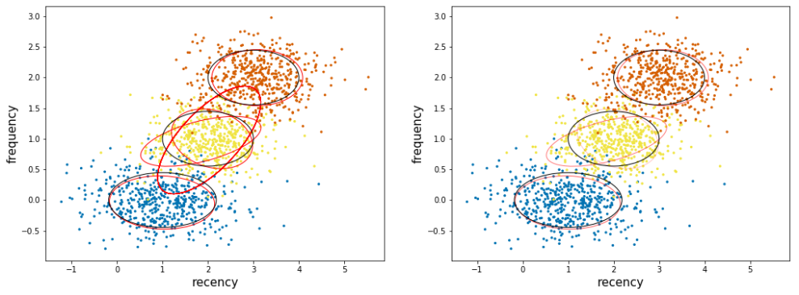

===============
 Scikit-learn
===============

Basic Scikit-learn documentation
===============

.. topic:: Introduction

    The objective here is to have everything useful for the projects, not to make a complete documentation of the whole package. Here I will try to document both version 1.6 and >2.0. A special enphase will be done on machine learning module ml (mllib is outdated).

Scikit-learn (http://scikit-learn.org/stable/) is the Machine Learning well-known library in python. Here is a very short summary from DataCamp:

.. figure:: Cheatsheets/Sklearn_Cheat_Sheet.png
   :scale: 100 %
   :alt: map to buried treasure

   This Cheatsheet is taken from DataCamp.
   

Data Preparation
==============

Many algorithms need to have the data normalized or scaled first.

Scaling Data
--------------

MinMax scaler: get the data in the [0,1] range (can be adapted to [-1,1] or other). Very sensitive to outliers.

https://scikit-learn.org/stable/modules/generated/sklearn.preprocessing.MinMaxScaler.html

.. sourcecode:: python

  from sklearn.preprocessing import StandardScaler

  scaler = MinMaxScaler()

  # Fit only to the training data
  scaler.fit(X_train)

  # Now apply the transformations to the data:
  X_train = scaler.transform(X_train)
  X_test = scaler.transform(X_test)

To get back the original scale, use scaler.inverse_transform() function.

Standard scaler: we substract the mean of data and divide by the standard deviation. (we then get the so-called Z values):

https://scikit-learn.org/stable/modules/generated/sklearn.preprocessing.StandardScaler.html

.. sourcecode:: python

  from sklearn.preprocessing import StandardScaler

  scaler = StandardScaler()

  # Fit only to the training data
  scaler.fit(X_train)

  # Now apply the transformations to the data:
  X_train = scaler.transform(X_train)
  X_test = scaler.transform(X_test)
  
  
Standard scaler can still be rather sensitive to outliers. Substracting by the median instead of the mean, and dividing by the inter quantile is much more robust to outliers:

https://scikit-learn.org/stable/modules/generated/sklearn.preprocessing.RobustScaler.html  

.. sourcecode:: python

  from sklearn.preprocessing import RobustScaler

  scaler = RobustScaler()

  # Fit only to the training data
  scaler.fit(X_train)

  # Now apply the transformations to the data:
  X_train = scaler.transform(X_train)
  X_test = scaler.transform(X_test)
  
Encoding of data
--------------------

Here is the simple Label encoding. It is usually used to change strings (but also integers) in integer label

.. sourcecode:: python

  from sklearn.preprocessing import LabelEncoder, OneHotEncoder
  data['col_encoded'] = LabelEncoder().fit_transform(data['col'].astype(str))
  
  #Also possible from Pandas:
  data['TRANSTYPE_label'] = pd.Categorical.from_array(data['TRANSTYPE']).labels 
  data[['TRANSTYPE','TRANSTYPE_label']]
  
.. figure:: Images/Encoding_pandas.png
   :scale: 60 %
   :alt: map to buried treasure 

A maybe more general way to label encode several features in one shot (and save the encoders!) would be:

.. sourcecode:: python

  list_encoders=[]
  for column in data[cat_cols]:
    le = preprocessing.LabelEncoder()
    data[column + "_encoded"] = le.fit_transform(data[column].astype(str))
    list_encoders.append(le)

  # Then the lists of columns to encode and associated encoders (already fitted!) are available in a python dictionary:
  dico_encoders={'columns_to_encode':cat_cols,
                 'list_encoders'    :list_encoders }
  
  # ...so that the dictionary can be reused later. Let's say we have new data with the same features  
  le_test = dico_encoders['list_encoders']
  data['TRANSTYPE_encoded'] = le_test[0].transform(data['TRANSTYPE'].astype(str))  
  
  # We can also convert back to the original feature: 
  data['TRANSTYPE_back'] = le_test[0].inverse_transform(data['TRANSTYPE_encoded'])
                 
Big question: when to use Label encoding, and when to use One Hot Encoding? See https://datascience.stackexchange.com/questions/9443/when-to-use-one-hot-encoding-vs-labelencoder-vs-dictvectorizor
In essence, Label Encoding is ok when working with tree methods

Stratified sampling
----------------------

.. sourcecode:: python

  from sklearn.datasets import make_classification
  from sklearn.cross_validation import StratifiedShuffleSplit
  from sklearn.metrics import accuracy_score, f1_score, precision_score, recall_score, classification_report, confusion_matrix

  # We use a utility to generate artificial classification data.
  X, y = make_classification(n_samples=100, n_informative=10, n_classes=3)
  sss = StratifiedShuffleSplit(y, n_iter=1, test_size=0.5, random_state=0)
  for train_idx, test_idx in sss:
      X_train, X_test, y_train, y_test = X[train_idx], X[test_idx], y[train_idx], y[test_idx]
      svc.fit(X_train, y_train)
      y_pred = svc.predict(X_test)
	  #macro, micro are defined here http://stackoverflow.com/questions/31421413/how-to-compute-precision-recall-accuracy-and-f1-score-for-the-multiclass-case
	  #Macro: Take the average of the f1-score for each class macro
	  #Micro: Compute the f1-score using the global count of true positives / false negatives, etc. (you sum the number of true positives / false negatives for each class) . accuracy_score gives the same!
      print(f1_score(y_test, y_pred, average="macro"))              
      print(precision_score(y_test, y_pred, average="macro"))
      print(recall_score(y_test, y_pred, average="macro"))  

.. _RF_sklearn-label:

Decision Tree
=============

Here is a simple example of DT for the Iris dataset:

.. sourcecode:: python

  from sklearn.datasets import load_iris
  from sklearn import tree
  iris = load_iris()
  clf = tree.DecisionTreeClassifier()
  clf = clf.fit(iris.data, iris.target)

We can use a vizualization tool, graphviz, to print the decision tree. It is sometimes useful to understand the classification of particular observation.

.. sourcecode:: python 

  import graphviz 
  dot_data = tree.export_graphviz(clf, out_file=None, 
                         feature_names=iris.feature_names,  
                         class_names=iris.target_names,  
                         filled=True, rounded=True,  
                         special_characters=True) 
  graph = graphviz.Source(dot_data)  
  graph
  
.. figure:: Images/Graphviz_tree.png
   :scale: 60 %
   :alt: map to buried treasure  

Random Forest
=============

The RF algo applied on the iris dataset. For the algorithm description see :ref:`Random Forest <RF_algo-label>` 

.. sourcecode:: python

  import numpy as np
  import pandas as pd
  from IPython.core.pylabtools import figsize
  from matplotlib import pyplot as plt
  import pylab
  from pylab import *
  import matplotlib.cm as cm
  import matplotlib.mlab as mlab
  import seaborn as sns

  #Import of SKLEARN packages
  from sklearn.metrics import accuracy_score, roc_curve, auc, confusion_matrix
  from sklearn.model_selection import train_test_split
  from sklearn.ensemble import RandomForestClassifier
  from sklearn.datasets import load_iris

  #LOADING IRIS DATASET:
  iris = load_iris()                            #The Iris dataset is available through the scikit-learn API
  idx = list(range(len(iris.target)))
  np.random.shuffle(idx)                   #We shuffle it (important if we want to split in train and test sets)
  X = iris.data[idx]
  y = iris.target[idx]

  # Load data in Pandas dataFrame and then in a Pyspark dataframe
  data_pd = pd.DataFrame(data=np.column_stack((X,y)), columns=['sepal_length', 'sepal_width', 'petal_length', 'petal_width', 'label'])
  data_pd.loc[data_pd['label']==0,'species'] = 'setosa'
  data_pd.loc[data_pd['label']==1,'species'] = 'versicolor'
  data_pd.loc[data_pd['label']==2,'species'] = 'virginica'
  data_pd.head()
  
.. figure:: Images/Iris_Dataset.png
   :scale: 100 %
   :alt: Iris dataset
  
.. sourcecode:: python
  
  # A VERY SMALL EDA

  g = sns.PairGrid(data_pd, vars=['sepal_length', 'sepal_width', 'petal_length', 'petal_width'], hue="label")
  g.map_diag(sns.kdeplot)
  g.map_lower(sns.kdeplot)
  g.map_upper(plt.scatter)  

.. figure:: Images/Iris_Seaborn.png
   :scale: 100 %
   :alt: Iris with seaborn
   
.. sourcecode:: python  
 
  sns.boxplot(x='species',y='petal_length',data=data_pd)   

.. figure:: Images/Iris_boxplot.png
   :scale: 100 %
   :alt: Iris with seaborn's boxplot

.. sourcecode:: python
   
  #FEATURES SELECTION
  feature_cols = ['sepal_length', 'sepal_width', 'petal_length', 'petal_width']
  target       = 'label'
  
  def train(clf_name, clf, df_used, feature_cols, target): 
        
        X = df_used[feature_cols].values
        y = df_used[target].values
        
        # CREATION OF TRAIN-TEST SETS		
        x_train, x_test, y_train, y_test = train_test_split(X,y,train_size=0.7, stratify=y) #stratify=y ensures that the same proportion of labels are in both train and test sets!

        # THE FIT ON THE TRAINING SET
        clf.fit(x_train, y_train)  

        # THE CLASSIFICATION
        y_pred = clf.predict(x_test)

        # EVALUATION OF THE ACCURACY
        accuracy = accuracy_score(y_test, y_pred, normalize=True, sample_weight=None)
        print('Results with the classifier: ', clf_name.upper())
        print('Accuracy derived (1=100%): ', accuracy)

        return y_test, y_pred
  
  clf_name = 'Random Forest'
  clf = RandomForestClassifier(#max_depth=50, 
                             n_estimators=100, 
                             max_features='auto',
                             criterion='gini',#'entropy',
                             class_weight='balanced',
                             bootstrap=True,
                             random_state=21,
                             n_jobs=-1) #n_jobs=-1 uses all available cores!!!

  y_test, y_pred = train(clf_name, clf, data_pd, feature_cols, target)

  #RANKING OF VARIABLES (available only for Random Forest)
  print("Ranking of variables from Random Forest:")
  feature_importance_index_sorted = np.argsort(clf.feature_importances_)[::-1]
  for jj in feature_importance_index_sorted:
    print(feature_cols[jj],np.around(clf.feature_importances_[jj],decimals=3)*100,'%')

  # Accuracy and Confusion Matrix 
  accuracy = accuracy_score(y_test, y_pred)
  print('Accuracy = ',accuracy)
  #print 'ROC_AUC  = ', roc_auc
  print('Confusion matrix:')
  C = confusion_matrix(y_test, y_pred)
  C_normalized = C / C.astype(np.float).sum()
  #print C_normalized

  Classes           = ['setosa','versicolor','virginica']
  C_normalized_pd = pd.DataFrame(C_normalized,columns=Classes,index=Classes)
  C_normalized_pd
  
.. figure:: Images/Accuracy_and_ConfMat.png
   :scale: 100 %
   :alt: Accuracy and Confusion matrix  

.. sourcecode:: python

  # SENSITIVITY COMPUTATION (taken from https://stackoverflow.com/questions/31324218/scikit-learn-how-to-obtain-true-positive-true-negative-false-positive-and-fal)
  FP = C_normalized_pd.sum(axis=0) - np.diag(C_normalized_pd)  
  FN = C_normalized_pd.sum(axis=1) - np.diag(C_normalized_pd)
  TP = np.diag(C_normalized_pd)
  TN = C_normalized_pd.values.sum() - (FP + FN + TP)

  # Sensitivity, hit rate, recall, or true positive rate
  TPR = TP/(TP+FN)
  # Specificity or true negative rate
  TNR = TN/(TN+FP) 
  # Precision or positive predictive value
  PPV = TP/(TP+FP)
  # Negative predictive value
  NPV = TN/(TN+FN)
  # Fall out or false positive rate
  FPR = FP/(FP+TN)
  # False negative rate
  FNR = FN/(TP+FN)
  # False discovery rate
  FDR = FP/(TP+FP)

  # Overall accuracy
  ACC = (TP+TN)/(TP+FP+FN+TN)

  print('SENSITIVITY:')
  Sensitivity_pd = pd.DataFrame(list(zip(Classes,TPR)),columns=['species','Sensitivity'])
  Sensitivity_pd

.. figure:: Images/Sensitivity.png
   :scale: 100 %
   :alt: Sensitivity 

   
Neural Networks
===============

Introduction to Keras package
-----------------------------------------

Keras (https://keras.io/) is a python library that works ontop of the Neural Network Theano and TensorFlow libraries. Here is a very short summary from DataCamp:

.. figure:: Cheatsheets/Keras_Cheat_Sheet_Python.png
   :scale: 100 %
   :alt: map to buried treasure

   This Cheatsheet is taken from DataCamp.

 
Parameters Tuning
==================

GridSearchCV (http://scikit-learn.org/stable/modules/generated/sklearn.model_selection.GridSearchCV.html#sklearn.model_selection.GridSearchCV) is a method to perform a grid search fro parameter tuning. It does a cross-validation by cutting in different pieces the train and test sets.

Here is an example on artificial data, taken from https://stackoverflow.com/questions/30102973/how-to-get-best-estimator-on-gridsearchcv-random-forest-classifier-scikit :

.. sourcecode:: python

  from sklearn.model_selection import GridSearchCV
  from sklearn.datasets import make_classification
  from sklearn.ensemble import RandomForestClassifier
  
  # Build a classification task using 3 informative features
  X, y = make_classification(n_samples=1000,
                           n_features=10,
                           n_informative=3,
                           n_redundant=0,
                           n_repeated=0,
                           n_classes=2,
                           random_state=0,
                           shuffle=False)

  base_estimator = RandomForestClassifier(n_jobs=-1, oob_score = True)
  
  param_grid = {
    'n_estimators': [200, 700],
    'max_features': ['auto', 'sqrt', 'log2']
  }
  
  CV_rfc = GridSearchCV(estimator=base_estimator, 
                        param_grid=param_grid,
                        cv=5)
  
  CV_rfc.fit(X_train, y_train)
  print(CV_rfc.best_params_)
  print(CV_rfc.best_score_)
  print(CV_rfc.best_estimator_)
  
Output: 

{'n_estimators': 200, 'max_features': 'log2'}
0.86
RandomForestClassifier(bootstrap=True, class_weight=None, criterion='gini',
            max_depth=None, max_features='sqrt', max_leaf_nodes=None,
            min_samples_leaf=1, min_samples_split=2,
            min_weight_fraction_leaf=0.0, n_estimators=700, n_jobs=-1,
            oob_score=True, random_state=None, verbose=0, warm_start=False)

How to measure the Feature importance in RF (or other algo)
======================================================================

Mean decrease accuracy (i.e. how is reduced the accuracy if we permute the values of some feature?)
------------------------------------------------------------------------------------------

Taken http://blog.datadive.net/selecting-good-features-part-iii-random-forests/

Another popular (maybe the most robust?) feature selection method is to directly measure the impact of each feature on accuracy of the model. The general idea is to permute the values of each feature and measure how much the permutation decreases the accuracy of the model. Clearly, for unimportant variables, the permutation should have little to no effect on model accuracy, while permuting important variables should significantly decrease it.
This method is not directly exposed in sklearn, but it is straightforward to implement it. Continuing from the previous example of ranking the features in the Boston housing dataset:

.. sourcecode:: python

  from sklearn.cross_validation import ShuffleSplit
  from sklearn.metrics import r2_score
  from collections import defaultdict
 
  X = boston["data"]
  Y = boston["target"]
 
  rf = RandomForestRegressor()
  scores = defaultdict(list)
 
  #crossvalidate the scores on a number of different random splits of the data
  for train_idx, test_idx in ShuffleSplit(len(X), 100, .3):
    X_train, X_test = X[train_idx], X[test_idx]
    Y_train, Y_test = Y[train_idx], Y[test_idx]
    r = rf.fit(X_train, Y_train)
    acc = r2_score(Y_test, rf.predict(X_test))
    for i in range(X.shape[1]):
        X_t = X_test.copy()
        np.random.shuffle(X_t[:, i])
        shuff_acc = r2_score(Y_test, rf.predict(X_t))
        scores[names[i]].append((acc-shuff_acc)/acc)
  print( "Features sorted by their score:" )
  print( sorted([(round(np.mean(score), 4), feat) for feat, score in scores.items()], reverse=True) )
  
Features sorted by their score:
[(0.7276, 'LSTAT'), (0.5675, 'RM'), (0.0867, 'DIS'), (0.0407, 'NOX'), (0.0351, 'CRIM'), (0.0233, 'PTRATIO'), (0.0168, 'TAX'), (0.0122, 'AGE'), (0.005, 'B'), (0.0048, 'INDUS'), (0.0043, 'RAD'), (0.0004, 'ZN'), (0.0001, 'CHAS')]
In this example LSTAT and RM are two features that strongly impact model performance: permuting them decreases model performance by ~73% and ~57% respectively. Keep in mind though that these measurements are made only after the model has been trained (and is depending) on all of these features. This doesn’t mean that if we train the model without one these feature, the model performance will drop by that amount, since other, correlated features can be used instead.
            
            
            
Score explanation for individual observation (using LIME)      
===================================================================

Taken from http://pythondata.com/tag/explanation/

When working with classification and/or regression techniques, its always good to have the ability to 'explain' what your model is doing. Using Local Interpretable Model-agnostic Explanations (LIME), you now have the ability to quickly provide visual explanations of your model(s). According to the paper, LIME is ‘an algorithm that can explain the predictions of any classifier or regressor in a faithful way, by approximating it locally with an interpretable model.’

Classification examples
----------------------------------

Simplest example: using only continuous features (not categorical):

Here is an example based on the Iris dataset, taken from the (https://marcotcr.github.io/lime/tutorials/Tutorial%20-%20continuous%20and%20categorical%20features.html):

.. sourcecode:: python

  import sklearn
  import sklearn.datasets
  import sklearn.ensemble
  import numpy as np
  import lime
  import lime.lime_tabular

  iris = sklearn.datasets.load_iris()
  train, test, labels_train, labels_test = sklearn.model_selection.train_test_split(iris.data, iris.target, train_size=0.80)

  rf = sklearn.ensemble.RandomForestClassifier(n_estimators=500)
  rf.fit(train, labels_train)

Output: 
RandomForestClassifier(bootstrap=True, class_weight=None, criterion='gini',
            max_depth=None, max_features='auto', max_leaf_nodes=None,
            min_impurity_decrease=0.0, min_impurity_split=None,
            min_samples_leaf=1, min_samples_split=2,
            min_weight_fraction_leaf=0.0, n_estimators=500, n_jobs=1,
            oob_score=False, random_state=None, verbose=0,
            warm_start=False)

.. sourcecode:: python

  sklearn.metrics.accuracy_score(labels_test, rf.predict(test))
  
Output: 
0.90

.. sourcecode:: python

  explainer = lime.lime_tabular.LimeTabularExplainer(train, feature_names=iris.feature_names, class_names=iris.target_names, discretize_continuous=True)       

  # We select one random observation (we can also take one particular, e.g. i=20)
  i = np.random.randint(0, test.shape[0])
  exp = explainer.explain_instance(test[i], rf.predict_proba, num_features=2, top_labels=1)

  exp.show_in_notebook(show_table=True, show_all=False)
  
.. figure:: Images/LIME_on_IRIS_classification_figure.png
   :scale: 100 %
   :alt: map to buried treasure
   
   
Score explanation for individual observation (using tree-interpreter)      
===================================================================================   
   
This package is designed for tree based methods like decision tree, random forest, extreme randomized forest.   
   
.. sourcecode:: python 

  #built on top of the RF model on Iris dataset above
   
  import treeinterpreter as ti
  feature_cols = ['sepal_length','sepal_width','petal_length','petal_width']
  Classes      = ['setosa','versicolor','virginica']

  def TreeInterpreter_contributions(x_test,fit,feature_cols):
    
    # Let’s predict now for a single instance.    
    instance = x_test
    fit.predict_proba(instance)  

    # Breakdown of feature contributions:
    prediction, bias, contributions = ti.predict(fit, instance)

    return prediction, bias, contributions

  def waterfall(series,pos_name,neg_name): #see http://pbpython.com/waterfall-chart.html
    fig, ax = plt.subplots(figsize=(7,7))
    df = pd.DataFrame({pos_name:np.maximum(series,0),neg_name:np.minimum(series,0)})
    blank = series.cumsum().shift(1).fillna(0)
    df.plot(kind='bar', stacked=True, bottom=blank, color=['r','b'],ax=ax)
    ax.get_children()[len(series)-1].set_color('g') #Put the prediction in green
    step = blank.reset_index(drop=True).repeat(3).shift(-1)
    step[1::3] = np.nan
    plt.plot(step.index, step.values,'-k',linewidth=0.5)
    return fig

  prediction, bias, contributions = TreeInterpreter_contributions(x_test,clf,feature_cols)
  class_selected = np.argmax(prediction[0])
  class_name_selected = Classes[class_selected]
  print(class_selected,class_name_selected)
  test2 = pd.Series([bias[0][class_selected]]+list(contributions[0][:,class_selected])+[-prediction[0][class_selected]],index=['bias']+feature_cols+['Net'])
  fig = waterfall(test2,class_name_selected,'Other labels')
  plt.ylim([-0.1,1.1])
  plt.axhline(y=0., linewidth=1, color = 'k',dashes=(5,5))
  plt.show()   
  
.. figure:: Images/Contributions.png
   :scale: 100 %
   :alt: Contributions to the prediction probability by tree-interpreter  
   
   
Very important update in the field of interpretation: 
==========================================================================

- ELI5 (Explain me like I am 5): https://eli5.readthedocs.io/en/latest/    

- SHAP: 

  * https://github.com/slundberg/shap : main intro + examples

  * http://www.f1-predictor.com/model-interpretability-with-shap/
  
  * https://medium.com/civis-analytics/demystifying-black-box-models-with-shap-value-analysis-3e20b536fc80
   
   
Ensemble Classification
======================================

See http://scikit-learn.org/stable/modules/ensemble.html
http://scikit-learn.org/stable/modules/generated/sklearn.ensemble.VotingClassifier.html
http://scikit-learn.org/stable/auto_examples/ensemble/plot_voting_decision_regions.html#sphx-glr-auto-examples-ensemble-plot-voting-decision-regions-py
http://scikit-learn.org/stable/auto_examples/ensemble/plot_voting_probas.html#sphx-glr-auto-examples-ensemble-plot-voting-probas-py
 
Here a case with 3 classifiers, with a parameter grid search:

.. sourcecode:: python

  from sklearn.ensemble import VotingClassifier
  from sklearn.model_selection import GridSearchCV
  clf1 = LogisticRegression(random_state=1)
  clf2 = RandomForestClassifier(random_state=1)
  clf3 = GaussianNB()
  eclf = VotingClassifier(estimators=[('lr', clf1), ('rf', clf2), ('gnb', clf3)], voting='soft') #voting=hard is majority voting, while voting soft is sum of probabilities, less strong.
  #eclf = VotingClassifier(estimators=[('lr', clf1), ('rf', clf2), ('gnb', clf3)], voting='soft', weights=[2,5,1]) #if we want to weigth the classifiers

  params = {'lr__C': [1.0, 100.0], 'rf__n_estimators': [20, 200],}

  grid = GridSearchCV(estimator=eclf, param_grid=params, cv=5)
  grid = grid.fit(iris.data, iris.target)

Clustering
======================

Excellent intro to the field: https://towardsdatascience.com/the-5-clustering-algorithms-data-scientists-need-to-know-a36d136ef68 

Gaussian Mixture Model (GMM)
-----------------------------------

http://scikit-learn.org/stable/modules/mixture.html

1. Classical GMM

2. Bayesian GMM

Here we can detect the number of component automatically (in theory).

Due to its Bayesian nature, the variational algorithm needs more hyper- parameters than expectation-maximization, the most important of these being the concentration parameter weight_concentration_prior. Specifying a low value for the concentration prior will make the model put most of the weight on few components set the remaining components weights very close to zero. High values of the concentration prior will allow a larger number of components to be active in the mixture.

The parameters implementation of the BayesianGaussianMixture class proposes two types of prior for the weights distribution: a finite mixture model with Dirichlet distribution and an infinite mixture model with the Dirichlet Process. In practice Dirichlet Process inference algorithm is approximated and uses a truncated distribution with a fixed maximum number of components (called the Stick-breaking representation). The number of components actually used almost always depends on the data.

Important parameters:

* weight_concentration_prior_type : str, defaults to ‘dirichlet_process’.

String describing the type of the weight concentration prior. Must be one of:

'dirichlet_process' (using the Stick-breaking representation),
'dirichlet_distribution' (can favor more uniform weights).

* weight_concentration_prior : float | None, optional.

The dirichlet concentration of each component on the weight distribution (Dirichlet). This is commonly called gamma in the literature. The higher concentration puts more mass in the center and will lead to more components being active, while a lower concentration parameter will lead to more mass at the edge of the mixture weights simplex. The value of the parameter must be greater than 0. If it is None, it’s set to 1. / n_components.

See See http://scikit-learn.org/stable/modules/mixture.html#variational-bayesian-gaussian-mixture

See http://scikit-learn.org/stable/modules/generated/sklearn.mixture.BayesianGaussianMixture.html#sklearn.mixture.BayesianGaussianMixture 

Based on http://scikit-learn.org/stable/auto_examples/mixture/plot_concentration_prior.html#sphx-glr-auto-examples-mixture-plot-concentration-prior-py 

.. sourcecode:: python

  import pandas as pd
  import numpy as np

  from sklearn.grid_search import GridSearchCV
  from sklearn.datasets import make_classification
  from sklearn.ensemble import RandomForestClassifier
  from sklearn.mixture import BayesianGaussianMixture

  import matplotlib as mpl
  import matplotlib.pyplot as plt

  %matplotlib inline

  # THE GENERATED DATASET

  # Parameters of the dataset
  random_state, n_components, n_features = 2, 3, 2
  colors = np.array(['#0072B2', '#F0E442', '#D55E00'])

  covars = np.array([[[.7, .0], [.0, .1]],
                     [[.5, .0], [.0, .1]],
                     [[.5, .0], [.0, .1]]])
  samples = np.array([500, 500, 500])
  means = np.array([[1, 0],
                    [2, 1],
                    [3, 2]])

  #covars = np.array([[[.7, .0], [.0, .1]],
  #                   [[.5, .0], [.0, .2]],
  #                   [[.5, .0], [.0, .3]]])
  #samples = np.array([5000, 5000, 5000])
  #means = np.array([[1, 0],
  #                  [2, 1],
  #                  [1, 1]])

  # Build a classification task using 3 informative features  (COULD USE THIS)
  #X, y = make_classification(n_samples=1000,
  #                         n_features=10,
  #                         n_informative=3,
  #                         n_redundant=0,
  #                         n_repeated=0,
  #                         n_classes=2,
  #                         random_state=0,
  #                         shuffle=False)

  # Generate data
  rng = np.random.RandomState(random_state)
  X = np.vstack([
      rng.multivariate_normal(means[j], covars[j], samples[j])
      for j in range(n_components)])
  y = np.concatenate([j * np.ones(samples[j], dtype=int)
                      for j in range(n_components)])

  X.shape,y.shape

  estimator = BayesianGaussianMixture(
        weight_concentration_prior_type="dirichlet_process", #(i.e. infinite)  #or "dirichlet_distribution" (i.e. finite)
        n_components=5*n_components, reg_covar=0, init_params='random',
        max_iter=1500, mean_precision_prior=.8,
        random_state=random_state)  #, [1, 1000, 100000])

  estimator.fit(X)

  def plot_ellipses(ax, weights, means, covars,edgecolor='black',by_weights='no'):
    for n in range(means.shape[0]):
        eig_vals, eig_vecs = np.linalg.eigh(covars[n])
        unit_eig_vec = eig_vecs[0] / np.linalg.norm(eig_vecs[0])
        angle = np.arctan2(unit_eig_vec[1], unit_eig_vec[0])
        # Ellipse needs degrees
        angle = 180 * angle / np.pi
        # eigenvector normalization
        eig_vals = 2 * np.sqrt(2) * np.sqrt(eig_vals)
        ell = mpl.patches.Ellipse(means[n], eig_vals[0], eig_vals[1],
                                  180 + angle, edgecolor=edgecolor)
        ell.set_clip_box(ax.bbox)
        if by_weights=='yes': ell.set_alpha(5*weights[n])
        #ell.set_facecolor('#56B4E9')
        ell.set_facecolor('none')
        ax.add_artist(ell)

  fig=plt.figure(1,(17,6))

  ax = plt.subplot(121)
  ax.scatter(X[:,0],X[:,1], s=5, marker='o', color=colors[y])
  ax.set_xlabel('recency',fontsize=15)
  ax.set_ylabel('frequency',fontsize=15)

  plot_ellipses(ax, estimator.weights_, estimator.means_,
                estimator.covariances_,edgecolor='red')
  plot_ellipses(ax, [1,1,1], means,
                covars)

  ax = plt.subplot(122)
  ax.scatter(X[:,0],X[:,1], s=5, marker='o', color=colors[y])
  ax.set_xlabel('recency',fontsize=15)
  ax.set_ylabel('frequency',fontsize=15)

  plot_ellipses(ax, estimator.weights_, estimator.means_,
                estimator.covariances_,edgecolor='red',by_weights='yes')
  plot_ellipses(ax, [1,1,1], means,
                covars)

  plt.show()

  estimator.weights_

  array([3.23183804e-01, 1.07006400e-01, 3.24464101e-01, 2.45301497e-01,
       4.14353274e-05, 2.58970793e-06, 1.61856745e-07, 1.01160466e-08,
       6.32252912e-10, 3.95158070e-11, 2.46973794e-12, 1.54358621e-13,
       9.64741381e-15, 6.02963363e-16, 3.76852102e-17])
       
       

